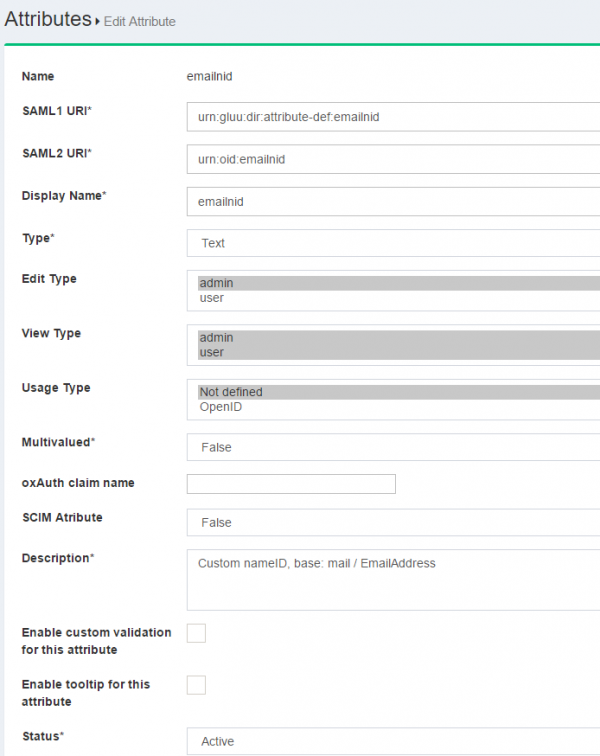
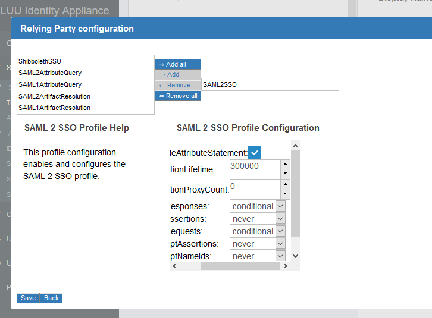
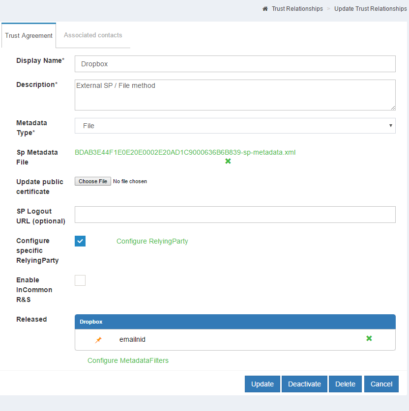
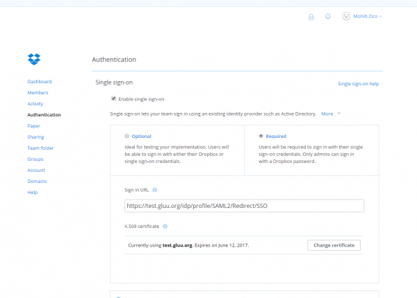
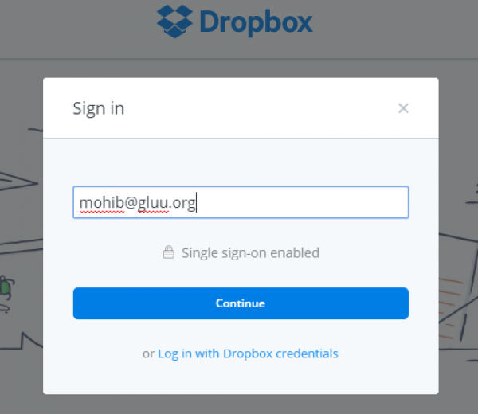

# SSO to Dropbox

This document is a step-by-step guide to setting up Dropbox SSO in Gluu Server.
This SSO requires setting a custom `nameid` called `emailnid`.

## Custom NameID
Please refer [here](../admin-guide/attribute#custom-attributes) on how to create custom attributes.

The new attribute screen should look like the screenshot below


The custom `nameid` needs to be defined in the `attribute-resolver` template file.

* Please edit the `attribute-resolver.xml.vm` file  under the `/opt/tomcat/conf/shibboleth2/idp` folder

* Add the `$attribute.name.equals('emailnid')` with the existing *#if( ! ($attribute.name.equals('transientId')* to look like the snippet below

```
#if( ! ($attribute.name.equals('transientId') or $attribute.name.equals('emailnid') ) ) 
```

* Add `nameid` definition 

```
 <resolver:AttributeDefinition id="emailnid"
                                xsi:type="Simple"
                                xmlns="urn:mace:shibboleth:2.0:resolver:ad"
                                sourceAttributeID="mail">
                        <resolver:Dependency ref="siteLDAP" />
                        <resolver:AttributeEncoder xsi:type="SAML2StringNameID"
                                xmlns="urn:mace:shibboleth:2.0:attribute:encoder"
                                nameFormat="urn:oasis:names:tc:SAML:1.1:nameid-format:emailAddress" />
</resolver:AttributeDefinition> 
```
* Add `emailAddress` in Principal Connector

```
 <resolver:PrincipalConnector xsi:type="pc:Transient" id="saml2Transient" nameIDFormat="urn:oasis:names:tc:SAML:1.1:nameid-format:emailAddress" /> 
```

* Restart Tomcat service

### Trust Relationship
Please refer [here](../../admin-guide/saml.md) to create trust relationship and fill up the form with the following info

The metadata for Dropbox is necessary to create trust relationship. Please use the following snippet so create the `dropbox_metadata.xml`.

```
 <EntityDescriptor entityID="Dropbox" xmlns="urn:oasis:names:tc:SAML:2.0:metadata">
    <SPSSODescriptor protocolSupportEnumeration="urn:oasis:names:tc:SAML:2.0:protocol">
        <NameIDFormat>urn:oasis:names:tc:SAML:1.1:nameid-format:emailAddress</NameIDFormat>
        <AssertionConsumerService index="1" Binding="urn:oasis:names:tc:SAML:2.0:bindings:HTTP-POST" Location="https://www.dropbox.com/saml_login" />
    </SPSSODescriptor>
</EntityDescriptor> 
```

*  Display Name: Dropbox
*  Description: External SP / File method
*  Metadata Type: File
*  SP Metadata File: Upload the 'dropbox_metadata.xml' which you just created
*  Configure Specific RelyiningParty: Yes
```
signResponses: conditional
signAssertions: never
signRequests: conditional
encryptAssertions: never
encryptNameIds: never
```


*  Released attribute: emailnid


### Configure Gluu Server as IdP in Dropbox

-  Log into Dropbox
-  Click on `Admin Console`
-  Click `Authentication`
-  Click on the checkbox labeled `Enable single-sign-on`
-  Optional/Required according to necessity
    - Sign in URL
    ```
    https://<hostname_of_Gluu_server>/idp/profile/SAML2/Redirect/SSO 
    ```

    - X.509 certificate 
        Get `shibIDP.crt` from Gluu Server `chroot` environment under `/etc/certs/` folder and upload it
    
    


*  Save configuration

### Test SSO
- Access https://www.dropbox.com and click on the `Sign In` button

- If the account is configured for SSO, then a screen similar to the 
screenshot below will appear after entering the email address.


- Click `Continue` and the website will redirect to Gluu Server for authentication.


