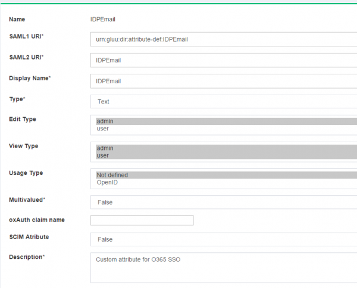
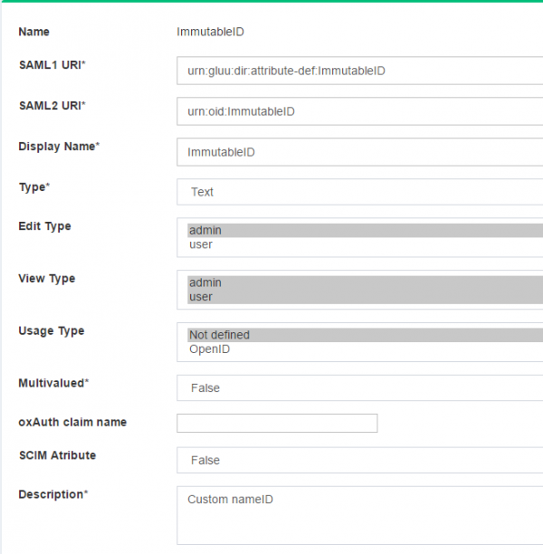
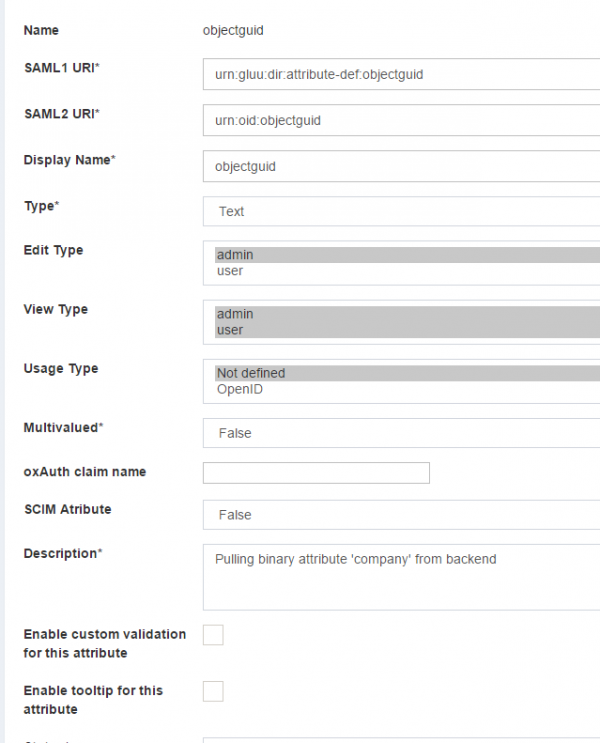
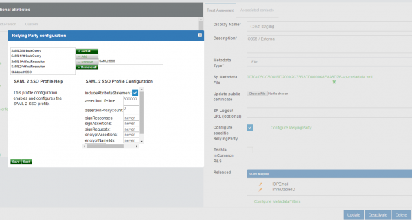

# Office 365 configuration in Gluu Server v3

This doc will guide you on how to setup a Gluu Server as your identity provider (IDP) for access to Office 365. 
By using a Gluu Server as your IDP you can bypass the process of storing passwords directly in O365.

!!! Note
    The attributes `ObjectGUID` and `IDPEmail` are mandatory for O365 SSO. The domain of `IDPEmail` must match the 
    registered domain as well.
    
## Requirements

- A Gluu Server with the Shibboleth IDP installed;
- An O365 account with administrative privilege.

## Office 365 Configuration 

1. Create a test user from Office365 Admin Panel. Alternatively, you can 
use [this doc](https://azure.microsoft.com/en-us/documentation/articles/active-directory-aadconnect/) to connect a 
backend Azure Active Directory (AD).  

2. Register the domain from the Office365 (O365) Admin Panel from `Settings` > `Domains`

    - `Verify` the domain

3. Register Gluu Server in O365

    - Install/Use Windows Server 2012 R2

    - [Install and Configure](https://technet.microsoft.com/en-us/library/jj205464) Windows Powershell *cmdlets*

    - Create a script and run through `Connect-MsolService` or you can provide values inside O365 admin panel. 
    
    - For Gluu Server, values would be something like these: 
    
```
ActiveLogOnUri                         : https://<hostname>/idp/profile/SAML2/SOAP/ECP
PassiveLogonUri                        : https://<hostname>/idp/profile/SAML2/POST/SSO 
DefaultInteractiveAuthenticationMethod :
FederationBrandName                    : Gluu Inc.
IssuerUri                              : https://<hostname>/idp/shibboleth
LogOffUri                              : https://<hostname>/identity/logout
MetadataExchangeUri                    : https://<hostname>/idp/shibboleth
NextSigningCertificate                 :
OpenIdConnectDiscoveryEndpoint         :

```

## Gluu Server Configuration

### Custom Attributes  

The configuration begins by creating a few custom attributes named `IDPEmail`, `ImmutableID` and `objectguid`. 
Refer to [this doc](../../admin-guide/attribute/#custom-attributes) to create custom attributes.

`objectguid` syntax will be slightly different from other custom attributes.
`*objectGUID` attributetype should be in the following syntax:

```
{

attributetype ( oxAttribute:1003 NAME 'objectGUID'
        SYNTAX 1.3.6.1.4.1.1466.115.121.1.5        
       X-ORIGIN 'Gluu - custom person attribute' )

}
```
1. On creating custom attributes in the schema, the same attributes needs to be created in the using oxTrust as depicted below.

    1. `IDPEmail` Custom Attribute
    
        
    
    2. `ImmutableID` Custom Attribute
    
        
    
    3. `objectguid` Custom Attribute
    
        


2. Edit the `attribute-resolver.xml.vm` file under `/opt/gluu/jetty/identity/conf/shibboleth3/idp` folder.

    - Add `$attribute.name.equals('ImmutableID')` with the existing transientID and PersistentID to look like the snippet below
 
            ##if( ! ($attribute.name.equals('transientId') or $attribute.name.equals('persistentId') or$attribute.name.equals('ImmutableID') ) )
            
    - Add `IDPEmail` attribute definition
    
            <resolver:AttributeDefinition xsi:type="ad:Simple" id="UserId" sourceAttributeID="IDPEmail">
                                <resolver:Dependency ref="siteLDAP" />
                                <resolver:AttributeEncoder xsi:type="enc:SAML2String" name="IDPEmail" friendlyName="UserId"/>
            </resolver:AttributeDefinition> 
        
    - Add `ImmutableID` attribute definition
        
            <resolver:AttributeDefinition id="ImmutableID" xsi:type="Simple"
                                      xmlns="urn:mace:shibboleth:2.0:resolver:ad"
                                      sourceAttributeID="objectguid">
                <resolver:Dependency ref="siteLDAP"/>
                <resolver:AttributeEncoder xsi:type="SAML2StringNameID"
                                        xmlns="urn:mace:shibboleth:2.0:attribute:encoder"
                                        nameFormat="urn:oasis:names:tc:SAML:2.0:nameid-format:persistent" />
            </resolver:AttributeDefinition>  

### IDP configuration
The cache refresh mechanism is used to populate the Gluu Server LDAP with data from a backend LDAP/AD. The `objectGUID` 
attribute must be pulled from the backend data source to Gluu Server.

- Edit the `ox-ldap.properties` (location: `/etc/gluu/conf/ox-ldap.properties`) to add the following:

`binaryAttributes=objectGUID,objectguid`

!!! Note 
    `objectGUID` (the first one) is the attribute which contains binary values in the backend AD 
    and `objectguid` (the second one) is the Gluu Server binary attribute name which will pull value from `objectGUID` attribute

- Restart oxAuth, identity, and idp services

### Identity Mapping

Two attributes require for mapping: 

 - IDPEmail
 - objectguid

`IDPEmail` pull data from backend's email attribute and `objectguid` get data from backend's objectGUID. 

### Create Trust Relationship
Refer [here](../../admin-guide/saml/#create-a-trust-relationship-in-the-gluu-server) to create trust relationships.

### Configure Relaying Party

Refer to [Relaying Party](../../admin-guide/saml/#relying-party-configuration) Configuration for more details. 
Relaying Party configuration screen should look like below.


