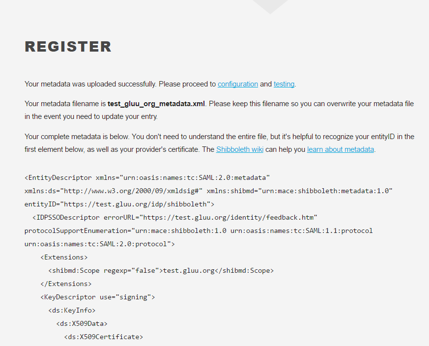
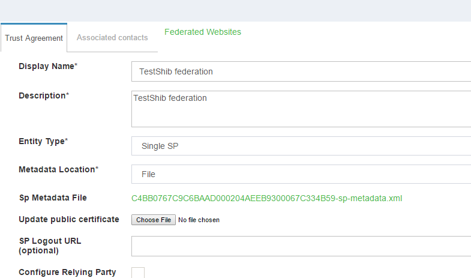
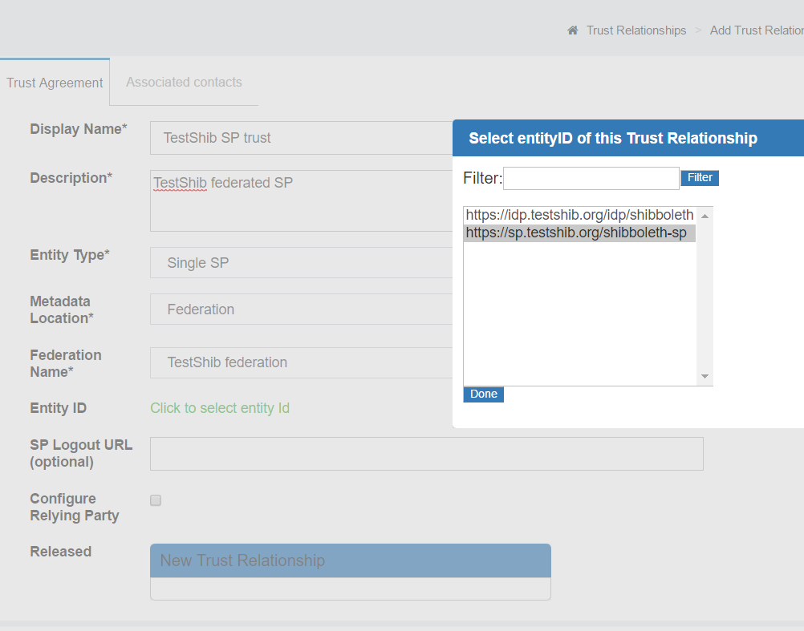
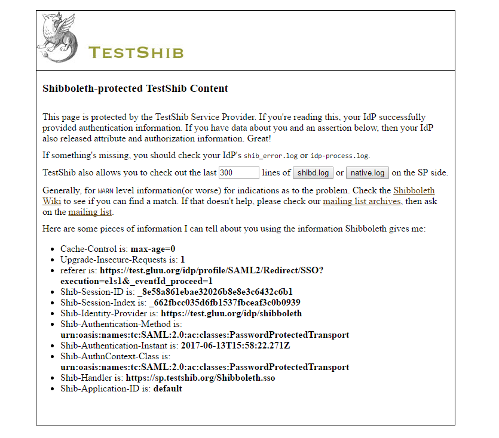

# Test Gluu Server with TestShib2

Here in this documentation we are showing how we can test Gluu Server with TestShib2. 
Please note that, you need to install 'Shibboleth IDP' in your Gluu server while 
running setup.py script. 

## TestShib2 configuration: part 1

 - Go to https://www.testshib.org/index.html
 - Click on 'Register'. Here we need to register our Gluu Server
 - Grab the SAML metadata of Gluu Server with: `https://[hostname_of_gluu_server]/idp/shibboleth`
 - Upload that XML file here in 'https://www.testshib.org/register.html' page
 - After successful registration, you will get something like this: 



 - Now let's move forward to 'Gluu Server configuration' 
 
## Gluu Server configuration

 - Download TestShib2 metadata from `https://www.testshib.org/metadata/testshib-providers.xml`
 - Log into Gluu Server oxTrust 
 - Create Trust Relationship with TestShib-provider metadata: 
   - We need to create a 'Federation' trust relationship with this metadata
   - SAML -> Add Trust Relationship
     - DisplayName: TestShib federation
     - Description: TestShib federation
     - Entity type: Single SP
     - Metadata Location: File
     - SP metadata file: upload 'testshib-providers.xml' metadata
     - 'Add'
     - Wait for validation success for this trust relationship. 
     


 - Create Trust Relationship with TestShib SP: 
   - Now we need to create a 'Federated trust relationship'
     - DisplayName: TestShib SP trust
     - Description: TestShib federated SP
     - Entity Type: Single SP
     - Metadata Location: Select 'Federation' from drop down menu
     - Federation Name: 'TestShib Federation'
     - Entity ID: click on this link, select 'https://sp.testshib.org/shibboleth-sp'
     - Configure Relying Party: not required
     - Released: Username
     - 'Add'
     



## TestShib2 configuration: part 2

 - Hit 'https://sp.testshib.org/' in browser
 - Put the entityID of your Gluu Server here. 
 - Hit 'Go'. 
 - If everything goes well, you will something like this: 
 

 
## Troubleshooting

 - Error code: 'Web Login Service - Unsupported Request The application you have accessed is not registered for use with this service.' from Gluu Server
    - Reason: Metadata is not loading properly. 
    - Resolution: Need to fix metadata-provider velocity template
    - HowTo: 
      - Backup existing 'metadata-providers.xml.vm' from ` /opt/gluu/jetty/identity/conf/shibboleth3/idp` location
      - Modify 'metadata-providers.xml.vm' code like below
      - Exit Gluu-Server container
      - Stop/Start Gluu-server container by: 
         - service gluu-server-3.x.x stop
         - service gluu-server-3.x.x start
      - Wait for 10 mins. 
    - 'metadata-provider.xml.vml' file: 

``` 
<?xml version="1.0" encoding="UTF-8"?>
<MetadataProvider id="ShibbolethMetadata" xsi:type="ChainingMetadataProvider"
    xmlns="urn:mace:shibboleth:2.0:metadata"
    xmlns:resource="urn:mace:shibboleth:2.0:resource"
    xmlns:security="urn:mace:shibboleth:2.0:security"
    xmlns:md="urn:oasis:names:tc:SAML:2.0:metadata"
    xmlns:xsi="http://www.w3.org/2001/XMLSchema-instance"
    xsi:schemaLocation="urn:mace:shibboleth:2.0:metadata http://shibboleth.net/schema/idp/shibboleth-metadata.xsd
                        urn:mace:shibboleth:2.0:resource http://shibboleth.net/schema/idp/shibboleth-resource.xsd
                        urn:mace:shibboleth:2.0:security http://shibboleth.net/schema/idp/shibboleth-security.xsd
                        urn:oasis:names:tc:SAML:2.0:metadata http://docs.oasis-open.org/security/saml/v2.0/saml-schema-metadata-2.0.xsd">

    <!-- ========================================================================================== -->
    <!--                             Metadata Configuration                                         -->
    <!--                                                                                            -->
    <!--  Below you place the mechanisms which define how to load the metadata for the SP you will  -->
    <!--  provide a service to.                                                                     -->
    <!--                                                                                            -->
    <!--  The Shibboleth Documentation at                                                           -->
    <!--  https://wiki.shibboleth.net/confluence/display/IDP30/MetadataConfiguration                -->
    <!--  provides more details.                                                                    -->
    <!--                                                                                            -->
    <!--  NOTE.  This file SHOULD NOT contain the metadata for this IdP.                            -->
    <!--                                                                                            -->
    <!-- ========================================================================================== -->


#foreach( $trustRelationship in $trustParams.trusts )

#if($trustRelationship.spMetaDataSourceType.value == 'file')
        <MetadataProvider id="SiteSP$trustParams.trustIds.get($trustRelationship.inum)" xsi:type="FilesystemMetadataProvider"
            metadataFile="$medataFolder$trustRelationship.spMetaDataFN" >
#end
#if($trustRelationship.spMetaDataSourceType.value == 'uri')
        <MetadataProvider id="SiteSP$trustParams.trustIds.get($trustRelationship.inum)" xsi:type="FileBackedHTTPMetadataProvider"

        metadataURL="$trustRelationship.spMetaDataURL"
        backingFile="$medataFolder$trustRelationship.spMetaDataFN"
        maxRefreshDelay="$trustRelationship.maxRefreshDelay" >
#end

#if( $trustRelationship.gluuSAMLMetaDataFilter and $trustRelationship.getGluuSAMLMetaDataFilter().size() > 0 )
            <MetadataFilter xsi:type="ChainingFilter" xmlns="urn:mace:shibboleth:2.0:metadata">
#foreach( $filter in $trustRelationship.getGluuSAMLMetaDataFilter() )
$filter
#end
            </MetadataFilter>
#end
#if($trustRelationship.spMetaDataSourceType.value == 'file' || $trustRelationship.spMetaDataSourceType.value == 'uri')
        </MetadataProvider>
#end
#end

</MetadataProvider>

```

