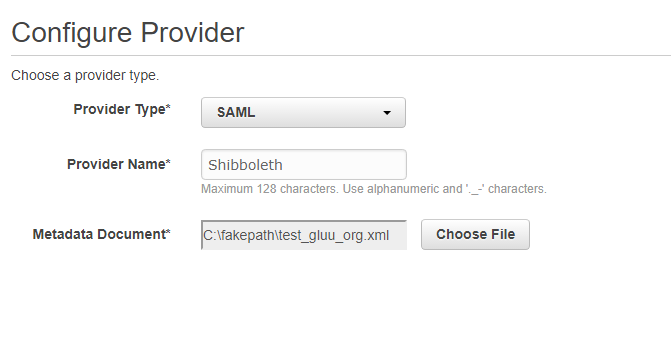
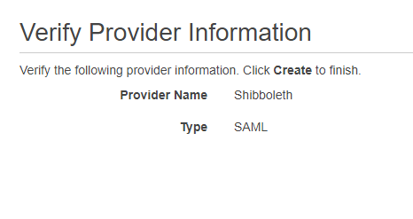
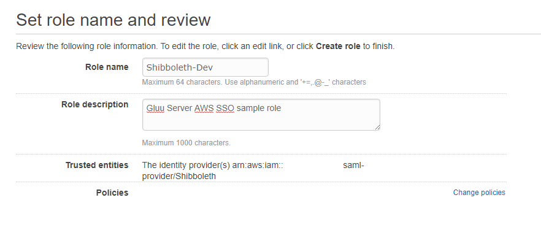
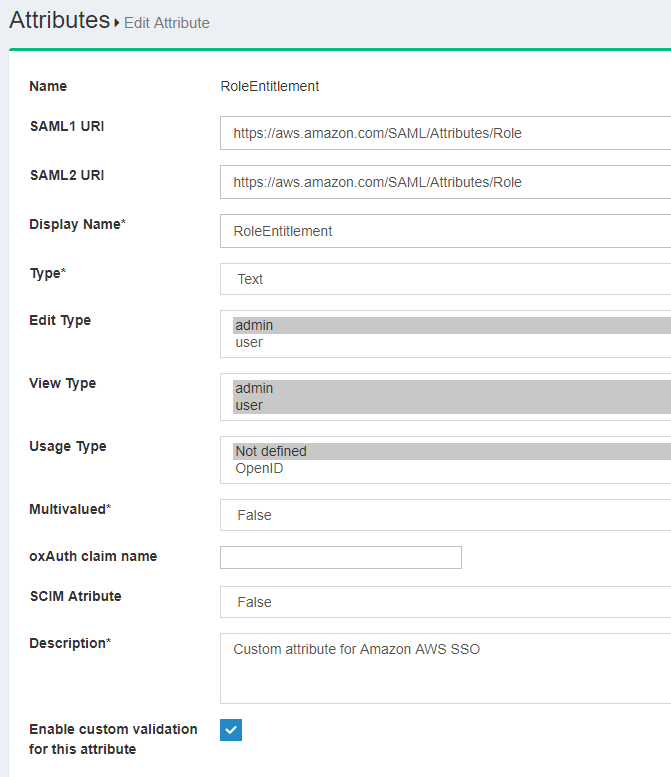

# Amazon AWS SSO with Gluu Server

This doc will guide you on how to setup a Gluu Server as your identity provider (IDP) for access to the Amazon Web Services (AWS) webconsole. By using a Gluu Server as your IDP you can bypass the process of creating user accounts directly in AWS.  

Instead of hard coding access with username and passwords, or access keys and secret keys, using a Gluu Server allows you to manage access based on LDAP groups within your enterprise environment.

## Requirements

 - A Gluu Server with the Shibboleth IDP installed; 
 - An AWS account with administrative privilege. 

## AWS Configuration

Log into the AWS Management Console. Find and navigate to the IAM module.

### Create Identity Provider
First you need to get the Shibboleth metadata file from your Gluu installation, which can be found by navigating to the following URL: `https://<hostname>/idp/shibboleth`. With that file you can create an IDP in your AWS account using the following steps: 

 - Click on 'Create Provider'
 - Provider Type: 'SAML'
 - Provider Name: 'Shibboleth'
 
 
 
 - Metadata Documentation: Upload the XML metadata file you just downloaded. 
 - Verify Provider Information



 - Create
 
    


### Create AWS Role
Create a role with the permissions you want to give people. You can set out-of-the-box or custom policies for the new AWS Role. For example, you could have roles like `admin`, `power` and/or `read only` with the appropriate policies attached. Check the [AWS docs](http://docs.aws.amazon.com/IAM/latest/UserGuide/id_roles_create.html) if you have questions about AWS Roles. 

Follow these steps to create an AWS role:

 - Click on 'Create new role'
 - Select role type:
    - 'Role for identity provider access'
    - Select 'Grant Web Single Sign-On (WebSSO) access to SAML provider
 - Verify Role trust:
 
```
{
  "Version": "2012-10-17",
  "Statement": [
    {
      "Effect": "Allow",
      "Action": "sts:AssumeRoleWithSAML",
      "Principal": {
        "Federated": "arn:aws:iam::xxxxxxx:saml-provider/Shibboleth"
      },
      "Condition": {
        "StringEquals": {
          "SAML:aud": "https://signin.aws.amazon.com/saml"
        }
      }
    }
  ]
}
``` 

 - Attach Policy: you can select whichever you prefer, we are not selecting anything right now for this doc. 
 - Set role name and review: Here is our test setup
  
   
   
 - `Create Role` 

## Gluu Server configuration

### Create AWS Custom Attributes in LDAP

Now you need to add two new attributes into your Gluu LDAP. Follow [these instructions](https://gluu.org/docs/ce/admin-guide/attribute/#add-the-attribute-to-ldap) to add new attributes in your LDAP server. 

Here are a few sample attribute values we added to the `custom.schema` doc:

```
attributetype ( 1.3.6.1.4.1.48710.1.3.1003 NAME 'RoleEntitlement'
        EQUALITY caseIgnoreMatch
        SUBSTR caseIgnoreSubstringsMatch
        SYNTAX 1.3.6.1.4.1.1466.115.121.1.15
        X-ORIGIN 'Gluu - AWS Assume Role' )
```   
      
```
attributetype ( 1.3.6.1.4.1.48710.1.3.1004 NAME 'RoleSessionName'
        EQUALITY caseIgnoreMatch
        SUBSTR caseIgnoreSubstringsMatch
        SYNTAX 1.3.6.1.4.1.1466.115.121.1.15
        X-ORIGIN 'Gluu - AWS Assume Role Session Name' )
```   
 
```
objectclass ( 1.3.6.1.4.1.48710.1.4.101 NAME 'gluuCustomPerson'
        SUP ( top )
        AUXILIARY
        MAY ( telephoneNumber $ mobile $ RoleEntitlement $ RoleSessionName )
        X-ORIGIN 'Gluu - Custom persom objectclass' )
```  
      
Make sure the `attributetype` LDAP ID number is unique. 

Save and test the custom configuration.

Now let's create these two attributes in the Gluu web UI ("oxTrust"). 

Here is how they will look: 

 - RoleEntitlement: 
  
  
  
 - RoleSessionName: 
  
  

### Create a Trust Relationship 

Now we need to create a SAML Trust Relationship for AWS in the Gluu Server. 

Follow these steps:

 - Log into Gluu Server oxTrust
 - Navigate to `Outbound SAML` > `Add Trust Relationship`
 - Enter the following values in each field: 
   - DisplayName: Amazon AWS
   - Description: external SP / File method
   - Entity Type: Single SP
   - Metadata Location: URI
   - SP Metadata URL: `https://signin.aws.amazon.com/static/saml-metadata.xml`
   - Configure Relying Party: Yes
     - 'SAML2SSO' Profile
       - includeAtributeStatemen: yes
       - assertionLifetime: 300000
       - signResponses: condititional
       - signAssertions: never
       - signRequests: condititional
       - encryptAssertions: never
       - encryptNameIds: never
   - Released attributes: 
     - Email
     - RoleEntitlement
     - RoleSessionName
     - Username

Wait for some time to load this configuration. Save the new Trust Relationship. 

### Test User Creation

Now we need to create a user in the Gluu Server to test this setup. This user should have an email address that is authorized to access the Amazon AWS account.

In addition to the other required attributes, we need to make sure that the two new attributes are present for this user.

  - `RoleEntitlement`: The value should look like this: `arn:aws:iam::xxxxxx:role/Shibboleth-Dev,arn:aws:iam::xxxx:saml-provider/Shibboleth`. This value is the combination of two attributes: (1) Role ARN and (2) Trusted entities. You can grab these values from your AWS console > IAM module. 
  - `RoleSessionName`: This is the email address of user. 
  
   

## SSO Testing

In order to test single sign-on, we need to use a link like this to start our flow: `https://<hostname>/idp/profile/SAML2/Unsolicited/SSO?providerId=urn:amazon:webservices`

## Questions or Issues?

Open a ticket on our [support portal](https://support.gluu.org). 
