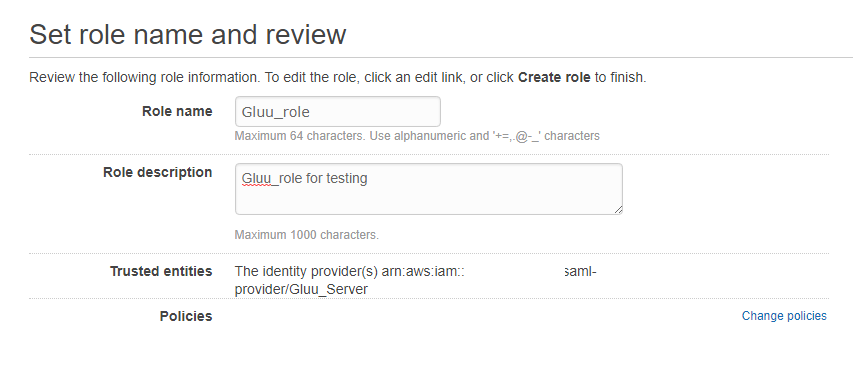
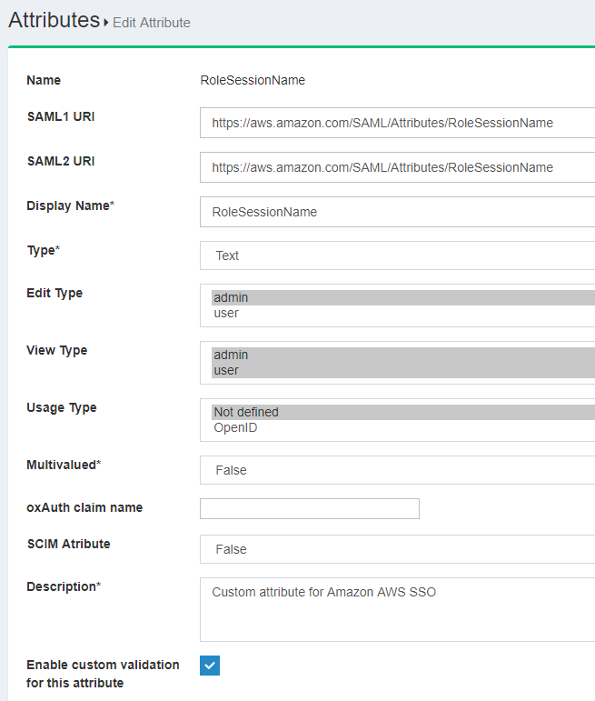
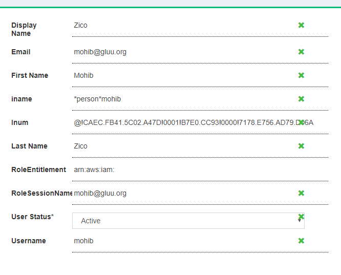

# Amazon AWS SSO with Gluu Server

This doc will guide you on how to setup Gluu to be your IDP to access AWS webconsole. By using Gluu as your IDP, you can bypass the process of creating user accounts in AWS.  

This will help you better manage access based on LDAP groups within your enterprise environment rather then hard coding access with username and passwords or access keys and secret keys.

## Requirements

 - Gluu Server with Shibboleth installed 
 - AWS administrative privilege 

## AWS Configuration

Log into AWS Management Console. Search for 'IAM' module. From 'IAM' module, we need to move forward. 

### Create Identity Provider
First you need to get the Shibboleth meta data file from your Gluu installation, which can be found by navigating to the following URL: `https://<hostname>/idp/shibboleth`. With that file you can create an IDP in your AWS account. 

 - Click on 'Create Provider'
 - Provider Type: 'SAML'
 - Provider Name: Anything you prefer. 
 - Metadata Documentation: Upload the XML metadata of your Gluu Server
 - Verify Provider Information
 - 'Create'
    


### Create AWS Role
Next create a role with the permissions you want to give people. You can set whatever out of the box or custom 
policies you want and attach it to the AWS Role that you create. For example, you could have an admin role, power user role and a 
read only role with the appropriate policies attached. If you have questions about this, there are docs in AWS to help you do this. 

 - Click on 'Create new role'
 - Select role type:
    - 'Role for identity provider access'
    - Select 'Grant Web Single Sign-On (WebSSO) access to SAML provider
 - Verify Role trust:
```
{
  "Version": "2012-10-17",
  "Statement": [
    {
      "Effect": "Allow",
      "Action": "sts:AssumeRoleWithSAML",
      "Principal": {
        "Federated": "arn:aws:iam::xxxxxx:saml-provider/Gluu_Server"
      },
      "Condition": {
        "StringEquals": {
          "SAML:aud": "https://signin.aws.amazon.com/saml"
        }
      }
    }
  ]
}
``` 
 - Attach Policy: you can select whichever you prefer, we are not selecting anything right now for this doc. 
 - Set role name and review: Here is our test setup
  
   
   
 - 'Create Role' 

## Gluu Server configuration

### Create AWS Custom Attributes in LDAP

Now you need to add two new attributes into your Gluu LDAP. Follow [these instructions](https://gluu.org/docs/ce/admin-guide/attribute/#add-the-attribute-to-ldap) to add new attributes in your LDAP server. 

Here are a few sample attribute values we added to the custom.schema doc:

```
attributetype ( 1.3.6.1.4.1.48710.1.3.1003 NAME 'RoleEntitlement'
        EQUALITY caseIgnoreMatch
        SUBSTR caseIgnoreSubstringsMatch
        SYNTAX 1.3.6.1.4.1.1466.115.121.1.15
        X-ORIGIN 'Gluu - AWS Assume Role' )
```   
      
```
attributetype ( 1.3.6.1.4.1.48710.1.3.1004 NAME 'RoleSessionName'
        EQUALITY caseIgnoreMatch
        SUBSTR caseIgnoreSubstringsMatch
        SYNTAX 1.3.6.1.4.1.1466.115.121.1.15
        X-ORIGIN 'Gluu - AWS Assume Role Session Name' )
```   
 
```
objectclass ( 1.3.6.1.4.1.48710.1.4.101 NAME 'gluuCustomPerson'
        SUP ( top )
        AUXILIARY
        MAY ( telephoneNumber $ mobile $ RoleEntitlement $ RoleSessionName )
        X-ORIGIN 'Gluu - Custom persom objectclass' )
```  
      
Make sure the `attributetype` LDAP ID number is unique. Save and test the custom configuration.

Now let's move forward to create this two attribute from Gluu oxTrust. Here is how they will look like: 

 - RoleEntitlement: 
  
  
  
 - RoleSessionName: 
  
  

### Trust Relationship creation

We need to create a SAML Trust Relationship now in Gluu Server. 

 - Log into Gluu Server oxTrust
 - SAML --> Add Trust Relationship
   - DisplayName: Amazon AWS
   - Description: external SP / File method
   - Entity Type: Single SP
   - Metadata Location: URI
   - SP Metadata URL: `https://signin.aws.amazon.com/static/saml-metadata.xml`
   - Configure Relying Party: Yes
     - 'SAML2SSO' Profile
       - includeAtributeStatemen: yes
       - assertionLifetime: 300000
       - signResponses: condititional
       - signAssertions: never
       - signRequests: condititional
       - encryptAssertions: never
       - encryptNameIds: never
   - Released attributes: 
     - Email
     - RoleEntitlement
     - RoleSessionName
     - Username
Wait for some time to load this configuration. 

### Test user creation

We need to create an user in our Gluu Server to test this setup. Please note that this user should have some email_address which is permitted in Amazon AWS to login. 
Along with other attributes, we need to make sure that those two new attributes are also present for this user.
  - `RoleEntitlement`: The value should be like this: `arn:aws:iam::xxxxxx:role/Gluu_role,arn:aws:iam::xxxx:saml-provider/Gluu_Server`
    - This value is the combination of two attributes, (a) Role ARN and (b) Trusted entities. You can grab these values from your AWS console/'IAM' module. 
  - `RoleSessionName`: This is the email_address of user. 
  
   

## SSO Testing

This is IDP-initiated SSO, we need to use a link like this to start our flow: `https://[hostname_of_Gluu_Server]/idp/profile/SAML2/Unsolicited/SSO?providerId=urn:amazon:webservices`
