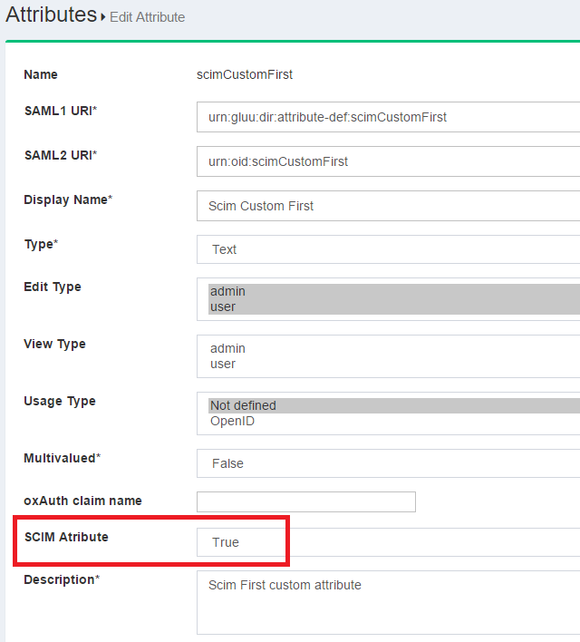
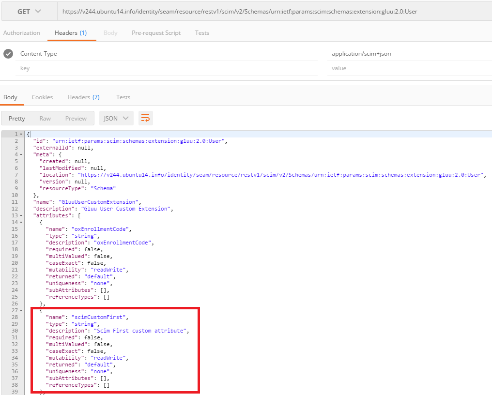

# User Management with SCIM

SCIM is a specification designed to reduce the complexity of user management operations by providing a common user schema and the patterns for exchanging this schema using HTTP in a platform-neutral fashion. The aim of SCIM is achieving interoperability, security, and scalability in the context of identity management.

You can think of **SCIM** merely as a **REST API** with endpoints exposing **CRUD** functionality (create, update, retrieve and delete).

For your reference, current version of the specification - 2.0 - is governed by the following documents: [RFC 7642](https://tools.ietf.org/html/rfc7642), [RFC 7643](https://tools.ietf.org/html/rfc7643), and [RFC 7644](https://tools.ietf.org/html/rfc7644).

## First steps: protect your API

The SCIM protocol does not define a specific method for authentication or authorization so that you can protect your API. In this regard there are a few guidelines in section 2 of [RFC 7644](https://tools.ietf.org/html/rfc7644). 

Gluu Server CE allows you to protect your endpoints with [UMA](scim-uma.md). This is a safe and standardized approach for protecting web resources. For SCIM, we **strongly recommend** its usage. Please visit this [page](scim-uma.md) to learn more on how to protect your API appropriately.

Alternatively, for testing purposes you can temporarily enable the test mode that uses a "Bearer token" approach. All examples given in this page are run under test mode and serve as a quick and easy way to start learning about SCIM.

!!! Note
    Despite the existence of an endpoint for version 1.0 of the spec, we strongly encourage the usage of version 2.0 of SCIM. 


## Using test mode

!!! Warning
    Test mode is a weak security approach to protect your service. This feature could be changed or removed in future releases of Gluu Server.

Starting with CE v2.4.4, the "test mode" configuration helps developers and administrators test the SCIM 2.0 endpoints easily. Instead of combining UMA protection and a client, in test mode a long-lived OAuth2 access token issued by the Gluu server is used to authorize access to endpoints.

To enable test mode, do the following:

* Login to the oxTrust GUI

* Go to `Configuration` > `Organization Configuration` and choose "enabled" for the SCIM support property


* Navigate to `Configuration` > `JSON Configuration` > `OxTrust Configuration`, then locate the property `scimTestMode`.


* Set it to `true` and click the `Save Configuration` button. 

The Gluu server will then create a long-lived OAuth2 access token with a 
validity period of one year.

* Click on `JSON Configuration` > `OxTrust Configuration` in the left navigation pane. 
This will retrieve the access token and will display it at the `scimTestModeAccessToken` property.


 
From then on, that token can be used as the query string 
parameter `access_token` when accessing the endpoints, for example:


You can verify the current authentication scheme by querying the `ServiceProviderConfig` endpoint:


To exit test mode, just set `scimTestMode` back to `false` then 
 click the `Save Configuration` button. This will switch the 
authentication scheme from OAuth2 Access Token to UMA. If you try using 
your access token again, you will get the `403 Unauthorized` error:


## Raw HTTP requests

For the sake of simplicity and to lower the barrier to start with SCIM, some raw HTTP sample requests are presented in this section. These requests exemplify how to do very basic CRUD on SCIM resources. While only users are being covered, you can extrapolate to groups and other kind of resources if any.

Examples shown here cover very little of what's possible to achieve with the SCIM REST API. For richer or advanced use cases, you may like to glance at the spec. The page [SCIM API](../api-guide/scim-api/#user-endpoint) offers a condensed and more amenable to read reference so that you can compose your requests with ease.

!!! Notes
    To undertake this exercise, temporarily enable test mode (see the previous section) and have your access token at hand. Remember to turn off this feature once you are finished.
    These examples make use of `curl` so ensure it's available in your testing environment.

### Creating resources

Let' create a dummy user. Open a text editor and paste the following:

```
{
	"schemas":["urn:ietf:params:scim:schemas:core:2.0:User"],
	"userName":"ajsmith",
	"name":{
		"familyName":"Smith",
		"givenName":"Joe"
	},
	"displayName":"Average Joe"
}
```

Save it to your local disk as `input.json` and open a command line interface (you don't need to login to Gluu's chroot). Issue this command replacing with proper values between the angle brackets and if required, passing the path to your Gluu host SSL certificate:

`$ curl --cacert /opt/gluu-server-<glu-version>/etc/certs/httpd.crt -H 'Content-Type: application/scim+json' -H 'cache-control: no-cache' -d @input.json -o output.json https://<host-name>/identity/seam/resource/restv1/scim/v2/Users?access_token=<test-mode-token>`

After execution open the file output.json. You should see a response like this (some contents have been supressed):

```
{
  "id": "...",
  "meta": {
    "created": "...",
    "lastModified": "...",
    "location": "https://.../scim/v2/Users/@!..."
    "resourceType": "User"
  },
  "schemas": [ "urn:ietf:params:scim:schemas:core:2.0:User" ],
  "userName": "ajsmith",
  "name": {
    "formatted": "Joe Smith",
    "familyName": "Smith",
    "givenName": "Joe"
  },
  "displayName": "Average Joe",
  ...
}
```

This new user has been given an `id`. If possible inspect your `ou=people` branch and find the entry whose `inum` matches the `id` given. An easier option would be to login via oxTrust and go to `Users` > `Manage People` and search "Joe" to see the recently created user.

SCIM will only allow you to create users with HTTP POST verb.

### Retrieving information of a user

One of the simplest ways to test retrieval is querying all information about a single user. Check in your LDAP the `inum` for Average Joe and do the following request with `curl` or just use a browser:

`https://<host-name>/identity/seam/resource/restv1/scim/v2/Users/<user-inum>?access_token=<test-mode-token>`

!!! Note:
    In Gluu server `inums` are lenghty and start with @!, include these two characters as well...

As a response, you will get a JSON document consisting of all attributes in Schema and their corresponding values. For Joe, almost all of them will have a *null* or an empty array as value, as in the following:

```
{
  "id": ...,
  "externalId": null,
  "meta": {...},
  "schemas": [...],
  "userName": "ajsmith",
  "name": {
    "formatted": "Joe Smith",
    "familyName": "Smith",
    "givenName": "Joe",
    ...
  },
  "displayName": "Average Joe",
  ...
  "locale": null,
  ...
  "emails": [],
  ...
  "phoneNumbers": [],
  ...
  "addresses": []
  ...
}
```


### Retrieval with filtering

The SCIM protocol defines a standard set of parameters that can be used to filter, sort, and paginate resources in a query response (see section 3.4.3 of [RFC 7644](https://tools.ietf.org/html/rfc7644)). Filtering capabilities are very rich and enable developers to build complex queries.

In this example, we will create a fairly simple query to return the first 2 users whose `userName` contains the sequence of letters "mi". Results should be sorted alphabetically by `givenName`.

Overwrite your `input.json` with the following. Replace content in angle brackets accordingly:

`access_token=<test-mode-token>&startIndex=1&count=2&sortBy=name.givenName&filter=userName%20co%20%22mi%22`

!!! Notes:
    This time we are not using JSON notation for input.
    The ampersand character to separe name/value pairs is typical of HTTP GET queries. 
    %20 and %22 account for white space and double quote respectively.
    co stands for "contains"

Time to run (notice the use of -G switch):

`curl -G --cacert /opt/gluu-server-<glu-version>/etc/certs/httpd.crt -H 'cache-control: no-cache' -d @input.json -o output.json https://<host-name>/identity/seam/resource/restv1/scim/v2/Users`

As response you will have a JSON file that looks like this:

```
{
	"totalResults": 2,
	"itemsPerPage": 2,
	"startIndex": 1,
	...
	"Resources": [
		{
		...
		attributes of first user matching criteria
  		..
  		},
		{
		...
		attributes of second user matching criteria
  		..
  		}
  	]
}
```

### Updating a user

!!! Note
    SCIM spec defines two ways to update resources: HTTP PUT and PATCH. Current Gluu implementation only supports PUT (PATCH being scheduled for a future release). This implies it's not possible to update single attributes but the whole resource is being replaced when the request is made.

Overwrite your `input.json` with the following. Replace content in angle brackets accordingly:

```
{
	"schemas":["urn:ietf:params:scim:schemas:core:2.0:User"],
	"id": <joe's-inum>,
	"userName":"ajsmith",
	"name":{
		"familyName":"Smith",
		"givenName":"Joe"
	},
	"displayName":"Joe Smith",
	"emails": [{
		"value": "jsmith@foodstuffs.eat",
		"type": "work",
		"primary": "true"
	}]	
}
```

And issue the PUT with `curl`:

`$ curl -X PUT --cacert /opt/gluu-server-<glu-version>/etc/certs/httpd.crt -H 'Content-Type: application/scim+json' -H 'cache-control: no-cache' -d @input.json -o output.json 'https://<host-name>/identity/seam/resource/restv1/scim/v2/Users/<user-inum>?access_token=<test-mode-token>'`

!!! Note
    Surround the URL with single quotes: `inum`s contain bang characters that might be misleading to your command line interpreter.

Response will show the same contents of a full retrieval.

Please verify changes were applied whether by inspecting LDAP or issuing a GET with your browser. If you have followed the details, you should notice a new e-mail added and the change in `displayName` attribute.


### Deleting users

For deleting, the DELETE method of HTTP is used.

No input file is used in this case. A delete request could be the following:

`$ curl -X DELETE --cacert /opt/gluu-server-<glu-version>/etc/certs/httpd.crt -H 'cache-control: no-cache' 'https://<host-name>/identity/seam/resource/restv1/scim/v2/Users/<user-inum>?access_token=<test-mode-token>'`

Use the `inum` of our dummy user, Average Joe.

Note in LDAP or oxTrust the absence of Joe.


## Extensions

[RFC 7643](https://tools.ietf.org/html/rfc7643) defines the schema for resource types in SCIM. In other words, defines structures in terms of attributes to represent users and groups as well as attribute types, mutability, cardinality, and so on. 

Despite schema covers to a good extent many attributes one might thing of, at times you will need to add your own attributes for specific needs. This is where user extensions pitch in, they allow you to create custom attributes for SCIM. To do so, you will have to:

* Add an attribute to LDAP schema
* Include the new attribute into an LDAP's objectclass such as gluuPerson or preferably, gluuCustomPerson
* Register and activate your new attribute through oxTrust GUI

Please visit this [page](attribute.md#custom-attributes) for a more detailed explanation. When registering the attribute in the admin GUI, please ensure you have set the `SCIM Attribute` parameter to `true`.



Once you submit this form, your attribute will be part of the User Extension. You can verify this by inspecting the `Schema` endpoint:

`https://<host-name>/identity/seam/resource/restv1/scim/v2/Schemas/urn:ietf:params:scim:schemas:extension:gluu:2.0:User`



In the JSON response, your new added attribute will appear.

You can learn more about SCIM Schema and the extension model by reading [RFC 7643](https://tools.ietf.org/html/rfc7643). Also refer to the following unit tests in SCIM-Client project for code examples in which custom attributes are involved:

* [User Extensions Object Test](https://github.com/GluuFederation/SCIM-Client/blob/version_3.0.2/src/test/java/gluu/scim2/client/UserExtensionsObjectTest.java)
* [User Extensions JSON Test](https://github.com/GluuFederation/SCIM-Client/blob/version_3.0.2/src/test/java/gluu/scim2/client/UserExtensionsJsonTest.java)