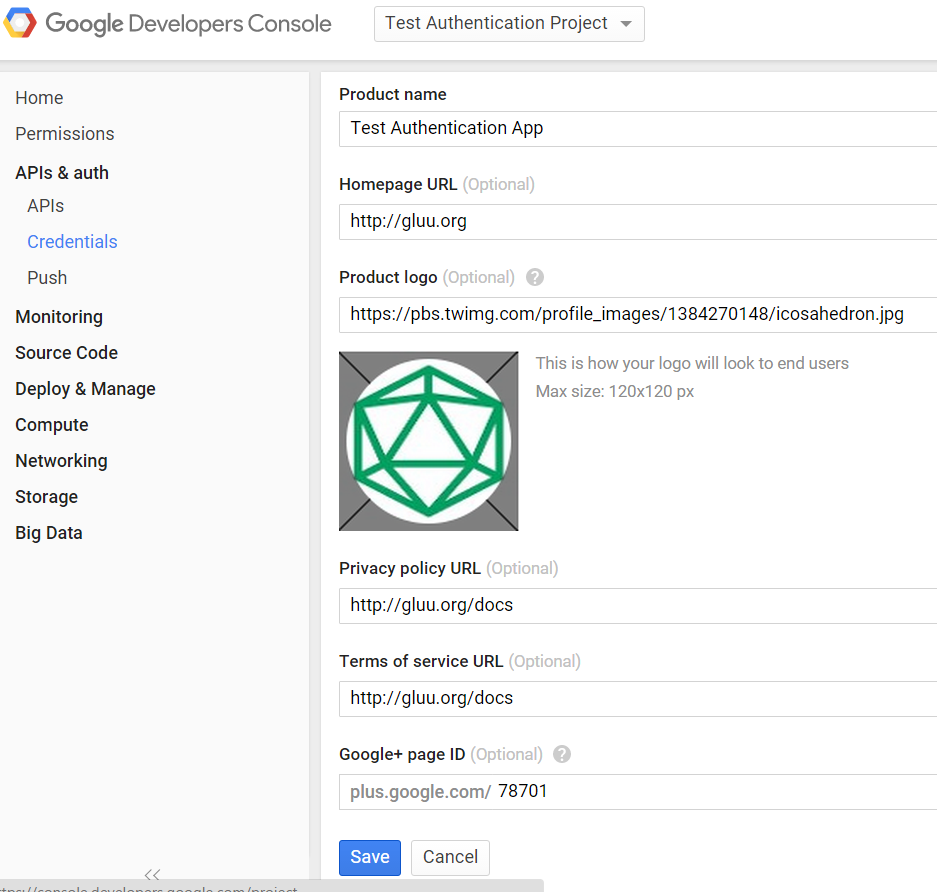
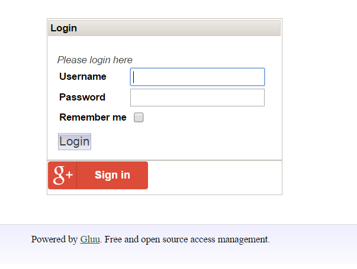

# Google+ OAuth 2.0 Login

## Overview 
This document will explain how to use Gluu's 
[gplus interception script](https://raw.githubusercontent.com/GluuFederation/oxAuth/master/Server/integrations/gplus/GooglePlusExternalAuthenticator.py) to configure the Gluu Server to send users to Google for authentication. 

## Configure oxTrust       

Follow the steps below to configure the certificate authentication in the oxTrust Admin GUI.       

1. Navigate to `Configuration` > `Manage Custom Scripts` > `Person Authentication`.        

2. Click the `Add Custom Scritp` button       
[add-script-button](../img/admin-guide/multi-factor/add-script-button.png)       

3. Fill in the form and add the [Google External Authenticator](https://raw.githubusercontent.com/GluuFederation/oxAuth/master/Server/integrations/gplus/GooglePlusExternalAuthenticator.py) Script.       

You'll also need to add some custom properties:       

 * __gplus_client_secrets_file__: `/etc/gluu/conf/google.json`
 * __gplus_deployment_type__: enroll
 * __gplus_remote_attributes_list__: email, given_name, family_name, and locale
 * __gplus_local_attributes_list__: uid, mail, givenName, sn, cn, preferredLanguage
 * __gplus_client_secrets_file__ - It is a mandatory property that holds
   the path to the application configuration file downloaded from Google
   console for application. An example is `/etc/certs/gplus_client_secrets.json`.

### Setting Google App
In order to call Google API's you will need to register as a developer and
create client credentials. You can follow these 
[instructions](https://developers.google.com/identity/protocols/OAuth2).

The first thing you'll need to do is Create a Project on Google to obtain
client credentials. Click "Create project" and enter your desired
project name.        

              

Then click on your newly created project from the listing on the
dashboard, and under the Credentials section, create a new "OAuth 2.0
client ID".        

       

Google will ask you to configure your consent screen, to add your logo
and other information displayed to the user to authorize Google to
release information.       

       

Fill out the form...       

       
       
Now you're ready to create the credentials. Enter "Authorized JavaScript
origins". It should be the uri of your Gluu Server--for example `https://idp.example.com`.       

       

Google will display the client-id and secret. Ignore that for now. Instead, download the JSON file which you are going to upload into
your Gluu Server next.       

       

Move this file to the location `/etc/gluu/conf/google.json`. The JSON
file will look something like this example:       

```
{
  "web": {
    "client_id": "7a64e55f-724d4e8c91823d5f1f18a0b2.apps.googleusercontent.com",
    "auth_uri": "https:\/\/accounts.google.com\/o\/oauth2\/auth",
    "token_uri": "https:\/\/accounts.google.com\/o\/oauth2\/token",
    "auth_provider_x509_cert_url": "https:\/\/www.googleapis.com\/oauth2\/v1\/certs",
    "client_secret": "bb76a2c99be94e35b874",
    "javascript_origins": [
    "https:\/\/brookie.gluu.info"
    ]
  }
}
```

The last step is to enable Google+ API's:       

- Navigate back to the Google API [console](https://console.developers.google.com/project)
- Select project and enter project name
- Open new project "API & auth -> API" menu item in configuration navigation tree
- Click "Google+ API"
- Click "Enable API" button


1) **gplus_deployment_type** - Specify the deployment mode. It is an
optional property. If this property isn't specified the script tries to
find the user in the local LDAP by 'subject_identifier' claim specified
in id_token. If this property has a 'map' value the script allows to map
'subject_identifier' to the local user account. If this property has an
'enroll' value the script adds a new user to the local LDAP with status
'active'. In order to map the IDP attributes to the local attributes it
uses properties from both gplus_remote_attributes_list and
gplus_local_attributes_list. The allowed values are map and enroll.

2) **gplus_remote_attributes_list** - Comma-separated list of attribute
names (user claims) that Google+ returns which map to local attributes
in the `gplus_local_attributes_list` property. It is mandatory only if
`gplus_deployment_type` is set to 'enroll'.

3) **gplus_local_attributes_list** - Comma-separated list of Gluu Server
LDAP attribute names that are mapped to Google user claims from the
`gplus_remote_attributes_list` property. It is mandatory only if
`gplus_deployment_type` is set to 'enroll'.

4) **extension_module** - Optional property to specify the full path of
an external module that implements two methods:

```
    
# This is called when the authentication script initializes

    def init(conf_attr):
    # Code here
    return True/False
 
# This is called after authentication

    def postLogin(conf_attr, user):
    # Code here
    return True    # or return False
        
```

5) **gplus_client_configuration_attribute** - Optional property to
specify the client entry attribute name which can override
`gplus_client_secrets_file file` content. It can be used in cases when
all clients should use a separate `gplus_client_secrets.json`
configuration.

## Testing

One simple way to test the configuration is to use oxTrust. In the
"Configure Authentication" dropdown menu, select "Google" (or whatever
you entered as the "Name" of the custom authentication script--as the
default authentication method.       

       

After you login and logout, you should be presented with a new login
form that has the Google login button:       
       
       
       
After clicking the Google login button, you are presented for
authorization--Google needs to make sure its ok to release attributes to
the Gluu Server:       

       

If the script doesn't work, and you locked yourself out of oxTrust,
don't worry! You could always revert back. Refer to [Reverting authentication method](../operation/faq/#revert-authentication-method)       

If things go wrong, it can leave the sessions in your browser in a bad
state. If things get really weird, remove the cookies in your browser
for the hostname of your Gluu Server.