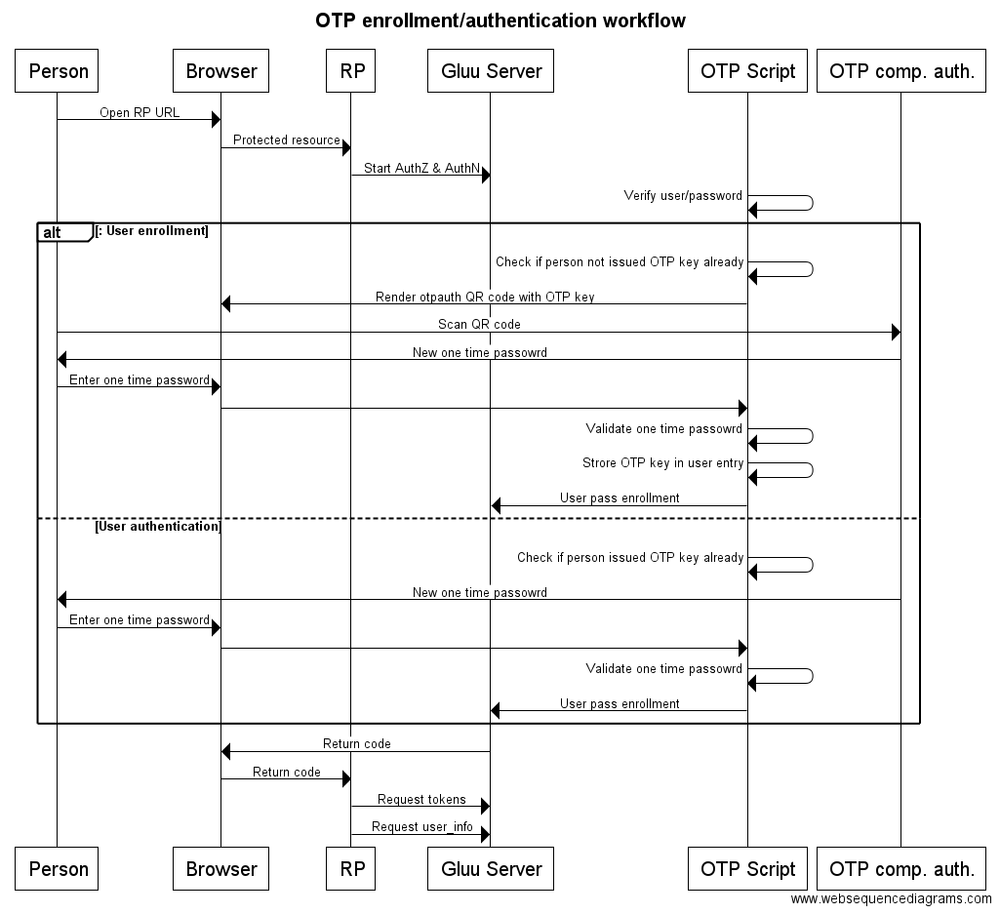

# One-Time Password (OTP) Authentication

## Overview
This document will explain how to configure the Gluu Server for a two-step authentication process with username and password as the first step, and HOTP/TOTP as the second step.

## Prerequisites
- A Gluu Server ([installation instructions](../installation-guide/index.md));
- [HOTP / TOTP authentication script](https://raw.githubusercontent.com/GluuFederation/oxAuth/master/Server/integrations/otp/OtpExternalAuthenticator.py) (included in the default Gluu Server distribution);
- An Android or iOS device with a mobile app installed that supports HOTP/TOTP, like [Google Authenticator](https://play.google.com/store/apps/details?id=com.google.android.apps.authenticator2).   

!!! Note
    Gluu's OTP interception script uses the two-factor event/counter-based HOTP algorithm [RFC4226](https://tools.ietf.org/html/rfc4226) and the time-based TOTP algorithm [RFC6238](https://tools.ietf.org/html/rfc6238).

## Sequence Diagram
Below is the sequence diagram for TOTP/HOTP and its flow explained:



### TOTP/HOTP enrollment/authentication workflow

```
Person->Browser: Open RP URL

Browser->RP: Protected resource

RP->Gluu Server: Start AuthZ & AuthN

OTP Script->OTP Script: Verify user/password

alt: User enrollment
	OTP Script->OTP Script: Check if person not issued OTP key already
	OTP Script->Browser: Render otpauth QR code with OTP key 
	Person->OTP comp. auth.: Scan QR code
	OTP comp. auth.->Person: New one time passowrd
	Person->Browser: Enter one time password
    Browser->OTP Script:
    OTP Script->OTP Script: Validate one time passowrd
    OTP Script->OTP Script: Strore OTP key in user entry
    OTP Script->Gluu Server: User pass enrollment
else User authentication
    OTP Script->OTP Script: Check if person issued OTP key already
    OTP comp. auth.->Person: New one time passowrd
    Person->Browser: Enter one time password
    Browser->OTP Script:
    OTP Script->OTP Script: Validate one time passowrd
    OTP Script->Gluu Server: User pass enrollment
end

Gluu Server->Browser: Return code
Browser->RP: Return code

RP->Gluu Server: Request tokens
RP->Gluu Server: Request user_info
```

## Properties
The module has a few properties:

1) otp_type - It's mandatory property. It's specify OTP mode: HOTP/TOTP.
   Allowed values: hotp/totp
   Example: hotp

2) issuer - It's mandatory property. It's company name.
   Example: Gluu Inc

3) otp_conf_file - It's mandatory property. It's specify path to OTP configuration JSON file.
   Example: /etc/certs/otp_configuration.json

4) label - It's label inside QR code. It's optional property.
    Example: Gluu OTP

5) qr_options - Specify width and height of QR image. It's optional property.
    Example: qr_options: { width: 400, height: 400 }

6) registration_uri - It's URL to page where user can register new account. It's optional property.
    Example: https://hostname/identity/register
    
## Configure OTP with Gluu Server

This is the list of steps needed to enable OTP person authentication module:

1. Confire new custom module in oxTrust:
    - Log into oxTrust with administrative permissions.
    - Open `Configuration` > `Manage Custom Scripts`.
    - Select `Person Authentication tab.
    - Enter name = otp
    - Enter level = 0-100 (priority of this method).
    - Select usage type `Interactive`.
    - Select the `Location Type`, if the `Location type` is LDAP, 
      script would be automatically populated in the `script` box below.
    - If `Location type` is selected as text, follow the below
        - Copy/paste script from TotpExternalAuthenticator.py.
    - Activate it via `Enabled` checkbox.
    - Click `Update` button at the bottom of this page.


2. Configure oxAuth to use OTP authentication by default:
    - Log into oxTrust with administrative permissions.
    - Navigate to `Configuration` > `Manage Authentication`.
    - Select `Default Authentication Method` tab. Select "otp" authentication mode.
    - Click `Update` button at the bottom of this page.


	
3. Try to log in using OTP authentication method:
    - Wait 30 seconds and try to log in again. During this time oxAuth reload list of available person authentication modules.
	- Once the scanning of QR is done on your mobile, click on Finish to get the OTP page to enter otp from your mobile.
    - Open second browser or second browsing session and try to log in again. It's better to try to do that from another browser session because we can return back to previous authentication method if something will go wrong.

!!! note
	Even if you have OTP generated on the mobile authenticator app, 
	you might have to scan the qr code again, if you are logging in 
	from different computer or at a different time or for a different session. 
	Since the QR code would expire after some time.
	


There are log messages in this custom authentication script. 
In order to debug this module we can use below command.

```
tail -f /opt/gluu/jetty/identity/logs/oxtrust.log | grep "OTP"
```

and
```
tail -f /opt/gluu/jetty/oxauth/logs/oxauth_script.log | grep "OTP"
```
## Don't have a QR code to scan:
If you have changed your mobile or you have reinstalled Google Authenticator app, 
and if the app is looking for QR code to scan, and you don't see a QR code.
Open Gluu LDAP server using a LDAP browser and navigate to  `appliances` 
and search for an attribute `oxExternalUid`. Remove the values of this attribute. 

!!! Note
	Logs are populated only if logs are enabled. For more info on logs refer to the [Log management](../operation/logs.md) section of the docs.
