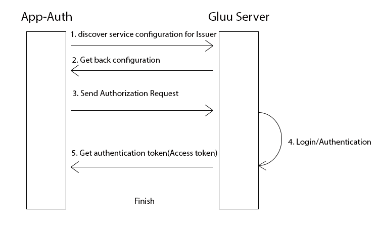

# App-Auth IOS

## Overview
## Overview
AppAuth for iOS and macOS is a client SDK for communicating with
[OAuth 2.0](https://tools.ietf.org/html/rfc6749) and
[OpenID Connect](http://openid.net/specs/openid-connect-core-1_0.html) providers. 

AppAuth strives to directly map the requests and responses of those specifications,
while following the idiomatic style of the implementation language. In
addition to mapping the raw protocol flows, convenience methods are
available to assist with common tasks like performing an action with
fresh tokens.
 
The library follows the best practices set out in
[OAuth 2.0 for Native Apps](https://tools.ietf.org/html/draft-ietf-oauth-native-apps)
including using
[Custom Tabs](http://developer.android.com/tools/support-library/features.html#custom-tabs)
for the auth request. For this reason,
`WebView` is explicitly *not* supported due to usability and security
reasons.
 
The library also supports the [PKCE](https://tools.ietf.org/html/rfc7636)
extension to OAuth which was created to secure authorization codes in
public clients when custom URI scheme redirects are used. The library is
friendly to other extensions (standard or otherwise) with the ability to
handle additional parameters in all protocol requests and responses.
 
Gluu server is certified OpenId Provider and supports
[Native Apps](https://tools.ietf.org/html/draft-ietf-oauth-native-apps)
either through custom URI scheme redirects, or App Links.

## Download
You can download (or clone) project from [Github Repository](https://github.com/openid/AppAuth-iOS)
 

## Auth Flow

AppAuth supports both manual interaction with the Authorization Server where you need to perform your own token exchanges, as well as convenience methods that perform some of this logic for you. This example uses the convenience method which returns either an XXXAuthState object, or an error.

XXXAuthState is a class that keeps track of the authorization and token requests and responses, and provides a convenience method to call an API with fresh tokens. This is the only object that you need to serialize to retain the authorization state of the session.

## Requirements

To use app-auth we need three parameters: issuer, clientId and redirectUri:     

- issuer from which the configuration will be discovered    

- clientId from dynamic client registration response    

- redirectUri - this scheme must be registered as a scheme in the project's Info property list      
 
## Configuration

First, we need to do dynamic client registration, for that go to - `https://<hostname>/oxauth-rp/home.htm`
On the top enter `https://<hostname>/.well-known/openid-configuration` as OpenID Connect Discovery url:

After on form "Dynamic Client Registration" fill next fields:     
 
- Registration Endpoint: https://<hostname>/.well-known/openid-configuration    

- Redirect URIs (space-separated): appscheme://client.example.com    

- Post Logout Redirect URIs (space-separated): https://net.openid.appauthdemo.logout      

- Response Types: CODE   

- Grant Types: AUTHORIZATION_CODE    

- Application Type: NATIVE    

   

## Main workflow diagram  

   
