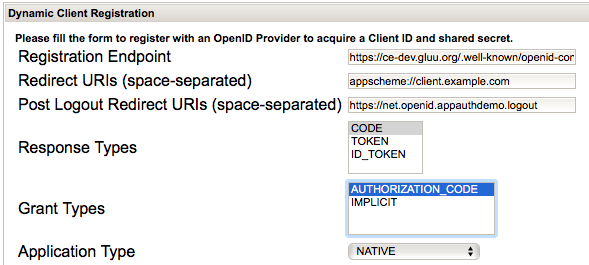

# App-Auth IOS

## Overview

AppAuth for iOS/Android and macOS is a client SDK for communicating with OAuth 2.0 and OpenID Connect providers. It strives to directly map the requests and responses of those specifications, while following the idiomatic style of the implementation language. In addition to mapping the raw protocol flows, convenience methods are available to assist with common tasks like performing an action with fresh tokens.

## Auth Flow

AppAuth supports both manual interaction with the Authorization Server where you need to perform your own token exchanges, as well as convenience methods that perform some of this logic for you. This example uses the convenience method which returns either an XXXAuthState object, or an error.

XXXAuthState is a class that keeps track of the authorization and token requests and responses, and provides a convenience method to call an API with fresh tokens. This is the only object that you need to serialize to retain the authorization state of the session.

## Requirements

To use app-auth we need three parameters: issuer, clientId and redirectUri:

- issuer from which the configuration will be discovered

- clientId from dynamic client registration response 

- redirectUri - this scheme must be registered as a scheme in the project's Info property list

## Configuration

First, we need to do dynamic client registration, for that go to - https://dev.gluu.org/oxauth-rp/home.htm
On the top enter https://dev.gluu.org as OpenID Connect Discovery url:

After on form "Dynamic Client Registration" fill next fields:

- Registration Endpoint: https://dev.gluu.org/.well-known/openid-configuration

- Redirect URIs (space-separated): appscheme://client.example.com

- Post Logout Redirect URIs (space-separated): https://net.openid.appauthdemo.logout

- Response Types: CODE

- Grant Types: AUTHORIZATION_CODE

- Application Type: NATIVE

## Main workflow diagram

