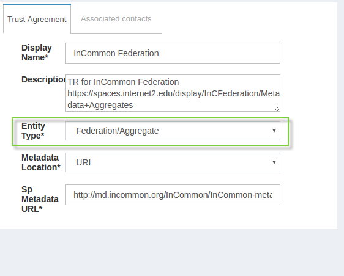

# SAML IDP 
## Overview
The Gluu Server can be deployed with the Shibboleth SAML IDP to support outbound SAML single sign-on (SSO). In an outbound SAML SSO transaction a website or application (SP) redirects users to a designated identity provider (IDP) for authentication and authorization. Upon successful authentication at the IDP, the user is returned to the SP with an active session. 

!!! Note 
    To support authentication at an external SAML IDP, review the [inbound SAML authentication guide](../authn-guide/inbound-saml-passport.md).

## Trust Relationship Requirements     
In the Gluu Server, the SAML IDPs SSO configuration is called a Trust Relationship (TR). Each TR requires the infomation listed below.

### Metadata of the SP             
Metadata is an XML file which has configuration data used to establish trust between the website (SP) and IDP (Gluu Server). Websites (SP) can provide metadata via a URL or as a separate file. Metadata can change, so a static URL typically requires the least amount of ongoing maintenance. 

### Metadata of the Gluu Server       
The Gluu Server's SAML metadata may be needed from time to time. It can be found at `https://hostname/idp/shibboleth`.
  
### Attribute Release      
Each SP may require one or more user attributes from the IDP in order to grant a person access to a protected resource. Required attributes vary depending on the application, and should be explicitly specified in the target application's documentation. The administrator can use the oxTrust interface to release the necessary attributes to the SP (as described [below](#create-a-trust-relationship-in-the-gluu-server). 

!!! Note    
    For a broader discussion of attributes, including how to create custom attributes and how to [configure the SAML NameID attribute](./attribute/#defining-nameid), refer to the [attributes documentation](./attribute.md).
    
## Create a Trust Relationship
Follow these instructions to create a SAML TR: 

1. Go to `SAML` > `Trust Relationships`    
2. Click on `Add Trust Relationship`     
3. A new page will appear with fields for all required information to create a Trust
  Relationship(TR).     

A description of each field follows:

- **Display Name**: Name of the Trust Relationship (it should be unique for every TR);       
- **Description**: Purpose of the TR and an SSO link can be added here;         
- **Metadata Type**: There are four available Metadata options to choose from. The correct type depends on how the SP is delivering Metadata to the IDP.      

    - *File*: Choose `File` if the SP has provided an uploadable metadata document in XML format.
    - *URI*: Chose `URI` if the SP metadata is hosted on a URI that is accessible from the Internet.
    - *Generate*: Choose `Generate` if the SP is an "in-house application" or the “Shibboleth SP” is going to be installed in the target application (SP). This option will generate a how-to guide for installing the Shibboleth SP. 
    - *Federation*: Choose this option if the target application (SP) is affiliated with a federation service (e.g. InCommon, NJEdge etc.). Fedeartion's TR must be created first for it to appear in this list. Learn more about working with a federation [below](#federation-configuration).   
    
!!! Note 
    If the Generate method is being used:       
    
    - The URL is the hostname of the SP.           
    - Pprovide a **non password protected** public certificate, which is a Base64 encoded ASCII file, and contain "-----BEGIN CERTIFICATE-----" and "-----END CERTIFICATE-----".        
    - After creating the Trust Relationship, download the generated configuration files from the `Download Shibboleth2 configuration files` link and place these configuration files inside the SP configuration.              
      
- **Released**: The SPs required attributes must be added to this panel. The required attributes can be selected from the menu on the left with the heading “Release Additional Attributes”.     

- **Entity Type**: There are two options to choose for entity type.
    - *Single SP*: 
    - *Federation/Aggregate* 
    
The Trust Relationship (TR) can be added by clicking the `Add` button located in the lower left side of the page.     

## Relying Party Configuration     
Through the Relying Party configuration you can customize how different IDP profiles will respond to requests received from the SP, including encryption and digital signature options. The underlying IDPs functionality is described in [the Shibboleth wiki](https://wiki.shibboleth.net/confluence/display/IDP30/RelyingPartyConfiguration). 

oxTrust allows you to tweak a limited subset of profiles mentioned in the Shibboleth wiki. The [SAML2SSO profile](https://wiki.shibboleth.net/confluence/display/IDP30/SAML2SSOConfiguration) is the most commonly used browser SSO profile. 

The "Configure Relying Party" checkbox is accessible on the TR creation page and must be enabled with a specific profile(s) selected as active for this TR to generate a valid configuration. In most cases, just adding the SAML2SSO profile with default settings will suffice.

     

Setting the checkbox will result in a link which, if clicked, will summon a list of profiles currently available for customization. Each entry in the list has a brief description of its purpose and a selection of settings for which custom values may be chosen, as can be seen on image below.     

     
    
## Federation Configuration     
If the SP is part of an identity federation such as [InCommon](https://www.incommon.org/participants/), the Gluu administrator has option to establish a Trust Relationship with it based on the federation's metadata. To achieve this he must add TR for the federation in the Gluu Server first. This will enable the administrator to more easily create TRs with SPs in the federation. 

The example below shows how an administrator would add a TR for the InCommon Federation.

Once a TR has been established with the federation, the Gluu Server administrator can easily create TRs with any SP included in the federation by selecting the federation from the `Federation Name` drop down menu and selecting the entity-id for the SP. 

In the example below we are creating a TR for the 'Internet2 Wiki', which is an InCommon Federation affiliated SP (meaning, the SPs entityID is available in InCommon metadata). 

## SAML SP
If your target application (SP) does not already support SAML, we recommend using the [Shibboleth SP](../../integration/sswebapps/saml-sp.md) web server filter to secure and integrate the application with your Gluu SAML IDP. 

## Inbound SAML
If you need to support inbound SAML to integrate with external partner or customer IDPs, review the [inbound SAML authentication guide](../authn-guide/inbound-saml-passport.md).
