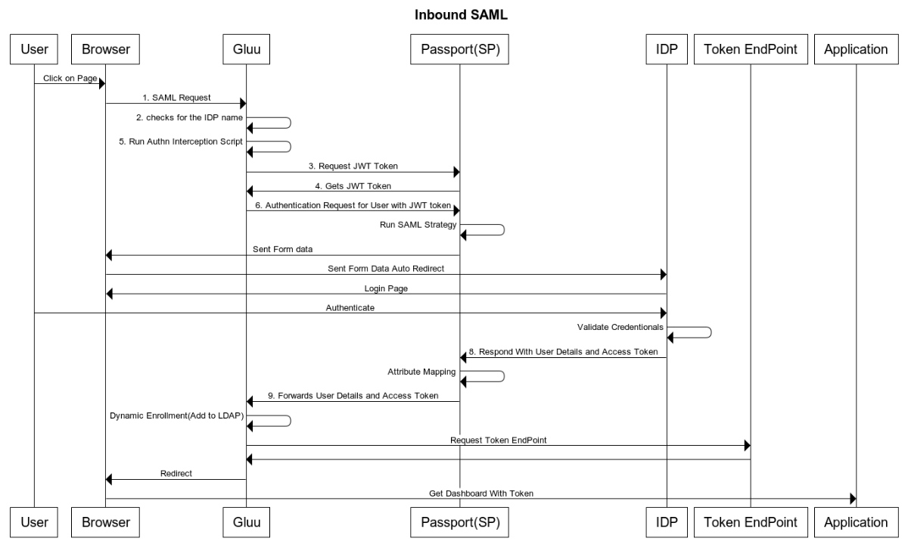
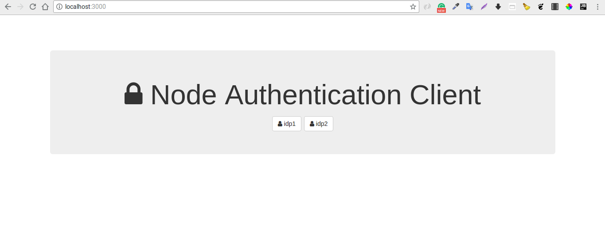
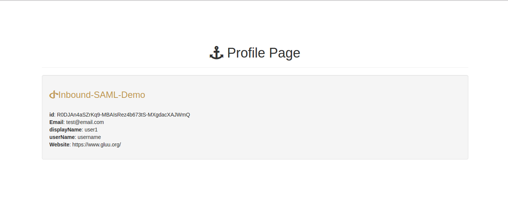

# Inbound SAML using Passport.js 
## Overivew

Inbound SAML enables you to configure your Gluu Server to support user authentication at an external SAML IDP. Inbound SAML is a frequent requirement for B2B SaaS providers that need to allow users from enterprise customers authenticate at their home IDP for access to the SaaS resources. 

The user flow is tyically similar to social login, but instead of giving users the option to login at a consumer service like Facebook or GitHub, you can send them to their home organization's SAML IDP for login. 

The Gluu Server uses the Passport.js authentication middleware and the [SAML IDP MultiAuthn interception script](https://github.com/GluuFederation/oxAuth/blob/evolveip/Server/integrations/idp/IdpMultiAuthnExternalAuthenticator.py) to enable inbound SAML SSO.

Post-authentication, if a local account does not already exist for the user, the script performs just-in-time provisioning to add the user to the Gluu OpenLDAP server. In this way, the Gluu SAML and OpenID Connect providers can gather claims and maintain SSO as normal.

!!! Note
    Previous versions of the Gluu Server used Asimba for inbound SAML. Documentation for Asimba can be found [here](https://github.com/GluuFederation/docs-ce-prod/blob/3.1.1/3.1.1/source/authn-guide/inbound-saml-asimba.md). For all new inbound SAML requirements, we now recommend using Passport.js and following the docs below.  

### About Passport  
Passport is an MIT licensed Express-based web application. We've modified it to call oxTrust APIs for its non-static configuration. Because its configuration is stored centrally in LDAP, you can scale Passport even in clustered topologies.

## Prerequisites
- A Gluu Server with Passport.js installed during setup ([Installation Instructions](https://github.com/GluuFederation/gluu-passport#setup-passportjs-with-gluu));      
- [IDP MultiAuthn interception script](https://github.com/GluuFederation/oxAuth/blob/evolveip/Server/integrations/idp/IdpMultiAuthnExternalAuthenticator.py).     

## Sequence Diagram

Below is a sequence diagram to help clarify the workflow for user authentication and provisioning. 



1. User-Agent calls gluu for Authentication with provided IDP name as base64 encoded json in state param like state=`base64({"salt":"<SALTVALUE>",provider":"<idp_name>"})`;        

2. Gluu Sever multiauthn script checks the IDP name;    

3. Gluu server calls Node-Passport server for a JWT token;       

4. Node-Passport server generates a JWT token and provides it in response to Gluu server;      

5. Gluu Server multiauthn script prepares the URL for passport server with provided IDP;    

6. Gluu server make a request to the Node-Passport server with the JWT token to authenticate the user for IDP provider;    

7. Node-Passport server redirects the user to the external IDP provider;    

8. After successful user authentication, the IDP will callback the Node-Passport server along with user details and access token;   

9. Node-Passport server will redirect back to Gluu Server with the user details and access token;      

10. The multiauthn interception script will check if the user exists in Gluu's OpenLDAP server.         
	a. If the user exists then the user will be logged into the system.       
	b. If the user does not exist, the interception script will create a new user with the required details in the Gluu OpenLDAP and log the user into the system.    

## Configure Gluu Server

Make sure you have deployed Passport.js during installation of your Gluu Server. 

Then follow the next steps:

1. Navigate to `Configuration` > `Manage Custom Scripts`;    

2. In the `Person Authentication` tab, find and enable the existing Passport script;      


    
3. Update the existing content in the Script field with the [IDP MultiAuthn interception script](https://github.com/GluuFederation/oxAuth/blob/evolveip/Server/integrations/idp/IdpMultiAuthnExternalAuthenticator.py);    

!!! Note
    Rather than replacing the existing script, you can also add a new strategy by scrolling to the bottom of the page.

4. Click on `update` at the end of the page.


5. Now navigate to `Configuration` > `Manage Authentication` > `Default Authenticaion`

5. Set the `Passport Support` field to `enabled`;    


6. In `/etc/gluu/conf` add configuration json file `passport-saml-config.json` containing IDP information;    

7. Once the configuration and settings have been entered, restart the passport service by following the below instructions:
    
    a. Login to chroot.
    
    b. Enter the following command to stop: `service passport stop`
    
    c. Enter the following command to start: `service passport start`

!!! Warning
	Strategies names and field names are case sensitive.


## Configure Passport

You can configure passport with either the setup script (beta) or manually. 

!!! Note
    If you have made any modifications to your passport server, we recommend using the manual steps. The script will override your changes and replace them with fresh code.

### Setup script configuration

1) Download or clone the [Github repo](https://github.com/GluuFederation/Inbound-SAML-Demo);   

2) Copy setup-script directory/folder in side gluu server's chroot (the command will be like:  `cp -a <path to downloaded repo>/setup-script /opt/gluu-server-3.1.1/root/`);   

3) Login to gluu-server's chroot: ` service gluu-server-3.1.1 login`;  

4) Navigate inside the setup-script directory: `cd setup-script`;  

5) Run `passport-setup.py` (it may take some time depending on your Internet speed and machine configurations because script also run commands like `npm install`);  

6) Follow console instructions to restart passport and oxAuth server or simply just restart the Gluu Server;   

7) You might need to run `chmod 777 -R /opt/gluu/node/passport/` after running this script to reset the file permissions . 

### Manual configuration

We can manually configure Passport using the following steps:

```sh 
su - node
export PATH=$PATH:/opt/node/bin
cd /opt/gluu/node/passport
npm install passport-saml --save

```
		
In `/opt/gluu/node/passport/server/app.js` add configs for saml:

```javascript

global.saml_config = require('/etc/gluu/conf/passport-saml-config.json')
```

In `/opt/gluu/node/passport/server/routes/index.js` add the route for saml:

```javascript
var passportSAML = require('../auth/saml').passport;
var fs = require('fs');
```

```javascript
//===================saml ==================== 
    var entitiesJSON = global.saml_config;
for (key in entitiesJSON) {
    //with out cert param in saml_config it will not work
    if (entitiesJSON[key].cert && entitiesJSON[key].cert.length > 5) {
        router.post('/auth/saml/' + key + '/callback',
            passportSAML.authenticate(key, {
                failureRedirect: '/passport/login'
            }),
            callbackResponse);

        router.get('/auth/saml/' + key + '/:token',
            validateToken,
            passportSAML.authenticate(key));
    }
    else {
        router.get('/auth/saml/' + key + '/:token',
            validateToken,
            function (req, res) {
            err = {
              message:"cert param is required to validate signature of saml assertions response"
            };
                logger.log('error', 'Cert Error: ' + JSON.stringify(err));
                logger.sendMQMessage('Cert Error: ' + JSON.stringify(err));
                res.status(400).send("Internal Error");
            });
    }
}

```

Expose the metadata through a global url

```javascript
router.get('/auth/meta/idp/:idp',
    function (req, res) {
        var idp = req.params.idp;
        logger.info(idp);
        fs.readFile(__dirname + '/../idp-metadata/' + idp + '.xml', (e, data) => {
            if (e)
                res.status(404).send("Internal Error");
            else
                res.status(200).set('Content-Type', 'text/xml').send(String(data));
        });
    });

```

In `/opt/gluu/node/passport/server/auth/configureStrategies.js` add support for SAML:

```javascript
var SamlStrategy = require('./saml');
```

```javascript
  //add this line in 
  SamlStrategy.setCredentials();
```

Put the SAML file name, `saml.js`, from the gluu-passport [repo](https://github.com/GluuFederation/gluu-passport/blob/version_3.1.1/server/auth/saml.js) on path `/opt/gluu/node/passport/server/auth/` 

Next we need to customize `passportpostlogin.xml` to use this project with the Gluu Server 3.1.1. 

!!! Note
    This will be added to the defaults in the next version, Gluu Server 3.1.2.

Copy the contents of [passportpostlogin.xhtml](https://github.com/GluuFederation/oxAuth/blob/evolveip/Server/src/main/webapp/auth/passport/passportpostlogin.xhtml) and paste to `opt/gluu/jetty/oxauth/custom/pages/auth/passport` (you need to create missing directories (`/auth/passport`))

Now restart passport service. 

```sh 
service passport stop
service passport start
```


## Onboarding new IDPs

Add new IDP configurations in the `/etc/gluu/conf/passport-saml-config.json` file. A sample IDP configuration is provided below:

```json
{"idp1": {"entryPoint": "https://idp.example.com/idp/profile/SAML2/POST/SSO",
                "issuer": "urn:test:example",
                "identifierFormat": "urn:oasis:names:tc:SAML:2.0:nameid-format:transient",
                "authnRequestBinding": "HTTP-POST",
                "additionalAuthorizeParams": "<Some additinal params json>",
                "skipRequestCompression": "true",
                "cert":"MIIDbDCCAlQCCQCuwqx2PNP...........YsMw==",//single line with out space and \n (importatnt)
                "reverseMapping": {
                        "email" : "email",
                        "username": "urn:oid:0.9.2342.19200300.100.1.1",
                        "displayName": "urn:oid:2.16.840.1.113730.3.1.241",
                        "id":  "urn:oid:0.9.2342.19200300.100.1.1",
                        "name": "urn:oid:2.5.4.42",
                        "givenName": "urn:oid:2.5.4.42",
                        "familyName": "urn:oid:2.5.4.4",
                        "provider" :"issuer"
                }
        }
}
```

In the above snippet replace `https://idp.example.com` with the URL of your IDP. It has the following keys:
		
		- `entryPoint` is mandatory field which is identity provider entry point is the address to authenticate through SAML SSO. 
		- `issuer` is mandatory field which is issuer string supply to identity provider.
		- `identifierFormat` if true, name identifier format to request from identity provider.
		- `authnRequestBinding` if set to HTTP-POST, will request authentication from IDP via HTTP POST binding, otherwise defaults to HTTP Redirect.
		- `additionalAuthorizeParams` dictionary of additional query params to add to 'authorize' requests.
		- `skipRequestCompression` if set to true, the SAML request from the service provider won't be compressed.
		- `cert` Identity Provider's public PEM-encoded X.509 certificate with  The `BEGIN CERTIFICATE` and `END CERTIFICATE` lines should be stripped out and the certificate should be provided on a single line.All \n must be removed from string.
		- `reverseMapping` is IDP representation of user fields
		- `email` is the user email
		- `username` is username of user
		- `displayName` is Display Name of user
		- `id` is userid for user.
		- `name` is full name of user
		- `givenName` is first name of user
		- `familyName` is last name of user

!!! Note
    If you used the setup script, the `passport-saml-config.json` file will be created by the script. You just need to modify the configurations as needed. 
		
## Gathering SAML Metadata

We also need SAML metadata from the external IDPs to register them with our IDP. 

Passport will generate SAML IDP metadata for each IDP listed in the `passport-saml-config.json` file. 

It can be accessed at the Passport endpoint: `https://<hostname>/passport/auth/meta/idp/<your-IDP-name-from-passport-saml-config.json>` 

We can also get metadata as an XML file at the following path: `...<path to gluu server >/opt/gluu/node/passport/server/idp-metadata`   

## Demo Server Config 

We are going to follow [this sequence diagram](https://github.com/GluuFederation/Inbound-SAML-Demo/wiki/Readme_single#sequence-diagram) for this demo. 

### Steps
1. We need an OpenID connect client to send an Authentication request via an interception script.       
    a. We assume that you know how to create OpenID connect client in gluu server. For more details you can follow this [Client registration doc](https://gluu.org/docs/ce/admin-guide/openid-connect/#client-registration-configuration).     
    b. If you have not create new separate strategy, in your created client set `passport` as `arc_value`  or if you have created separate script than set `acr_value` to the title of your script. If you followed our guide and created a strategy with the name `passportsaml`, your `acr_value` should be set to `passportsaml`.    
    c. set `redirect_uri` as per your project requirements.     

2. Now we will use the client created in step 1 for authentication requests;  
    a. We need to call standard gluu GET Authentication request using created `clientID` and `acr_value`;    
    b. Follow [Gluu openid-connect-api](https://gluu.org/docs/ce/api-guide/openid-connect-api/#requestauthorizationget) to create an authentication request;   
    c. Additionally we need to add `state` and `nonce` as query params with created authentication request;     
    d. state -> base64 of json {"salt":"<salt_value>","provider":"<idp_name>"};       
    e. Nonce -> String value used to associate a Client session with an ID Token, and to mitigate replay attacks. The value is passed through unmodified from the Authorization Request to the ID Token. Sufficient entropy MUST be present in the nonce values used to prevent attackers from guessing values.
    
    ```java
      //Example for generating getAuthentication request in java
    
   
        import com.google.common.collect.Lists;
        import org.xdi.oxauth.client.AuthorizationRequest;
        import org.xdi.oxauth.model.common.ResponseType;
        
        import java.util.Random;
        
        public class OpenIdGenerator {
        
            static String clientid = "your_client_id";
            static String redirect_uri = "redirect_uril";
            static String host = "your_glue host";
            static String acr_valur = "acr_value";
        
        
            public static void main(String[] args) throws Exception {
                String nounce = String.valueOf(randInt(100000000, 999999999));
                AuthorizationRequest authorizationRequest = new AuthorizationRequest(Lists.newArrayList(ResponseType.CODE, ResponseType.ID_TOKEN)
                        , clientid
                        , Lists.newArrayList("openid", "profile")
                        , redirect_uri, String.valueOf(randInt(100000000, 999999999)));
                authorizationRequest.setRedirectUri(redirect_uri);
                authorizationRequest.setState("You state value"); //base64 of json {"salt":"<salt_value>","provider":"<idp_name>"}
                authorizationRequest.setAcrValues(Lists.newArrayList(acr_valur));
                String queryString = "https://" + host + "/oxauth/authorize?" + authorizationRequest.getQueryString();
                System.out.println(queryString);
            }
        
            public static int randInt(int min, int max) {
        
                // Usually this can be a field rather than a method variable
                Random rand = new Random();
        
                // nextInt is normally exclusive of the top value,
                // so add 1 to make it inclusive
                int randomNum = rand.nextInt((max - min) + 1) + min;
        
                return randomNum;
            }
        }
     
     //output will be like this :- https://gluu.evp.org/oxauth/authorize?response_type=code+id_token&client_id=%40%215C0B.B148.7E63.326C%210001%21562E.F01E%210008%21664D.7760.0EC3.762D&scope=openid+profile&redirect_uri=https%3A%2F%2Flocalhost%3A8080&state=eyJwcm92aWRlciI6ImlkcDEifQ%3D%3D&nonce=232334315&acr_values=passportsaml
    ```
3) Open the generated links to initiate the `SAML IDP MultiAuthentiocation` flow. 

## Demo Client Config

Proxy-client is the demo node.js application to test Passport Inbound SSO. The project requires latest version of node-js to be installed on your machine 

### Steps

1. Clone the [project](https://github.com/GluuFederation/Inbound-SAML-Demo) using git clone;     
2. Register a new OIDC client in your gluu server with redirect uri `http://localhost:3000/profile` and copy `clientID` and `secret` ;   
3. Open `client-config.json` and add details like `ClientID`, `clientSecret`, and `hostname`;    
4. Copy the `passport-saml-config.json` which you used in setting up Passport Inbound SSO](#onboarding-new-idps) 
5. Open terminal and navigate to the project directory;   
6. Execute following commands:     
    a. `npm install`      
    b.  `node server.js`           
7. In a browser, navigate to `http:localhost:3000` and click on one of the IDP links to test your configuration. It will redirect you to your configured IDP using SAML SSO.

8. After login, you might be asked to authorize the release of your personal data.


9. On allowing from Authorization page Server will redirect to Proxy-client (Demo application) with Query params like  `...../profile/response_type=code&scope=openid&client_id=s6BhdRkqt3&state=af0ifjsldkj&redirect_uri=https%3A%2F%2Fclient.example.og%2Fcb`

10. using Information from query params of redirect uri demo Application will fetch the user information and display it on profile page!



