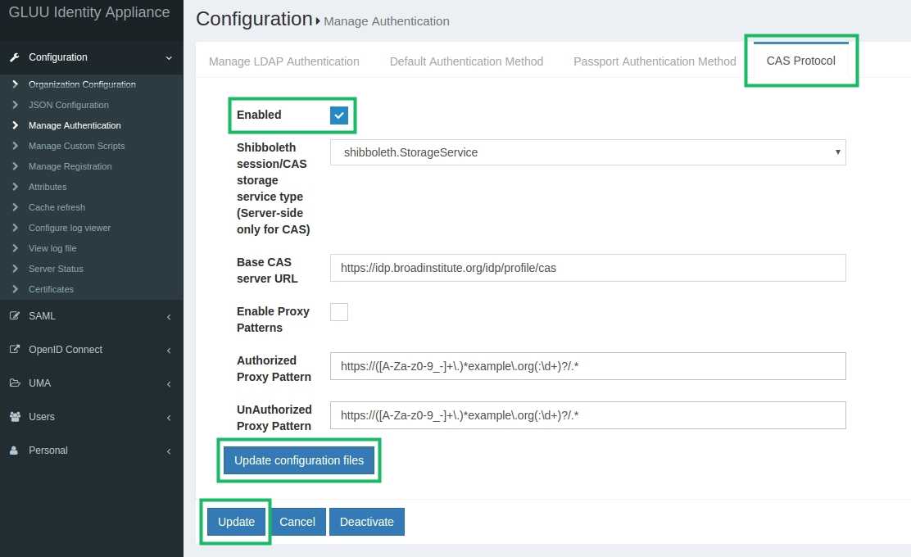
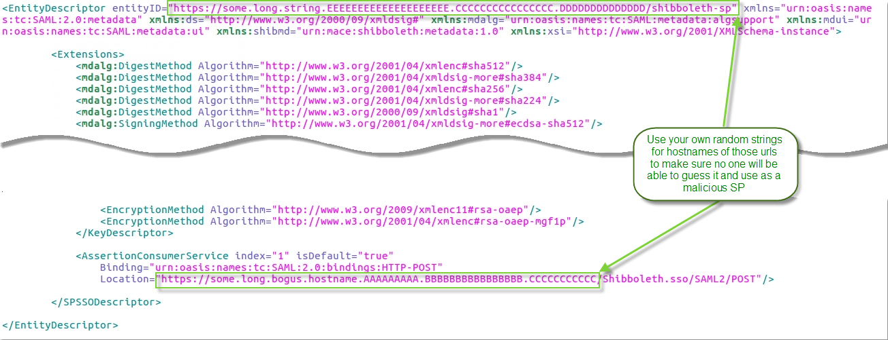
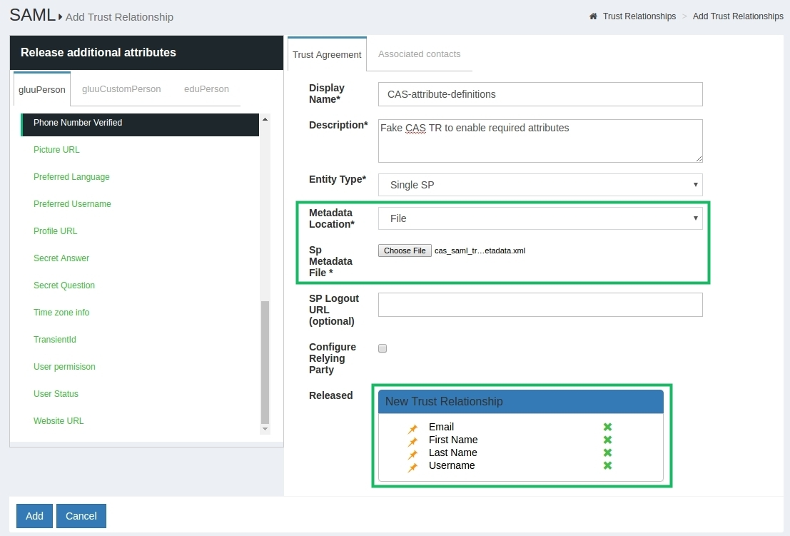

# CAS
## Overview
Central Authentication Service (CAS) is a legacy single sign-on (SSO) protocol for web applications. The name CAS also refers to a software package that implements the CAS protocol, which is now included in the Shibboleth IDP v3 package. 

The Gluu Server can be deployed with the Shibboleth IDP, and incorporates all CAS-related functionality included in Shib.

Shibboleth supports most of the [CAS protocol v2 specification](https://apereo.github.io/cas/5.0.x/protocol/CAS-Protocol-V2-Specification.html), including attribute release and CAS proxy support.

!!! Note
    CAS should *only* be used if there are legacy applications which only support CAS. Otherwise, all new SSO development should use [OpenID Connect](../admin-guide/openid-connect.md). 

## Key CAS server's endpoints

<table border="1">
    <tr>
        <th>Url</th>
        <th>Description</th>
    </tr>
    <tr>
        <td>https://your.gluu.host/idp/profile/cas/login</td>
        <td>Start point of SSO flow</td>
    </tr>
    <tr>
        <td>https://your.gluu.host/idp/profile/cas/serviceValidate</td>
        <td>ticket validation endpoint (CAS)</td>
    </tr>
    <tr>
        <td>https://your.gluu.host/idp/profile/cas/samlValidate</td>
        <td>ticket validation endpoint (SAML)</td>
    </tr>
</table>

## Configuration

### Outbound vs. Inbound CAS 
Gluu provides two main scenarios involving CAS flows. By analogy with SAML scenarios let's call them "outbound CAS" and "inbound CAS".

Outbound CAS is a traditional way to employ the protocol. Website or application (or, more likely, CAS client acting on behalf of them)
redirects a user to a designated CAS server (in this case your Gluu CE instance) for authentication and authorization. CAS server authenticates the user, checks whether such application is
allowed to request his/her personal data, then redirects user's browser back to the application/CAS client with a `service ticket`. The ticket is then validated by them by
calling respective validation endpoint at CAS server via back-channel connection. Depending on protocol version and server's policies, some attributes may
also be sent in response to validation call.

In contrary, inbound CAS is a way for Gluu server itself to delegate authentication 
to some remote CAS server in your organization's network. By doing so it allows you 
to leverage your existing infrastracture and broadens your authentication options. 
From a technical standpoint it's just another 
[custom authentication script](../authn-guide/customauthn/) which is already 
pre-packaged in your instance. You can find out more about how to configure 
it on [corresponding Github page](https://github.com/GluuFederation/oxAuth/tree/version_3.0.1/Server/integrations/cas2).

### Outbound CAS
In Gluu CE 3.0 outbound CAS configuration is split into two different parts. First, CAS support must be enabled in web UI.
Then applications which should be allowed to use this CAS server must be added to service registry - this part is done from Linux console (inside the container). After those mandatory steps are completed, you also may want to define a list of attributes which should be released in addition to user id which is sent by default (also done via Linux console).

#### Enabling CAS

!!! Warning
    CAS is very demanding in terms of clocks' synchronization between CAS server and CAS client
    Make sure ntp is configured and running on both hosts, and their 
    times are as close as possible before proceeding!

Please follow next steps to enable the feature:

1. Log in to oxTrust administrator web UI
2. Proceed to `Configuration` -> `Manage authentication` page, `CAS Protocol` tab
3. Leave all settings on the page at defaults, set `Enabled` checkbox and click the `Update` button
4. Click the `Update configuration files` button

  

#### Configuring service registry

Let's start by configuring a very basic CAS setup which only returns user's id to requesting application (will use it as a foundation to build a more functional setup(s) upon later on)

1. Move into the Gluu CE container: 

    `# service gluu-server-3.1.2 login`
    
2. Edit `/opt/gluu/jetty/identity/conf/shibboleth3/idp/cas-protocol.xml.vm` template file by 
putting a `ServiceDefinition` bean inside pre-existing `reloadableServiceRegistry`
bean as exemplified below. You must use a regexp defining your application instead of 
`"https:\/\/([A-Za-z0-9_-]+\.)*example\.org(:\d+)?\/.*"` 
Pattern like `".*"` may be used as a wildcard to create an "allow-all" definition for a test setup.
   
3. Restart the oxTrust's service to re-generate new files from updated templates: 

    `# service identity restart`
    
4. Restart the IdP's service to apply your changes: 

    `# service idp restart`

```
    <bean id="reloadableServiceRegistry"
          class="%{idp.cas.serviceRegistryClass:net.shibboleth.idp.cas.service.PatternServiceRegistry}">
        <property name="definitions">
            <list>
                <!--
                <bean class="net.shibboleth.idp.cas.service.ServiceDefinition"
                      c:regex="https://([A-Za-z0-9_-]+\.)*example\.org(:\d+)?/.*"
                      p:group="proxying-services"
                      p:authorizedToProxy="true"
                      p:singleLogoutParticipant="true" />
                <bean class="net.shibboleth.idp.cas.service.ServiceDefinition"
                      c:regex="http://([A-Za-z0-9_-]+\.)*example\.org(:\d+)?/.*"
                      p:group="non-proxying-services"
                      p:authorizedToProxy="false" /
                -->

                <bean class="net.shibboleth.idp.cas.service.ServiceDefinition"
                      c:regex="https:\/\/([A-Za-z0-9_-]+\.)*example\.org(:\d+)?\/.*"
                      p:group="institutional-services"
                      p:authorizedToProxy="false" />

            </list>
        </property>
    </bean>
```

At this point you should start getting a successful CAS ticket validation response from 

    `https://your.gluu.host/idp/profile/cas/serviceValidate`
    
containing at least your user id (which is taken from `uid` attribute by default).

#### Enabling attributes you plan to release in Shibboleth IdP

Shibboleth IdP requires you to define all atributes it will work with 
when serving SAML and CAS requests in `/opt/shibboleth-idp/conf/attribute-resolver.xml` file. 
Though Gluu CE 3.1.2 doesn't offer complete CAS support in admin web UI, 
there is a neat hack which can make this step easier for you. 
As all attributes added to list of released attributes of any SAML TR in 
web UI are automatically placed in the `attribute-resolver.xml`, 
you can create a "fake" SAML TR the only purpose of which will be storing 
attributes you need to release to all your CAS apps. Note that it has nothing
to do with actual decision about whether each attribute should be sent to a 
specific requesting application (you'll learn how to do this in the next section), 
it just pushes all required attribute definitions to `attribute-resolver.xml`.

!!! Warning 
    For security concerns, you should make sure that nobody with malicious intent will be able to use this TR to fool your IdP into releasing user's attributes to them.
    This may be achieved by choosing some completely random and very long string for `entityId` and hostname in the assertion consumer endpoint url; generating your own bogus SP certificate just for this TR and requiring signing of SAML requests for it will add security too (though it's already an overkill)
    
You can download a ready stub metadata file from [here](./cas_saml_tr_stub_metadata.xml) 
and update it as shown on picture below:

 

Please follow next steps to create the "fake" TR:

1. Log in to web UI as administrator
2. Move to `SAML` -> `Trust Relationships` and click `Add Relationship` button
3. Fill in all fields as shown on picture below, select `File` 
method of metadata provision and upload your customizing stub metadata file, 
add attributes `Username`, `First Name`, `Last Name` and `Email` 
to the list of released attributes at the bottom of the page
4. [Optional] Set `Configure Relying Party` checkbox, add `SAML2SSO` 
profile to the list while making sure "signRequests" setting is set to `Always`
5. Click the `Add` button

 

#### Specifying list of attributes to release

So far our setup only has been releasing user id which may 
happen to be too limiting for most applications. Being a part 
of Shibboleth now, CAS makes use of its powerful attribute 
release/filter policies engine to determine which attributes to send to each destination.

Currently the only way to tweak attribute release is to edit corresponding 
template file in the container. Please follow next steps to release 
attributes we defined in previous section to CAS application we added 
to service registry in the beginning:

1. Move into the Gluu CE container: 

    `# service gluu-server-3.1.2 login`
    
2. Edit `/opt/gluu/jetty/identity/conf/shibboleth3/idp/attribute-filter.xml.vm` 
template file by putting an `AttributeFilterPolicy` bean provided below right 
before the closing `</AttributeFilterPolicyGroup>` tag at the end of it.
Properties named `attributeID` you can see there are ids assigned to corresponding attributes in 
`/opt/shibboleth-idp/conf/attribute-resolver.xml` file (those are "internal names"
which don't always correspond to names displayed in web UI); 
you can also learn them by checking the "Name" field when viewing attribute's 
properties in web UI (`Configuration` -> `Attributes` page)
When placing the bean, be careful not to put it within some Velocity's loop there (note the control 
words startings with `"#"`). You must use a regexp defining your application instead of 
`"https:\/\/([A-Za-z0-9_-]+\.)*example\.org(:\d+)?\/.*"` 
Pattern like `".*"` may be used as a wildcard to create an "allow-all" definition for a test setup. 
In case you'll need to add several CAS filtering policies, make sure their `id` properties differ.

3. Restart the oxTrust's service to re-generate new files from updated templates: 

    `# service identity restart`
    
4. Restart the IdP's service to apply your changes: 

    `# service idp restart`

```
<AttributeFilterPolicy id="ManualCASFilterRule1">
    <PolicyRequirementRule xsi:type="RequesterRegex" regex="^https:\/\/([A-Za-z0-9_-]+\.)*example\.org(:\d+)?\/.*$" />
    <AttributeRule attributeID="mail">
      <PermitValueRule xsi:type="ANY" />
    </AttributeRule>
    <AttributeRule attributeID="givenName">
      <PermitValueRule xsi:type="ANY" />
    </AttributeRule>
    <AttributeRule attributeID="sn">
      <PermitValueRule xsi:type="ANY" />
    </AttributeRule>
    <AttributeRule attributeID="uid">
      <PermitValueRule xsi:type="ANY" />
    </AttributeRule>
</AttributeFilterPolicy>
```

#### Changing attribute used as "user id" in CAS server's ticket validation response

By default `uid` attribute is used as a source for user id returned in successful
ticket validation response. By adding a specifically crafted Relying Party override 
element to `relying-party.xml` this behavior can be changed (please note this 
approach won't change `nameid` in SAML response in case SAML ticket validation endpoint 
(will be covered in the next section) is used instead of "native" CAS validation endpoint)

In example below it's configured to use `eduPersonPrincipalName` attribute instead of `uid`. 
You must use your own expression instead of 
`"https:\/\/([A-Za-z0-9_-]+\.)*example\.org(:\d+)?\/.*"`, or a wildcard expression (`".*"`)

```
        <bean id="shibboleth.regexRelyingParty" parent="RelyingParty" >
            <property name="activationCondition" >
                <bean class="net.shibboleth.idp.profile.logic.RelyingPartyIdPredicate" >
                            <constructor-arg>
                                    <bean class="com.google.common.base.Predicates" factory-method="containsPattern"
                                        c:_0="https:\/\/([A-Za-z0-9_-]+\.)*example\.org(:\d+)?\/.*" />
                            </constructor-arg>
                </bean>
            </property>
            <property name="profileConfigurations">
                <list>
                    <ref bean="CAS.LoginConfiguration" />
                    <ref bean="CAS.ProxyConfiguration" />
                    <bean parent="CAS.ValidateConfiguration" p:userAttribute="eduPersonPrincipalName" />
                </list>
            </property>
        </bean>
```

#### Ticket validation using SAML protocol

CAS supports [SAML requests](https://apereo.github.io/cas/5.0.x/protocol/SAML-Protocol.html) 
during ticket validation step. Corresponding endpoint is located 
at `https://your.gluu.host/idp/profile/cas/samlValidate` url and may 
be used instead of "native" CAS `/serviceValidate` if your CAS client supports it. 
Other steps of the general CAS flow stay the same.


## Logging

You can find main page about logging in Gluu CE [here](../operation/logs.md)

### Outbound CAS logging
As part of Shibboleth IdP, CAS is now logging to `/opt/shibboleth-idp/logs/idp-process.log`. 
You can control verbosity of the IdP's logs by editing logging levels 
in `/opt/shibboleth-idp/conf/logback.xml`

### Inbound CAS logging
As inbound CAS is implemented with oxAuth's custom authentication 
script, the same rules as for other custom scripts apply. 

Most of events are rooted to `/opt/gluu/jetty/oxauth/logs/oxauth_script.log` file. 
General oxAuth log may also provide some clues: `/opt/gluu/jetty/oxauth/logs/oxauth.log`
You can control verbosity of oxAuth's logs by editing **log4j**'s 
configuration in `WEB-INF/classes/log4j2.xml` **inside** 
`/opt/gluu/jetty/oxauth/webapps/oxauth.war` package.
