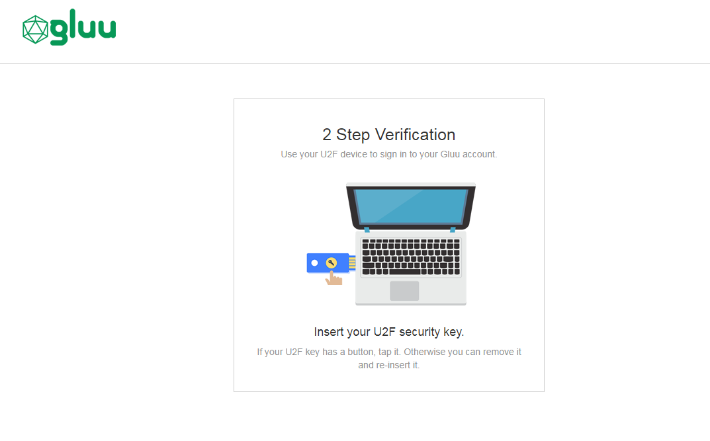

# FIDO U2F

## Overview
FIDO Universal 2nd Factor (U2F) is an open authentication standard that strengthens and simplifies two-factor authentication using specialized USB or NFC devices. 

This document will explain how to use the 
[U2F interception script](https://raw.githubusercontent.com/GluuFederation/oxAuth/master/Server/integrations/u2f/U2fExternalAuthenticator.py) 
to implement a two-step authentication process with username and password as the first step, and any U2F device as the second step. 

Below is the illustration of U2F login page, which would be shown after first step.



### U2F Devices
Some well known U2F devices and manufacturers include:           

- [Yubico](https://www.yubico.com/)      
- [Vasco DIGIPASS SecureClick](https://www.vasco.com/products/two-factor-authenticators/hardware/one-button/digipass-secureclick.html)   
- [HyperFIDO](http://hyperfido.com/)       
- [Feitian Technologies](http://www.ftsafe.com/)      

[Purchase U2F devices on Amazon](https://www.amazon.com/s/ref=nb_sb_noss/146-0120855-4781335?url=search-alias%3Daps&field-keywords=u2f). 

Or, check [FIDO's certified products](https://fidoalliance.org/certification/fido-certified-products/) for a comprehensive list of U2F devices (sort by `Specification` == `U2F`). 

## Prerequisites
- A Gluu Server ([installation instructions](../installation-guide/index.md));      
- [U2F interception script](https://github.com/GluuFederation/oxAuth/blob/master/Server/integrations/u2f/U2fExternalAuthenticator.py) (included in the default Gluu Server distribution);     
- At least one U2F device for testing, like one of the devices [listed above](#u2f-devices).   

## Properties
The script has the following properties

|	Property	|	Description		|	Example	|
|-----------------------|-------------------------------|---------------|
|u2f_application_id		|URL of the application		|`https://idp.mycompany.com`|
|u2f_server_uri		|DNS/URL of the oxauth/u2f server|`https://idp.mycompany.com`|
|u2f_server_metadata_uri|URL of the u2f server metadata|`https://idp.mycompany.com`|

## Enable U2F

Follow the steps below to enable U2F authentication:

1. Navigate to `Configuration` > `Manage Custom Scripts`.    

2. Click on the `Person Authentication` tab       


3. Find the U2F script       


4. Enable the script by checking the box       


5. Scroll to the bottom of the page and click `Update`

Now U2F is an available authentication mechanism for your Gluu Server. This means that, using OpenID Connect `acr_values`, applications can now request U2F authentication for users. 

!!! Note 
    To make sure U2F has been enabled successfully, you can check your Gluu Server's OpenID Connect 
    configuration by navigating to the following URL: `https://<hostname>/.well-known/openid-configuration`. 
    Find `"acr_values_supported":` and you should see `"u2f"`. 

## Make U2F the Default Authentication Mechanism

Now applications can request U2F authentication. If U2F should be the default authentication mechanism, follow these instructions: 

1. Navigate to `Configuration` > `Manage Authentication`. 
2. Select the `Default Authentication Method` tab. 
3. In the Default Authentication Method window you will see two options: `Default acr` and `oxTrust acr`. 


- The `oxTrust acr` field controls the authentication mechanism that is presented to access the oxTrust dashboard GUI (the application you are in).    
- The `Default acr` field controls the default authentication mechanism that is presented to users from all applications that leverage your Gluu Server for authentication.    

You can change one or both fields to U2F authentication as you see fit. If you want U2F to be the default authentication mechanism for access to oxTrust (the admin portal) and all other applications that leverage your Gluu Server, change both fields to U2F.  

## FIDO entries in LDAP
Entries of FIDO U2F can be found in LDAP under the user section as in the below. You can use your preferred LDAP browser
to view the entries.


## FIDO Discovery Endpoint  
Your Gluu Server FIDO discovery endpoint can be found at `https://<hostname>/.well-known/fido-u2f-configuration`

## FIDO SCIM APIs

The SCIM standard is concerned with two classes of resources, namely, users and groups. However, according to spec, the service can be extended to add new resource types. The Gluu Server implementation of SCIM contains a resource type called "Fido device". 

### FIDO devices

A FIDO device represents a user credential stored in the Gluu Server LDAP that is compliant with the [FIDO](https://fidoalliance.org) standards. These devices are used for strong authentication.

Including FIDO devices as a resource type will allow application developers to query, update and delete a users existing FIDO devices. Adding devices does not take place through the service though since this process requires direct end-user interaction, i.e. device enrollment.

The following is a summary of features of a FIDO Device SCIM resource:

* Schema urn: `urn:ietf:params:scim:schemas:core:2.0:FidoDevice`
* Name of resource: `FidoDevice`
* Endpoint URL (relative to base URL of service): `/scim/v2/FidoDevices`
* Device attributes: Attributes pertaining to this resource type are listed by visiting the URL `https://<host-name>/identity/restv1/scim/v2/Schemas/urn:ietf:params:scim:schemas:core:2.0:FidoDevice`. 

Currently the service supports:
* Device search and retrieval (via `GET` and `POST`)
* Single device update via `PUT`
* Single device deletion via `DELETE`

### Example: querying enrolled Super Gluu devices

Say we are interested in having a list of iOS supergluu devices a user has enrolled. In a setting of test mode, we may issue a query like this:

```
curl -G -H 'Authorization: Bearer ...access token...' --data-urlencode 'filter=deviceData co "ios"' -d count=10 -o output.json https://<host-name>/identity/seam/resource/restv1/scim/v2/FidoDevices/
```

Your result list might look like:

```
{
  "totalResults": ...,
  "itemsPerPage": ...,
  "startIndex": 1,
  "schemas": [
    "urn:ietf:params:scim:api:messages:2.0:ListResponse"
  ],
  "Resources": [
    {
      "id": "...",
      "meta": {...},
      "schemas": ["urn:ietf:params:scim:schemas:core:2.0:FidoDevice"],
      "userId": "...",
      ...
      "deviceData": "{\"uuid\":\"ABC123\", \"type\":\"iPhone\", \"platform\":\"ios\", \"name\":\"Someone's iPhone\", \"os_name\":\"iOS\", \"os_version\":\"10.0.1\"}",
      "displayName": ...,
    }
  ]
}
``` 


