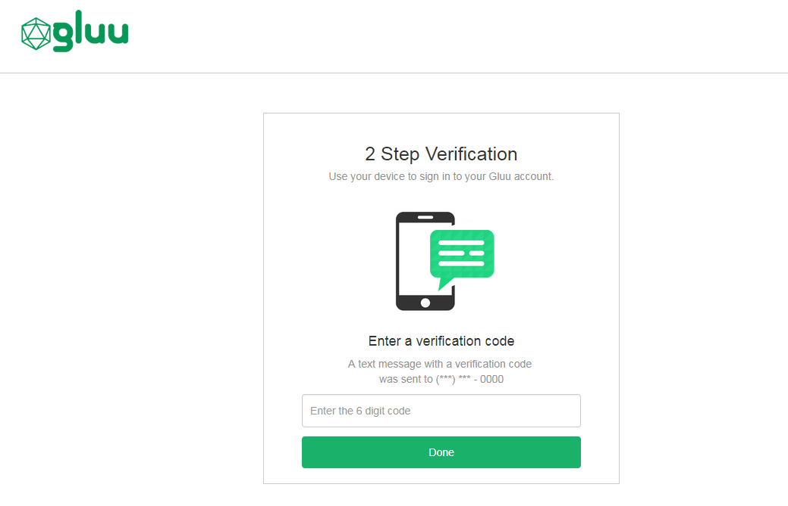
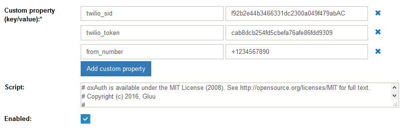

# SMS One-Time Password (OTP) Authentication

## Overview
In this document you will learn how to configure second-factor authentication in Gluu Server 
using One-time passcodes (OTP) sent via SMS. Here, we will use the [Twilio](https://www.twilio.com) 
service to deliver messages. Twilio sends OTP to the registered mobile number, sent OTP needs to be entered in the 
second login screen, which looks like the screen below. Below is a sample of second step of the authentication.



## Prerequisites 

- A Gluu Server (installation instructions [here](../installation-guide/index.md))
- The [Twilio SMS OTP script](https://github.com/GluuFederation/oxAuth/blob/master/Server/integrations/twilio_sms/twilio2FA.py) (included in the default Gluu Server distribution)

!!! Note:
    The SMS OTP script included in the default Gluu Server distribution relies on the Twilio messaging service. If you use a different messaging service, you will need to modify your interception script.
    
## Twilio Configuration

Twilio accounts feature Voice, SMS, and MMS capabilities but we will only need SMS here. You can start with a trial account to see how SMS OTP authentication is integrated into Gluu Server. When you are ready to move to production, you will want to purchase a Twilio plan.

When registering for a Twilio account, you will be asked to verify your personal phone number, and then will be given a Twilio phone number. Ensure the number given is [SMS enabled](https://support.twilio.com/hc/en-us/articles/223183068-Twilio-international-phone-number-availability-and-their-capabilities) and that it supports sending messages to the countries you are targeting. You may need to enable such countries manually (see the [Geo permissions page](https://www.twilio.com/console/sms/settings/geo-permissions)).

Trial accounts only allow sending messages to mobile numbers already linked to the account, so for testing you will want to add (and verify) some additional numbers (besides your personal one) to make sure the integration is working as expected. 
    
## Properties

The custom script has the following properties:

|	Property	|	Description		|
|-----------------------|-------------------------------|
|twilio_sid		|Twilio account SID		|
|twilio_token		|Access token associated to Twilio account|
|from_number            |Twilio phone number assigned to the account|


## Enable SMS OTP

Using your admin credentials login to oxTrust and go to `Configuration` > `Custom scripts`. 

Scroll down and find the script whose name is `twilio_sms`. Populate the following properties:

* `twilio_sid`: Paste the *"Account SID"* of your recently created Twilio account. You can find this value in your account dashboard

* `twilio_token`: Similar to your SID, you were also given a token upon registration.

* `from_number`: Use the Twilio number that was provided when you created your account (not your personal number).

If some property is not already being shown in the UI, just press the "Add custom property" and fill the values accordingly. Use the delete icons on the right to remove a row if necessary. Also ensure "Enabled" is checked.

So far, your configuration may look like this:



Scroll down to the bottom of the page and clik the "Update" button.

## Make SMS OTP the Default Authentication Mechanism

Finally, Navigate to `Configuration` > `Manage Authentication` > `Default Authentication Method`. Select **"twilio_sms"** as default. **Do not** log out yet.

While the script and configurations are reloaded, have one or more LDAP users ready for the test. Ensure their entries contain the attribute `phoneNumberVerified` with appropriate values set.

Using a separate browser session, try to authenticate to Gluu server. After providing username and password, you will be requested to enter an OTP code. 

In most cases, you will get a SMS with the six-digit code delivered to user's registered mobile phone as soon as the login button was pressed. Enter the code and authentication should have succeeded.

If you encounter a problem, take a look at the logs, specially `/opt/gluu/jetty/oxauth/logs/oxauth_script.log`. You may revert the default authentication method using the browser session in oxTrust you already have open.

Inspect all messages related to OTP. For instance, the following messages show an example of correct script initialization:

```
OTP. Initialization
OTP. Load OTP configuration
OTP. Initialized successfully
```
