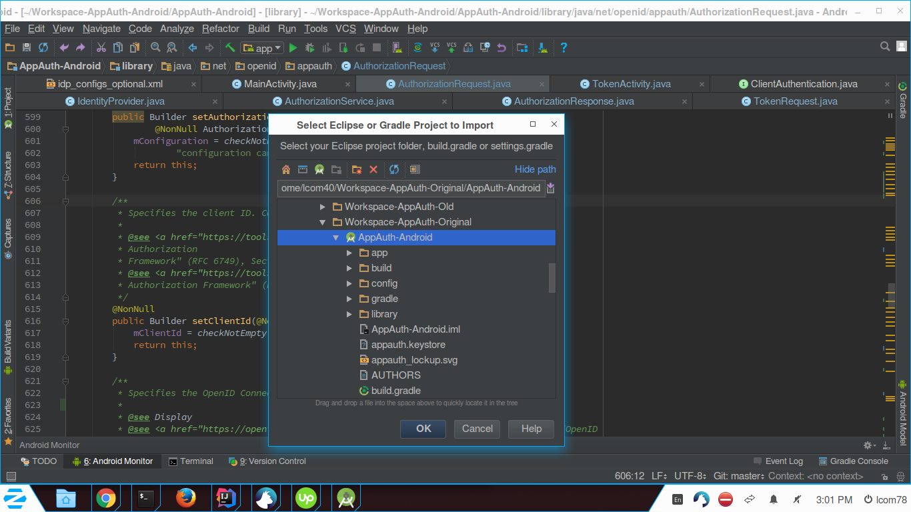
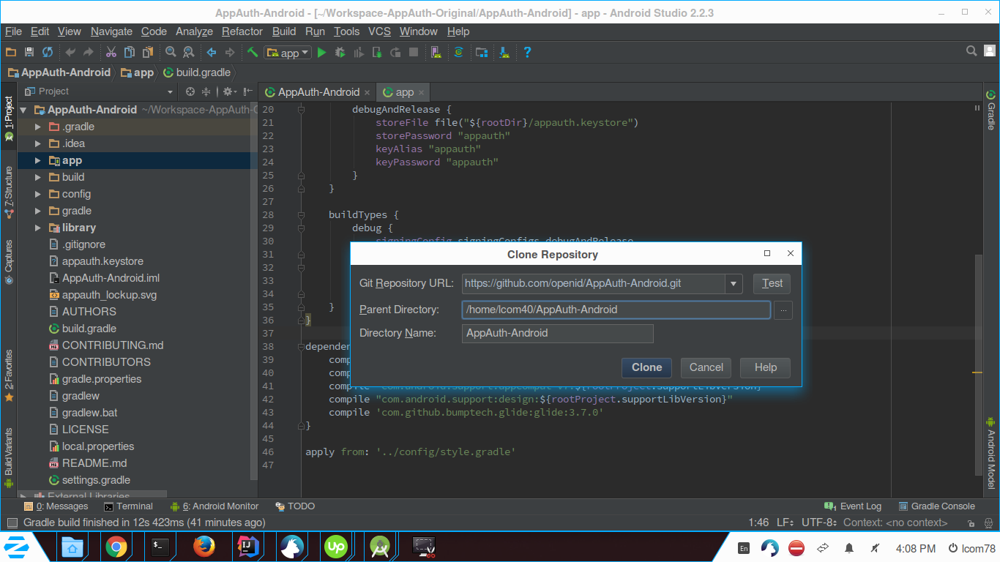

# AppAuth Android

## Prerequisite
 
   1. A Gluu Server up and running(installation doc is available [here](https://gluu.org/docs/ce/installation-guide/install/))
   1. AndroidStudio with a virtual/real device(downloadable [here](https://developer.android.com/studio/index.html))
 
## Overview

AppAuth for Android is a client SDK for communicating with OAuth 2.0 and OpenID Connect providers. It strives to directly map the requests and responses of those specifications, while following the idiomatic style of the implementation language. In addition to mapping the raw protocol flows, convenience methods are available to assist with common tasks like performing an action with fresh tokens. More information can be found [here](https://appauth.io).
 
Gluu server is certified OpenId Provider and supports
[Native Apps](https://tools.ietf.org/html/draft-ietf-oauth-native-apps)
either through custom URI scheme redirects, or App Links.

You can download (or clone) project from [Github Repository](https://github.com/openid/AppAuth-Android).
The specification is also describe there too. It is recommented to read this specification.
  
Below are steps we are going to go through:

1. OpenId Client registration on Gluu Server
1. Clone and customize the AppAuth android demo
1. Demonstration

## register an openId Client on Gluu server 

You can follow [this](https://gluu.org/docs/ce/admin-guide/openid-connect/#client-registration-configuration) documentation to add openid client on gluu server. The following are the required fields and their respective value.
   - Client Name: We use `AppAuthAndroidApp`, you can use what ever name you want here.
   - Application Type: `Native` or `Web`
   - Pre-Authorization: `False`
   - Persist client Authorizations: `True`
   - Authentication method for the Token Endpoint: `none`
   - Redirect Login URIs: make sure the value provide here is an hierarchical and absolute uri. For example, if you declare custom scheme `myscheme` and host `client.example.com` then redirectURL will look like: `myscheme://client.example.com`. We use `appscheme://client.example.com` for our testing purpose
   - Scopes: `openid`,`profile`,`email`
   - Grant types: `authorization_code`

!!! Note
    Take note of the `client_id` value after registration. That value is required in the Android App Side and looks like this `@!ACCF.2BA5.0292.66A5!0001!6990.4C6C!0008!36B8.5CE5.24E2.91AD`.
  
If you still want to use client secrete in you app for  `Authentication method for the Token Endpoint` 
you can check official doc by [AppAuth](https://github.com/openid/AppAuth-Android/blob/master/README.md#utilizing-client-secrets-dangerous)  

## Build and configure the AppAuth android demo
 
### Build the project

Android Studio is an official IDE for Android.
You can find Android Studio, it's features, docs, user guide etc.
from [Official Android Website for developers](https://developer.android.com/studio/index.html).
 
There are two ways to build existing project either download source code zip
file or clone repository.
 
#### Import from the download source code

If you have downloaded source code zip file then follow below steps to
import project in Android Studio:
 
1. Extract the source code zip file in your desired folder in your
computer's file system.

1. Open Android Studio, Go to `File` -> `New `-> `Import project`. It will
prompt to select existing project from your computer.

1. Browse the folder where you extracted source code file and select
the build.gradle file of the project.

    

1. Click `OK` and it will start building project.
 
#### Clone the project

Another way if you don't want to download source code manually and want
to clone repository then follow below steps:
 
1. Open Android Studio, Go to `File` -> `New` -> `Project from Version Control`
-> `Git`.

    

1. It will prompt in which you need to provide following details and then
click `Clone`.
 
    - Git Repository URL: Repository URL which you want to clone
    - Parent Directory: Folder location in which you want to store
    - project in your computer
    - Directory Name: Project Name
    

1. It will Clone repository into the folder you mentioned
in **Parent Directory** above and start building the project.
 
If you get an error like: "Error:Could not find
com.android.support:customtabs:26.0.1." then be sure you have installed
the Android Support Library from the Android SDK Manager. Follow the
Android Studio prompts to resolve the dependencies automatically.
 
Once the project build successfully, you can see that there are two
modules in the project.
 
- App(Demo app which use AppAuth library)
- Library(AppAuth library project)

### Configuration  

#### Modifiy the `RedirectUriReceiverActivity` file

After completing authorization in custom tab, above custom scheme
will redirect back to app.
The library configures the `RedirectUriReceiverActivity` to
handle a custom scheme and need to declare this activity into
your `AndroidManifest.xml` file by adding following:
 
```xml
    <activity android:name="net.openid.appauth.RedirectUriReceiverActivity">
        <intent-filter>
            <action android:name="android.intent.action.VIEW"/>
            <category android:name="android.intent.category.DEFAULT"/>
            <category android:name="android.intent.category.BROWSABLE"/>
            <data android:scheme="YOUR_CUSTOM_SCHEME"
                android:host="YOUR_REDIRECT_HOST"/>
        </intent-filter>
    </activity>
```
Example here:

 
#### Modify the `auth_config.json` file

Replace following `auth_config.json` file of app located at `app/res/raw/auth_config.json`
with following content:
 
```json
{
  "client_id": "Put ClientId obtained from registration here",
  "redirect_uri": "Put custom scheme redirect_uri here",
  "authorization_scope": "openid email profile",
  "discovery_uri": "<IDP hostname>.well-known/openid-configuration",
  "authorization_endpoint_uri": "",
  "token_endpoint_uri": "",
  "registration_endpoint_uri": "",
  "https_required": true
}
```

 
_If you keeps client_id blank it will Automatically initialize "**Dynamic client registration**" process mentioned above._
 
## Demonstration

- Make sure there is a user register in Gluu server that you can use to test the application.
Use Oxtrust Gui to do that.
- Launch the app from Android Studio:
  You will see this screen:

   

- Click the `START AUTHORIZATION` button:
  That will redirect you to your gluu instance login page

 
 
 

- Provide the user credentials and hit the `login` button
  The result is something like this:


 
