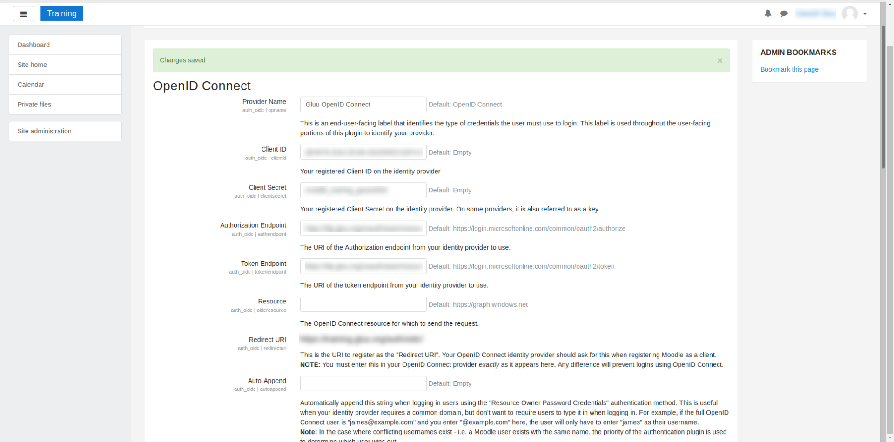

# SSO To Moodle
## Overview

The following doc describes how to achieve SSO to Moodle using the Gluu Server IDP and the Moodle OpenID Connect (OIDC) plugin from Office 365.

## Install OIDC in Moodle

Clone the `moodle-auth_oidc` source code from its git repo:

```
# git clone https://github.com/Microsoft/moodle-auth_oidc.git
```

Let's assume that Moodle is installed at the following location: 

`/var/www/html/moodle.yoursite.com/public_html/`. 

Move the code to auth as follows:

```
# mv  moodle-auth_oidc   /var/www/html/moodle.yoursite.com/public_html/auth/oidc
```

Login as admin to your Moodle site and then navigate to:

`Site administration` > `Plugins` > `Authentication` 

Follow the on-screen instructions about updating the database. 

## Add OIDC Client in Gluu 
In oxTrust, navigate to `OpenID Connect` > `Clients`. 

Create a new client with the following specifications:

| Attribute Name     |              Values       |
|-------------------------|---------------------------------------|
| Client Name     | Your desired value|| Application Type        | Web |
| Pre-Authorization        |Enabled                        |
| Authentication method for the Token Endpoint     |   `client_secret_post`    |
| Redirect Login URIs   | `https://<hostname>/auth/oidc/` |
| Scopes | address, email, openid, permission, phone, profile, user_name |
| Response Types | code, token, id_token |
| Grant Types | authorization_code, implicit, refresh_token |
| Logout Session Required | True |

## Configure Gluu in Moodle



Enter the corresponding values in the Moodle OIDC form:

| OIDC Form Field Name     |              Values       |
|-------------------------|---------------------------------------|
| Provider Name | Gluu OpenID Connect |
| Client ID | Enter the value from the newly created client |
| Client Secret | Enter the value from the newly created client|
| Authorization Endpoint | Enter the authorization_endpoint value, which can be found at `https://<idp-hostname>/.well-known/openid-configuration` |
| Token Endpoint |Enter the token_endpoint value, which can be found at `https://<idp-hostname>/.well-known/openid-configuration` |
| Redirect URI auth_oidc | `https://<hostname>/auth/oidc/` |
