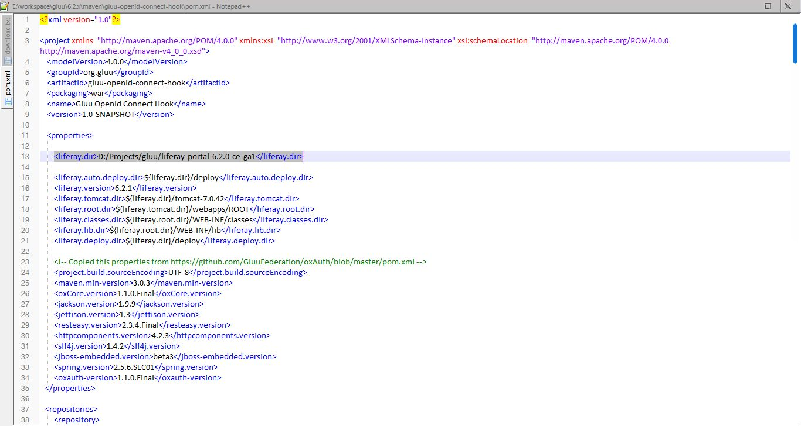
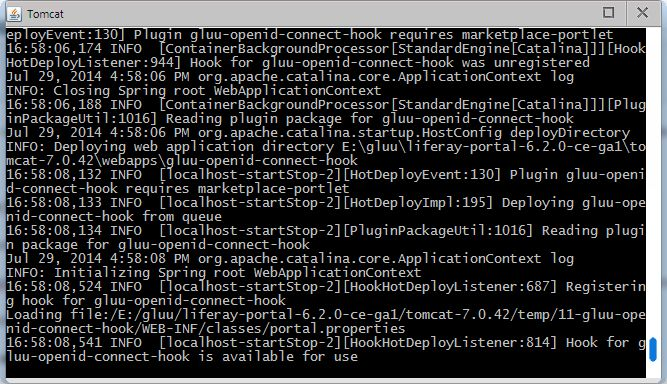
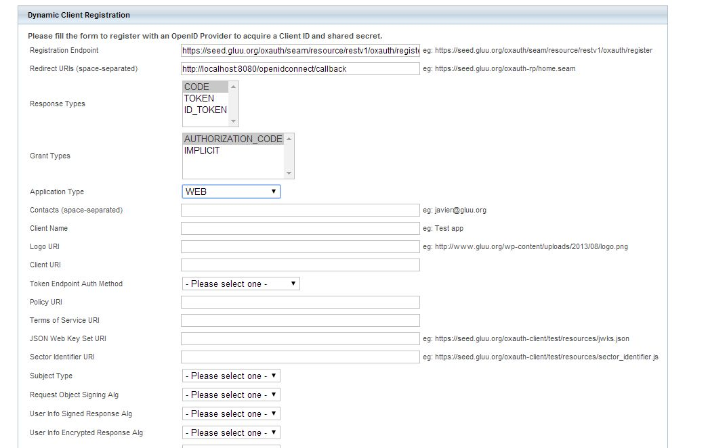
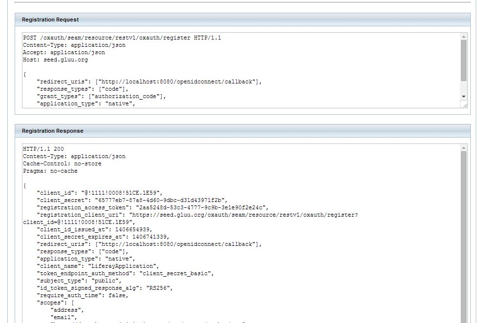
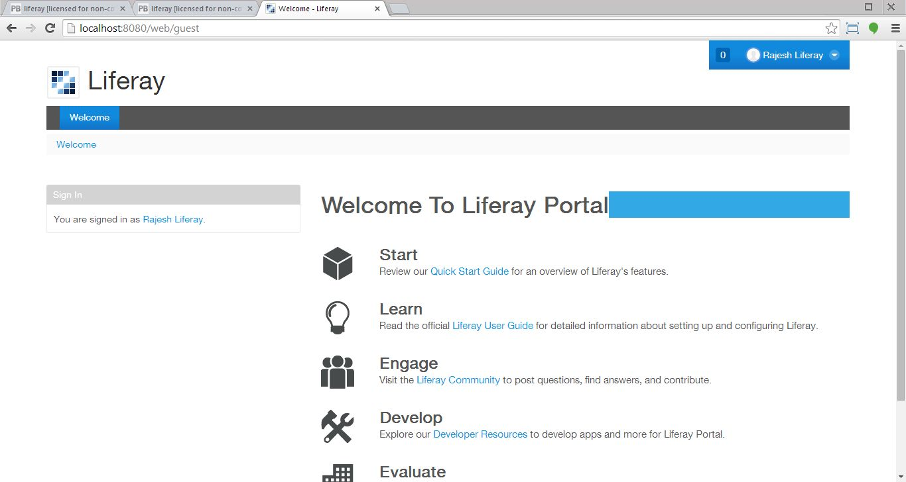

# mod_auth_openidc RP Integration

## Basic Web Server Installation

Before you can install mod_auth_openidc, you need to have an Apache
HTTPD server running with SSL enabled. 

### Apache Web Server

It is assumed that all the hostnames will be dns resolvable. If not, 
then add the entries in `/etc/hosts` file on both the web server
and Gluu Server. 

If you don't have the Apache HTTPD server installed, use apt-get
to install the Ubuntu standard distribution:

``` text
# apt-get install apache2
# service apache2 start
```

### SSL Configuration
The SSL Module is necessary for the Apache OpenID Connect Module. Please 
use the following commands to activate the `ssl module`.

``` text
# a2enmod ssl
```

The next step is to create a self-signed SSL Certificate.

* Create a directory to put the generate the ssl certificate

``` text
# mkdir /etc/apache2/ssl`
# openssl req -x509 -nodes -days 365 -newkey rsa:2048 -keyout /etc/apache2/ssl/apache.key -out /etc/apache2/ssl/apache.crt
```

* Answer the questions that are asked. A template is given below

``` text
	Country Name (2 letter code) [AU]:US
	State or Province Name (full name) [Some-State]:TX
	Organization Name (eg, company) [Internet Widgits Pty Ltd]:Acme Inc.
	Organizational Unit Name (eg, section) []:
	Common Name (e.g. server FQDN or YOUR name) []:www.mydomain.com
	Email Address []:help@mydomain.com
```

#### Configure Apache to use SSL
This section will guide you through the steps to configure apache to 
use the SSL module

1. Open the `default-ssl.conf` file

``` text
# vim /etc/apache2/sites-available/default-ssl.conf`

```

2. Update the certificate locations with the newly created certificates 
`/etc/apache2/ssl/apache.key` and `/etc/apache2/ssl/apache.crt`

3. Activate the SSL Virtual Host and CGI

``` text
# a2ensite default-ssl.conf
# a2enmod cgid
# service apache2 restart

```

At this point, its a good time to test to make sure SSL and CGI are 
working. Point your browser at 
https://www.mydomain.com/cgi-bin/printHeaders.cgi
You should see a list of current environment variables. 

## Configuration of mod_auth_openidc 

### Installation

`mod_auth_openidc` module depends on the Ubuntu package `libjansson4`: 

``` text
# apt-get install libjansson

```

You'll also need the mod_auth_openidc and libjose packages which can 
be downloaded from the [Releases Page](https://github.com/zmartzone/mod_auth_openidc/releases).

For example, at this time the current release is 2.1.3, so the command would be:

``` text
# wget https://github.com/pingidentity/mod_auth_openidc/releases/download/v2.1.3/libcjose_0.4.1-1ubuntu1.trusty.1_amd64.deb
# wget https://github.com/pingidentity/mod_auth_openidc/releases/download/v2.1.3/libapache2-mod-auth-openidc_2.1.3-1ubuntu1.trusty.1_amd64.deb
# dpkg -i libcjose_0.4.1-1ubuntu1.trusty.1_amd64.deb
# dpkg -i libapache2-mod-auth-openidc_2.1.3-1ubuntu1.trusty.1_amd64.deb

```

!!! Note
    Get the latest packages here: https://github.com/zmartzone/mod_auth_openidc/releases

Note, if you like to build from source, you can clone the project at [Github Page](https://github.com/zmartzone/mod_auth_openidc)

Now you can enable the module

``` text
# sudo a2enmod auth_openidc
# sudo service apache2 restart

```

### Client Registration

There are two methods for client registration:

1. Dynamic Client Registration
2. Manual Client Registration

For this example, let's create the client manually in the Gluu Server.
When you add the client, use the following parameters:

``` text
Name: mod_auth_openidc
Client Secret: something-sufficiently-unguessable
Application Type: Web
Pre-Authorization: Enabled
login uri: https://www.mydomain.com/callback
Subject Type: Public
Scopes: openid, profile, email
Response Types: code
Grant Types: authorization_code

```

Make a note of the `client_secret` (you won't get to see it again)! You'll
also need the `client_id` for the next step.

### Install CGI script

This cgi-script makes for a good test page! 

``` text
# vi /usr/lib/cgi-bin/printHeaders.cgi

```

Then paste in this code

``` python
#!/usr/bin/python

import os

d = os.environ
k = d.keys()
k.sort()

print "Content-type: text/html\n\n"

print "<HTML><Head><TITLE>Print Env Variables</TITLE></Head><BODY>"
print "<h1>Environment Variables</H1>"
for item in k:
    print "<p><B>%s</B>: %s </p>" % (item, d[item])
print "</BODY></HTML>"

```

Then you'll need to make the script executable by the Apache2

``` text
# chown www-data:www-data /usr/lib/cgi-bin/printHeaders.cgi
# chmod ug+x /usr/lib/cgi-bin/printHeaders.cgi

```

### Configuring the Apache VirtualHost 

You are almost done! You'll need to configure mod_auth_openidc to
protect your server.

``` text
# vi /etc/apache2/sites-available/default-ssl.conf

```

Add the following right under `<VirtualHost _default_:443>`

``` apacheconf
OIDCProviderMetadataURL https://idp.mydomain.com/.well-known/openid-configuration
OIDCClientID (client-id-you-got-back-when-you-added-the-client)
OIDCClientSecret (your-client-secret)
OIDCRedirectURI https://www.mydomain.com/callback
OIDCResponseType code
OIDCScope "openid profile email"
OIDCSSLValidateServer Off
OIDCCryptoPassphrase (a-random-seed-value)
OIDCPassClaimsAs environment
OIDCClaimPrefix USERINFO_
OIDCPassIDTokenAs payload
<Location "/">
    Require valid-user
    AuthType openid-connect
</Location>

```

Then restart Apache to effect the changes

``` text
# service apache2 restart

```

The most confusing part here is the `OIDCRedirectURI`--don't set this
to a path used by your server. The apache-filter uses the redirect_uri 
to process the response from the OpenID Provider (Gluu Server). 

Now you're ready to test. Open your web browser, and point it at 
`https://www.mydomain.com/cgi-bin/printHeaders.cgi` 

If you're not logged in already, you should be redirected to 
the authentication page. If you are logged in, you should just see
an html page with the `REMOTE_USER` variable populated. Also
check out the `OIDC_id_token_payload` and all the claims for 
`USERINFO_` 

## Installation

We assume that all the hostnames will be dns resolvable. If not, then
add the according entries in `/etc/hosts`, please.

### Add EPEL Repository

Run the following command to __Add EPEL Repo__.

* `# rpm -ivh http://download.fedoraproject.org/pub/epel/6/x86_64/epel-release-6-8.noarch.rpm`

### Apache Web Server

To setup __Apache2 SSL__, run the following commands:

!!! Note
    If the hiredis package is not found by the `yum` command, please download it manually from [this page](https://centos.pkgs.org/6/puias-unsupported-x86_64/hiredis-0.12.1-1.sdl6.x86_64.rpm.html) and install it.

```
# yum install httpd mod_ssl
# yum install curl hiredis jansson
```

### Configure SSL Module
This section will guide you to create SSL certificates.
Use the following commands to crete a  directory and generate the certificates.

```
# mkdir /etc/httpd/ssl
# openssl req -new -x509 -sha256 -days 365 -nodes -out /etc/httpd/ssl/httpd.pem -keyout /etc/httpd/ssl/httpd.key
```

You will be prompted to enter some values such as company name, country etc. Please enter them and your certificate will be ready. A template is given below

```text
	Country Name (2 letter code) [XX]:US
	State or Province Name (full name) []:TX
	Locality Name (eg, city) [Default City]:Austin
	Organization Name (eg, company) [Default Company Ltd]:Gluu
	Organizational Unit Name (eg, section) []:
	Common Name (eg, your name or your server's hostname) []:modauth-centos.info
	Email Address []:support@gluu.org
```

The next step is to configure Apache to use the certificates and use the following command to edit the `ssl.conf` file. 
```
# vi /etc/httpd/conf.d/ssl.conf
```

The important part of the configuration is to enter the path to the created SSL certificates. The example is given below.<br/>
**Note:** Please make sure to use the correct server name in the configuration file.

```
    SSLCertificateFile /etc/httpd/ssl/httpd.pem
    SSLCertificateKeyFile /etc/httpd/ssl/httpd.key
    ServerAdmin support@gluu.org
    ServerName gluu.org
```

Restart Apache Server and you are done configuring the SSL Module. Use the command below to restart the Apache Server.

```
# service httpd restart
```

### Authentication Module (mod_auth_openidc)
!!! Note
    The latest version of the apache OpenID Connect module is available from [this page](https://github.com/zmartzone/mod_auth_openidc/releases)

The latest package for the apache module might have multiple dependencies which must be installed first.


Run the following command to install the `mod_auth_openidc` module:

```
rpm -ivhhttps://github.com/zmartzone/mod_auth_openidc/releases/download/v1.8.2/mod_auth_openidc-1.8.2-1.el6.x86_64.rpm
```

!!! Note
    If there are any difficulties installing `hiredis` and `jansson`,
try to update the package database of your system using the command below.

```
# yum upgrade
```
#### Load Authentication Module 
Please make sure that the following shared-object file exists by running the following command:

```
ls -l /usr/lib64/httpd/modules/mod_auth_openidc.so
```
## Install CGI Script
The test page is made using the cgi-script. Please use the following command to create the script.

```
# vi /var/www/cgi-bin/printHeaders.cgi
```

Please paste the following code to prepare the script

```python
#!/usr/bin/python

import os

d = os.environ
k = d.keys()
k.sort()

print "Content-type: text/html\n\n"

print "<HTML><Head><TITLE>Print Env Variables</TITLE></Head><BODY>"
print "<h1>Environment Variables</H1>"
for item in k:
    print "<p><B>%s</B>: %s </p>" % (item, d[item])
    print "</BODY></HTML>"

```

The next step is to make the script executable by HTTPD

```text
# chown apache:apache /var/www/cgi-bin/printHeaders.cgi
# chmod ug+x /var/www/cgi-bin/printHeaders.cgi
```

### Client Registration

There are two methods for client registration:

1. Dynamic Client Registration
2. Manual Client Registration

You can use any of the methods to register the client.
For this example, let's create the client manually in the Gluu Server.
Please use the following parameters to create the client:

```text
Name: mod_auth_openidc
Client Secret: something-sufficiently-unguessable
Application Type: Web
Pre-Authorization: Enabled
login uri: https://www.mydomain.com/callback
Subject Type: Public
Scopes: openid, profile, email
Response Types: code
```

!!! Note
    The `client_secret` should be noted after creating the client in Gluu Server as it is used later.
### Configure the Apache Virtualhost
The apache module is confgured in the defautl ssl configuration file. Please use the command below to open the file

```text
# vi /etc/httpd/conf.d/ssl.conf 
```

Please add the following at the bottom of the file

```text
OIDCProviderMetadataURL https://idp.mydomain.com/.well-known/openid-configuration
OIDCClientID (client-id-you-got-back-when-you-added-the-client)
OIDCClientSecret (your-client-secret)
OIDCRedirectURI https://www.mydomain.com/callback
OIDCResponseType code
OIDCScope "openid profile email"
OIDCSSLValidateServer Off
OIDCCryptoPassphrase (a-random-seed-value)
OIDCPassClaimsAs environment
OIDCClaimPrefix USERINFO_
OIDCPassIDTokenAs payload
<Location "/">
    Require valid-user
    AuthType openid-connect
</Location>
```

!!! Warning
    Please remember to populate the `OIDCRedirectURI` with a value that is not used by the server. The apache-filter uses the redirect_uri to process the response from the OpenID Provider (Gluu Server).

Please restart the HTTPD server for the changes to take effect

```text
# service httpd restart
```

Now you're ready to test. Open your web browser, and point it at
https://www.mydomain.com/cgi-bin/printHeaders.cgi

## oxRay

[LifeRay][liferay] OpenID Connect plugin to authenticate users using
Gluu IdP.


### Overview

The oxAuth LifeRay plugin is used to authenticate and auto-log users
from Gluu Server into [LifeRay][liferay] with the same credentials. It
is built on top of oxAuth, the OpenID Connect provider by Gluu.

The oxAuth plugin intercepts any attempt to login from anywhere in the
LifeRay and redirects the request and the user to an oxAuth server where
the identification takes place, actually. If the user has authorized the
server to share some of his basic information with the oxAuth plugin,
the user will be redirected back to the LifeRay CMS, and logged in,
automatically.

The goal of this project is to use the LifeRay CMS as the basis for an
organizational personal data store service.

Note: This plugin does not support auto-user creation from information
supplied by the oxAuth Plugin. Instead, it can be implemented by
extending the plugin.

### Deployment

The plugin is provided in two variants--[Maven][maven] and [Ant][ant].
You can either use Maven or the LifeRay plugin SDK to build and deploy
this plugin as a standard LifeRay hot deployable WAR file.

### Deploying WAR file using Maven

This requires a prerequisite: make sure that you have [Maven][maven]
installed on your system to build this plugin from source.

1. Checkout the Maven source from the [oxRay Repository][https://github.com/GluuFederation/oxRay/tree/master/6.2.x/maven/gluu-openid-connect-hook].

2. Open the file `pom.xml` in `gluu-openid-connect-hook`, and update
your local LifeRay Tomcat bundle path. This is required for building the
WAR file and deploying to the LifeRay Tomcat bundle.



3. Run the following command in the `gluu/6.2.x/maven/gluu-openid-connect-hook` 
directory:

```
mvn clean install package liferay:deploy
```

This will take a few seconds to download the dependency `jar` files, and
generate the LifeRay-compiled deployable WAR file. It will be placed
within your `<liferay-bundle-folder>/deploy` directory, and the hot
deployable process will start.

### Using LifeRay Plugin SDK With Ant

This requires a prerequisite: we assume that you have the plugin SDK
both installed and configured with LifeRay bundle.

1. Checkout the gluu-openid-connect-hook plugin source from the
repository, and place these files in your local directory for the plugin
SDK. Usually, this is `liferay-plugins-sdk-6.2.0-ce-ga1/hooks`.

2. Run the following command in the folder `liferay-plugins-sdk-6.2.0-ce-ga1/hooks/gluu-openid-connect-hook`:

```
ant clean deploy
```

### Using Binary From Repository

You can also download a compiled binary as a standard LifeRay deployable
WAR file from the following location:

[oxRay LifeRay Deployable War File](https://github.com/GluuFederation/oxRay/blob/master/6.2.x/binary/gluu-openid-connect-hook-6.2.0.1.war)

Copy this WAR file in your LifeRay bundle. Usually, this is located at
`liferay-portal-6.2.0-ce-ga1/deploy`.

Once the plugin is deployed as a WAR file either using Maven or Ant, you
will see the following success message in your LifeRay Tomcat server:



### Client Registration

A LifeRay application needs to be registered with the Authorization
server before initiating an authentication request/response with OAuth
IdP server.

The following steps are necessary to obtain both a client id and a
client secret. These data will be used within the LifeRay portal
properties.

1. Go to the location `https://seed.gluu.org/oxauth-rp/home.seam`.
2. You will see the Dynamic Client Registration Section.
3. Enter the Registration Endpoint uri, for example
`https://idp.example.org/oxauth/seam/resource/restv1/oxauth/authorize`.
	* You can derive this uri from your IdP auto-discovery uri which is
like that: `https://<Your IDP Server Domain>/.well-known/openid-configuration`.
	* You can search for the registration endpoint, and copy that uri here.
4. Enter the redirect uris as `http://localhost:8080/openidconnect/callback`:
	* Replace your domain name with `localhost:8080`
	* This will be your LifeRay handler for logging a user into LifeRay,
automatically, when a redirect comes back from the OAuth server.
5. Select the Response Types: CODE
6. Select the Application Type: WEB
7. For development purposes use: NATIVE (if you are testing on a local
machine with `localhost:8080` domain)
8. Enter Client Name: LifeRay App (you can choose any name here).
9. All other options can be left as they are--please see the attached
screenshot:



10. Click `Submit`, and both the following `Registration Request` and
`Registration Response` will be displayed:



11. Save the Registration Response to your local system. The parameters
`client_id` and `client_secret` are used in LifeRay when configuring
`portal-ext.properties`.

#### Modifying portal.properties

It is necessary to modify `portal-ext.properties` file to reflect oxAuth
server client credentials and server's URL. It can be accomplished by
navigating into the `liferay-portal-6.2.0-ce-ga1` folder, where the file
`portal-ext.properties` is stored.

Note: To either activate or deactivate the oxAuth plugin put the value
`true` (to activate) or `false` (to deactivate), respectively.

```
gluu.openidconnect.auth.enabled=true
```

* oxAuth client ID and client secret:

```
gluu.openidconnect.client.id=@!1111!0008!51CE.1E59
gluu.openidconnect.client.secret=65777eb7-87a8-4d60-9dbc-d31d43971f2b
```

* OAuth server domain

```
gluu.openidconnect.idp.domain=https://idp.gluu.org`
```

* OAuth server auto discovery URI

```
gluu.openidconnect.url.discovery=https://idp.gluu.org/.well-known/openid-configuration
```

* Your OAuth server logout uri (typically, this will be used to logout a
user from OAuth when a user logs out from LifeRay)

```
gluu.openidconnect.idp.logout=https://idp.gluu.org/identity/logout
```

* LifeRay server callback uri that will be used as a handling response
by the OAuth server after authentication:
   * replace the `localhost:8080` with your LifeRay domain name:

```
gluu.openidconnect.client.redirect.url=http://localhost:8080/openidconnect/callback
```
     This page will be invoked when the user does not exist in the
     LifeRay database, but gets authenticated from the OAuth Server.

* Typically, create a LifeRay page with the name `/no-such-user-found`,
  or redirect to the LifeRay registration page uri like that:

```
gluu.openidconnect.no.such.user.redirect.url=http://localhost:8080/no-such-user-found
```

Restart the LifeRay server after editing the file
`portal-ext.properties`.

### Log In Using the LifeRay Front End

* Server Bootup
	* Once the LifeRay server is restarted, open your browser and
      navigate to the URI `http://localhost:8080`.

* Login URI
	* Once the LifeRay page successfully loaded navigate to the OpenID
      connect page at `http://localhost:8080/openidconnect/login`.

Note: you can edit the theme code, and link to the login uri as
`http://localhost:8080/openidconnect/login`. In result the user will
always redirect to the OAuth server for authentication.

* OAuth authentication
	* The LifeRay login uri will redirect users to the OAuth IdP server
      for user authentication. Internally, passing the oAuth client id 
      as the following screen:


* Request for permission
	* This screen can be configured depending upon your OAuth Server
      implementation.


* OAuth callback (user auto-login to LifeRay)
	* After a successful authentication with the OAuth server, IdP will
send a callback to LifeRay with a specific code as a parameter:

```
http://localhost:8080/openidconnect/callback?code=xxx`
```

This will be intercepted by our oxAuth LifeRay plugin. Upon validation
of the token with the Gluu IdP, it will result in a login of the user to
the LifeRay. The user will be redirected to his respective start page.



[ant]: https://en.wikipedia.org/wiki/Apache_Ant "Apache Ant, Wikipedia"

[liferay]: https://en.wikipedia.org/wiki/Liferay "LifeRay, Wikipedia"

[maven]: https://en.wikipedia.org/wiki/Apache_Maven "Apache Maven, Wikipedia"

[oxray]: https://github.com/Gluufederation/oxRay/6.2.x/maven "oxRay repository"

## Using OpenID Connect to authenticate a person in Java

The [OpenID Connect](https://openid.net/connect/) Protocol offers Java
developers a way to authenticate a person at any Internet domain that
supports the standard. To accomplish this, the domain must provide a way
to register clients--the website and mobile applications that use the
authentication API offered by the domain.

## Discovery

Discovery is the first step! Luckily, its super-easy! All you have to 
do is make a get request to
`https://{domain}/.well-known/openid-configuration`.

This will return a JSON object, as described in the
[specification](http://openid.net/specs/openid-connect-discovery-1_0.html).
For example, you can see Gluu's OpenID Connect discovery
[url](https://idp.gluu.org/.well-known/openid-configuration).

This will tell you everything you need to know about this OpenID Connect
provider, like what are the endpoints (URLs), what crypto is supported,
and what user claims can you ask for.

An [example](../OpenIdConnectDiscoveryAction.java)
of a Discovery Request, using the oxAuth RP library.

### Client Registration

In SAML, the website was called a "Service Provider." In OpenID Connect,
the website (or mobile application) is called a "Client". Clients can be
registered manually by the OP, but more frequently, clients use the
[Dynamic Registration
API](http://openid.net/specs/openid-connect-registration-1_0.html) to
automate the process.

### Obtaining the id_token 

After your client is registered, it is time to get down to business.
OpenID Connect offers two common workflows for authentication: basic
(where the person is using a browser, and can be re-directed) and
implicit where the client sends the credentials, including the secret.
There is a useful implements guide for
[basic](http://openid.net/specs/openid-connect-basic-1_0.html) and
[implicit](http://openid.net/specs/openid-connect-implicit-1_0.html).

### Logout 

OpenID Connect defines a mechanism for [Session
Management](http://openid.net/specs/openid-connect-session-1_0.html).
The idea is that JavaScript in a web tab can detect that another tab has
logged out. One detection of a logout event, the Web application can
cleanup sessions in any backend systems as necessary. It is not 100%
effective. If the tab is closed when the logout occurs in another tab,
the event may not be detected, and the backend systems are advised to
timeout sessions.

## Using OpenID Connect from JavaScript
See [OpenID Connect plugin for Passport](http://www.gluu.co/.qqh2) for further details.

