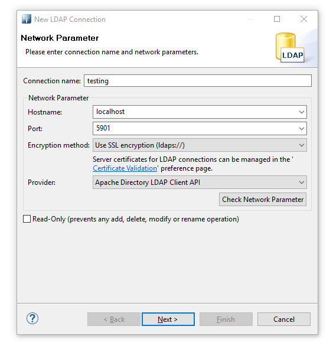
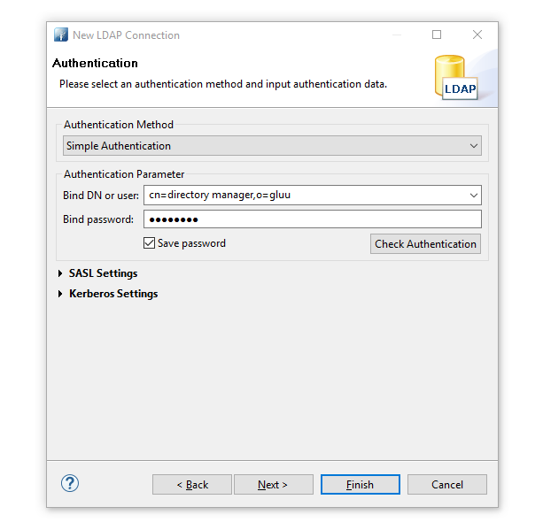
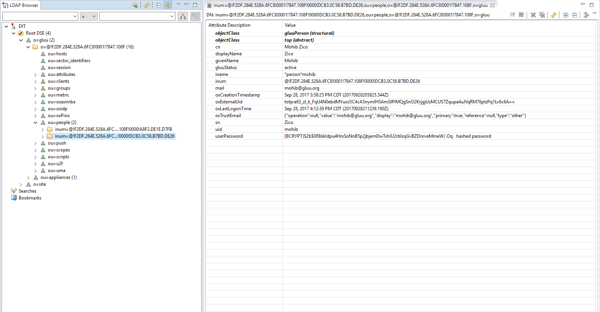
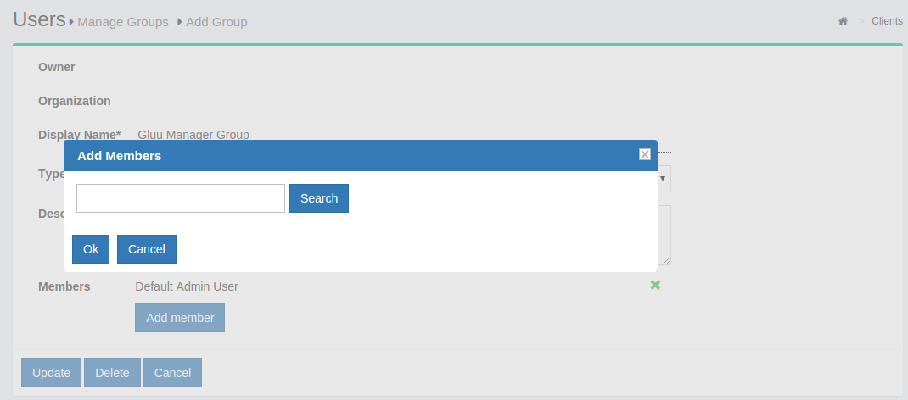

# Local User Management
In this document we cover managing people in the Gluu Server's OpenLDAP Directory and graphical user interface "oxTrust".

We also briefly cover the Gluu Server's **very basic** out-of-the-box user registration feature. However, when it comes to user registration, we almost always recommend writing your own registration process, then using the [SCIM 2.0 APIs](./scim2.md) to register the users in your Gluu service. 

## Manage users in Gluu LDAP
All the data generated by the Gluu Server is stored in its local LDAP server (included in every deployment). In the LDAP you can see full details like how OpenID Connect clients are stored and how user objects are mapped in the LDAP tree.

You will need an LDAP browser like [JXplorer](http://jxplorer.org/) and can find configuration in `/opt/gluu-server-3.1.3/etc/gluu/conf/ox-ldap.properties`, e.g.:

```
bindDN: cn=directory manager,o=gluu
bindPassword: foobar
servers: localhost:1636
```

You will need to establish a tunnel from your computer to the target Gluu Server's LDAP. Tunneling is required because Gluu Server's LDAP port, 1636, is not exposed to the Internet.

In the below example we are showing how to connect and use Gluu Server's internal LDAP server with any LDAP browser. 

 - Create tunnel:   
   - `ssh -L 5901:localhost:1636 root@[ip_of_Gluu_server]`
 - Open LDAP browser        
   - Create new connection 
       
   - Perform authentication. 'Password' is the the password of 'admin' user.  
        
   - Browse ldap and go to 'ou=people'.           
            


## Manage People in oxTrust
To manage people in oxTrust, navigate to `User` > `Manage People`.

From this interface you can add and search users. Because the user database can potentially be very large, a value with at least two characters is required in the search field. In other words, you can not click search with a blank entry to populate all users. If you need to see all users, this would be best performed manually within the [Gluu LDAP server](#manage-users-in-gluu-ldap). Upon performing a user search in oxTrust a list will be populated with all users that match the search.


To edit a user, simply click on any of the hyperlinks associated with
that user and you will be taken to a user management interface where you
can modify specific attributes relating to that user.


## Manage Groups in oxTrust
Out of the box, the Gluu Server includes one group: the Gluu Manager
Group (`gluuManager`). Groups can be added and populated as
needed. By using the `Manage Groups` feature, the Gluu Server
Administrator can add, delete or modify any group or user within a
group. The list of available groups can be viewed by hitting the
`Search` button with a blank search box.


The Gluu Server Administrator can modify information such as Display
Name, Group Owner, Visibility type etc. The Server Administrator can
also add or delete users within existing groups. The group information
is represented as shown below.


If any member of the Organization is required to be added in any
specific group, this can be achieved be clicking on the Add Member
button. The flow is _Add Member --> Search the name/email of the user
--> Select the user --> Click OK --> Update._


## Import People in oxTrust
Gluu Server allows the administrator to import users from a file. 
This can be accessed by navigating to `Users` > `Import People`.


* Click on the `Add` button to select the file from which the users will be imported. 
This feature has been tested with a `xls` file.


* The file needs to be validated before it can be imported. Click on the `Validate` button.

* Click on the `Import` button to complete the import of users.

Note!!!
     There is a [known issue](https://github.com/GluuFederation/oxTrust/issues/1007) in Gluu 3.1.3 that affects file upload feature like **Person Import**, **Organization logo upload**.
     The solution for that issue is documented [here](https://gluu.org/docs/ce/operation/faq/#how-to-fix-imagefiles-upload-issue-in-gluu-313).

### File Structure

The file needs to contain the following fields from which the user data will be pulled. 
Please remember to use the exact spelling as shown here.

* Username

* First Name

* Last Name

* Email
 
   
## User Registration 
The Gluu Server is shipped with a user registration script that implements a very basic user registration process. 

In most situations, we recommend writing a custom registraton app and then using Gluu's [SCIM 2.0 endpoints](./scim2.md#supporting-a-user-registration-process-with-scim) to send the identity data to Gluu. Using SCIM will give you more control and flexibility over the registration process. Also, since oxTrust is frequently not Internet facing, the registration page (`https://<hostname>/identity/register`) may not be available to a user on the web.        

Instructions for using Gluu's user registration functionality follows: 

### Enable User Registration
To enable user registration via the Gluu Server, follow these steps:

1. Navigate to `Custom Scripts` and select the `User Registration` tab;   
2. Find the `Enabled` field and check the box;     
3. Click the `Update` button at the bottom of the page;      
4. New users will now be able to register for accounts at: `https://<hostname>/identity/register`.  

!!! Note 
    When user registration is handled via oxTrust, users can **not** be added to a backend LDAP or Active Directory server. This means that self-registration via oxTrust is only effective if users are authenticated by GluuLDAP (and not a backend LDAP or AD server).

### Adding Attributes to Registration
A limited number of attributes are present in the default registration form. If more attributes are needed they can be added via the GUI by navigating to `Organization Configuration` > `Manage Registration`. Learn how to [add attributes](../admin-guide/oxtrust-ui.md#manage-registration) to the default registration form. 

### Manual Approval of New Users
By default the `Custom property (key/value)` field will include the value: `enable_user` and `true`. This enables new users to login as soon as registration is complete. If you want to manually review and approve new user registrations, you can set this value to `false` as shown in the screenshot below.


