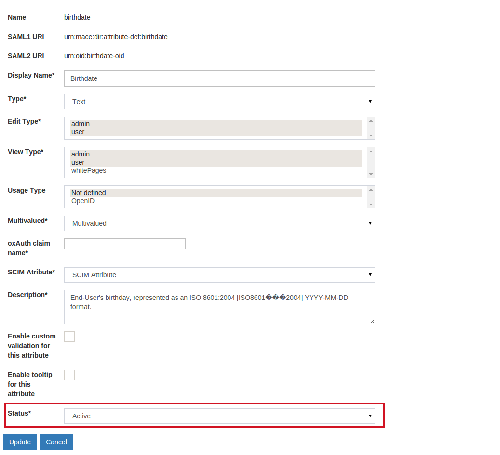
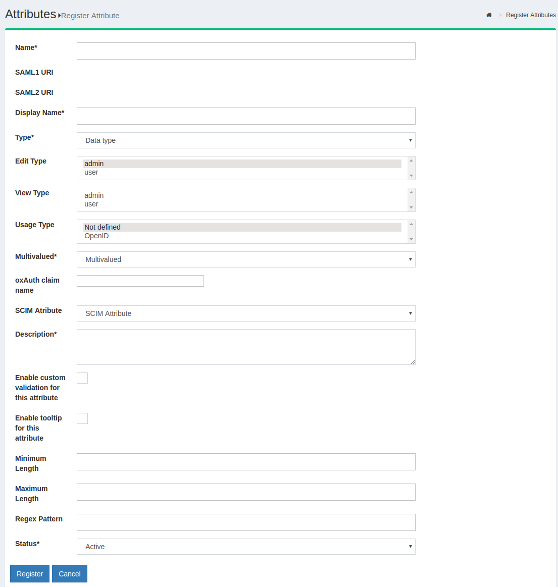

# SAML Attribute

!!! Attention
    The official support end-of-life (EOL) date for Gluu Server 2.4.4 is December 31, 2018. Starting January 1, 2019, no further security updates or bug-fixes will be provided for Gluu Server 2.X. We strongly recommend [upgrading](https://gluu.org/docs/ce/upgrade/) to the newest version.

## Attrubute in oxTrust
An *Active* attribute list can be seen from the Configuration >
Attributes section.


The Gluu Server has a large LDAP tree which includes all standard
attributes. It is not necessary for all of them to be *Active*. The
active LDAP trees can be sorted using the *Show only Active Attributes*
link.


The Gluu Server administrator can make changes, such as changing the
status to active/inactive, to an attribute after clicking on it.



Additional custom attributes can be added in below way

 - Add custom attribute to /opt/gluu/schema/openldap/custom.schema 
   - In this below example 'customTest' is our custom attribute : 
```
attributetype ( oxAttribute:1003 NAME 'customTest'
        SUBSTR caseIgnoreSubstringsMatch EQUALITY caseIgnoreMatch
        SYNTAX 1.3.6.1.4.1.1466.115.121.1.15        
       X-ORIGIN 'Gluu - custom person attribute' )
```
 - Add custom attribute to gluuCustomPerson objectClass
   - Example: 
```
objectclass ( oxObjectClass:101 NAME 'gluuCustomPerson' SUP top AUXILIARY MAY (customTest) X-ORIGIN 'Gluu - Custom persom objectclass' )

```
 - Stop LDAP server with command `service solserver stop`
 - Create custom configuration holder with `mkdir -p /opt/symas/etc/openldap/slapd.d`
 - Test custom configuration with `/opt/symas/bin/slaptest -f /opt/symas/etc/openldap/slapd.conf -F /opt/symas/etc/openldap/slapd.d`
 - Start LDAP server with command `service solserver start`

Register new attribute with Gluu Server GUI, oxTrust, by
clicking the **Register Attribute** button. Then, the following screen will
appear:



* _Name:_ This field defines the name of the custom attribute which must
  be unique in the Gluu Server LDAP tree.

* _SAML1 URI:_ This field contains the SAML1 uri for the custom attribute.

* _SAML2 URI:_ This field contains the SAML2 uri for the custom attribute.

* _Display Name:_ This display name can be anything that is human readable.

* _Type:_ The attribute type should be selected from the drop-down menu.
  There are four attribute types supported by Gluu:
  1. Text
  2. Numeric
  3. Photo
  4. Date

* _Edit Type:_ This field controls which type of an user is allowed to edit
  corresponding attribute at his/her "Profile" page of the web UI (when feature
"User can edit own profile" is enabled).

* _View Type:_ This field controls which type of an user is allowed to view
  corresponding attribute at his/her "Profile" page of the web UI.

* _Privacy Level:_ Please select the desired privacy level from the
  drop-down menu. The privacy level has a specific range of 1 to 5.

* _Multivalued:_ Please select multivalue in this field if the attribute
  contains more than one value.

* _SCIM Attributes:_ If the attribute is a part of SCIM architecture select true.

* _Description:_ This contains a few words to describe the attribute.

* _Status:_ The status, when selected active, will release and publish
  the attribute in IdP.

  ## Custom NameID
  Gluu Server comes with the `transientID` attribute which is the default `NameID`.
  If there are other `NameID` requirements, it is possible to create them as well.
  The custom attribute must be created in oxTrust first before defining it as the `NameID`.
  Please see the [oxTrust custom attribute guide](#using-oxtrust) to create the custom attribute in oxTrust.

  ## Defining NameID
  The template file for `NameID` definitions are located in the `attribute-resolver.xml.vm` file under `/opt/tomcat/conf/shibboleth2/`.
  The example below adds `testcustomattribute` as `NameID` based on UID attribute. The following are put into the `attribute-resolver.xml.vm` file.

  * Add declaration for the new attribute
  ```
  if( ! ($attribute.name.equals('transientId') or $attribute.name.equals('testcustomattribute') ) )
  ```
  * Add definition for the new attribute
```
 <resolver:AttributeDefinition id="testcustomattribute" xsi:type="Simple"
                              xmlns="urn:mace:shibboleth:2.0:resolver:ad"
                              sourceAttributeID="uid">

        <resolver:Dependency ref="siteLDAP"/>
        <resolver:AttributeEncoder xsi:type="SAML2StringNameID"
                                xmlns="urn:mace:shibboleth:2.0:attribute:encoder"
                                nameFormat="urn:oasis:names:tc:SAML:2.0:nameid-format:persistent" />
</resolver:AttributeDefinition> 
```
* Restart identity service using below command

` service identity restart` 

However it is recommended to stop and start service using 

`service identity stop`

`service identity start`

# OpenID Connect Scopes

In OpenID Connect, scopes are used to group attributes, and to provide a human 
understandable description of the attributes. This improves usability when you need 
to prompt a person to approve the disclosure of attributes to a third party.
An example of the default Gluu Server authorization request can be seen
here:


So if you have custom attributes, you may need to define a custom OpenID Scope.
This is pretty easy to do using the oxTrust user interface, and you can just
select the attributes that you previously registered.

The scopes menu is under the `OpenID Connect` button in the oxTrust menu. The scope menu has the search functionality to search the available scopes and an `Add Scope` button.


The `Add Scope` button will bring the following interface.


* Display Name: The name of the scope which will be displayd when searched
* Description: A small description of the scope being defined
* Scope Type: Default, if the scope needs the option to be released by default. Other options are LDAP, Dynamic, and OpenID.
* Default Scope: True if the scope is released to clients by default. 

The claims are added by clicking on the **Add Claim** button.


