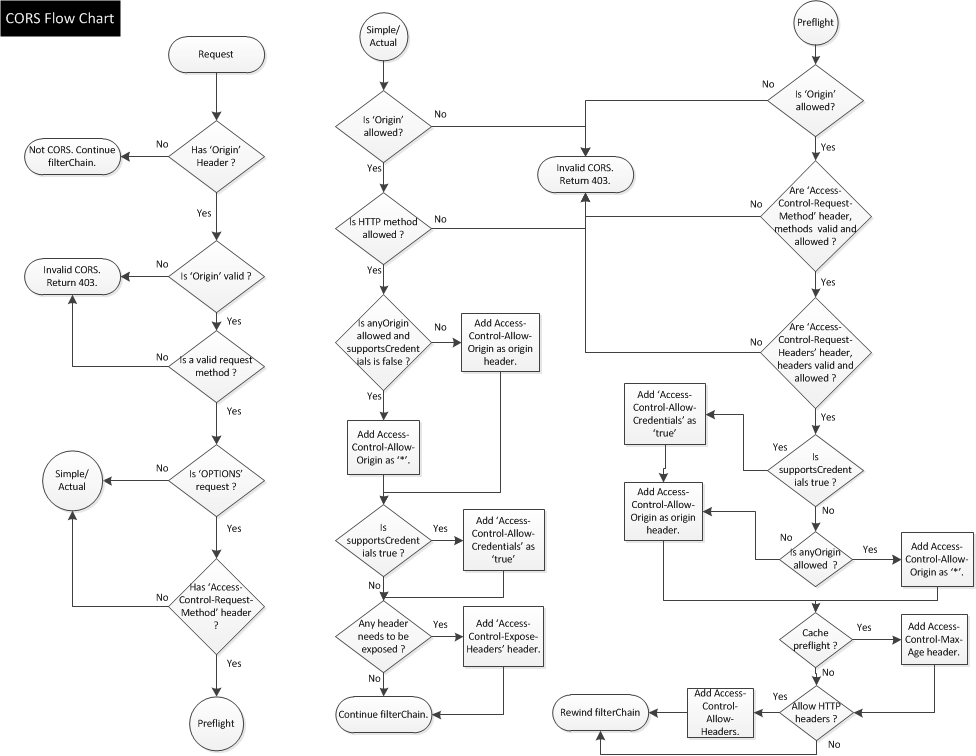
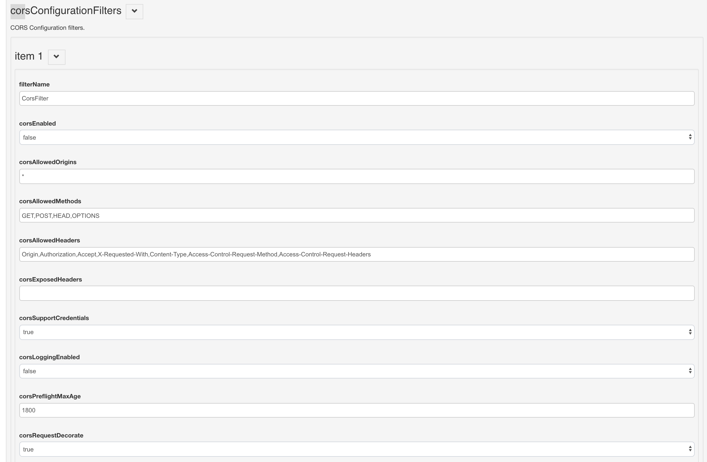

# CORS Filter 

## Overview

CORS Filter is an implementation of the [W3C's Cross-Origin Resource Sharing (CORS) specification](http://www.w3.org/TR/cors/).
CORS is a mechanism which enables cross-origin requests. The CORS Filter works by adding required `Access-Control-*` headers to the `HttpServletResponse` object. 

The filter also protects against HTTP response splitting. If a request is invalid, or is not permitted, the request is rejected with HTTP status code 403 (Forbidden). This flowchart demonstrates request processing by this filter:

 

The minimal configuration required to use the CORS Filter is shown below, which is already added to the `web.xml` in `oxauth.war`. Below is only for reference and no additional action is required. Configuration steps are defined below. CORS Filter reads the configurations from LDAP and therefore configuration can be done in oxTrust UI directly.
Filter Name for CORS Filter in Gluu CE will be `org.xdi.oxauth.filter.CorsFilter`.

```
    <filter>
        <filter-name>CorsFilter</filter-name>
        <filter-class>org.xdi.oxauth.filter.CorsFilter</filter-class>
    </filter>
    <filter-mapping>
        <filter-name>CorsFilter</filter-name>
        <url-pattern>/.well-known/*</url-pattern>
    </filter-mapping>
    <filter-mapping>
        <filter-name>CorsFilter</filter-name>
        <url-pattern>/seam/resource/restv1/oxauth/*</url-pattern>
    </filter-mapping>
    <filter-mapping>
        <filter-name>CorsFilter</filter-name>
        <url-pattern>/opiframe</url-pattern>
    </filter-mapping>
```

## Configure CORS

CORS can be configured in oxTrust. Follow these steps: 

1. Login to oxTrust
1. Navigate to `Configuration` > `JSON Configuration` > `oxAuth Configuration`
1. Scroll down to find `corsConfigurationFilters`
1. If `corsConfigurationFilters` is hidden or collapsed, click the arrow to expand.

    

1. This will display the CORS Configuration Filters parameters, as shown below:

    

1. Defined and configure the parameters
1. Click `save` at the bottom of the page.

### Supported Parameters

CORS Filter supports following initialization parameters:

<table border="1">
        <tr>
            <th>Attribute</th>
            <th>Description</th>
        </tr>
        <tr>
            <th>corsAllowedOrigins</th>
            <td>AA list of origins that are allowed to access the resource. 
            A <mark>*</mark> can be specified to enable access to resource from any origin. 
            Otherwise, a whitelist of comma separated origins can be provided. 
            Eg:  <mark>http://www.w3.org, https://www.apache.org. </mark>
            Defaults: <mark>*</mark> (Any origin is allowed to access the resource).</td>
        </tr>
        <tr>
            <th>corsAllowedMethods</th>
            <td>A comma separated list of HTTP methods that can be used to 
            access the resource, using cross-origin requests. These are the methods which will 
            also be included as part of Access-Control-Allow-Methods header in pre-flight response. 
            Eg: <mark>GET, POST</mark>. Defaults: <mark>GET, POST, HEAD, OPTIONS</mark></td>
        </tr>
        <tr>
            <th>corsExposedHeaders</th>
            <td>A comma separated list of request headers that can be used when making an actual request. 
            These headers will also be returned as part of Access-Control-Allow-Headers header in a 
            pre-flight response. Eg: <mark>Origin,Accept</mark>. Defaults: <mark>Origin, Accept, X-Requested-With, 
            Content-Type, Access-Control-Request-Method, Access-Control-Request-Headers</mark>.</td>
        </tr>
        <tr>
            <th>corsSupportCredentials</th>
            <td>A flag that indicates whether the resource supports user credentials. 
            This flag is exposed as part of <mark>Access-Control-Allow-Credentials</mark> header in a 
            pre-flight response. It helps browser determine whether or not an actual request 
            can be made using credentials. Defaults: <mark>true</mark></td>
        </tr>
        <tr>
            <th>corsLoggingEnabled</th>
            <td>Value to enable logging, Setting the value to <mark>False</mark> will disable logging. Defaults:<mark>true</mark></td>
        </tr>
        <tr>
            <th>corsPreflightMaxAge</th>
            <td>The amount of seconds, browser is allowed to cache the 
            result of the pre-flight request. This will be included as part of 
            <mark>Access-Control-Max-Age</mark> header in the pre-flight response. A negative value will 
            prevent CORS Filter from adding this response header to pre-flight response. Defaults: <mark>1800</mark></td>
        </tr>
        <tr>
            <th>corsRequestDecorate</th>
            <td>A flag to control if CORS specific attributes should be added 
            to HttpServletRequest object or not. Defaults: <mark>true</mark></td>
        </tr>
</table>
