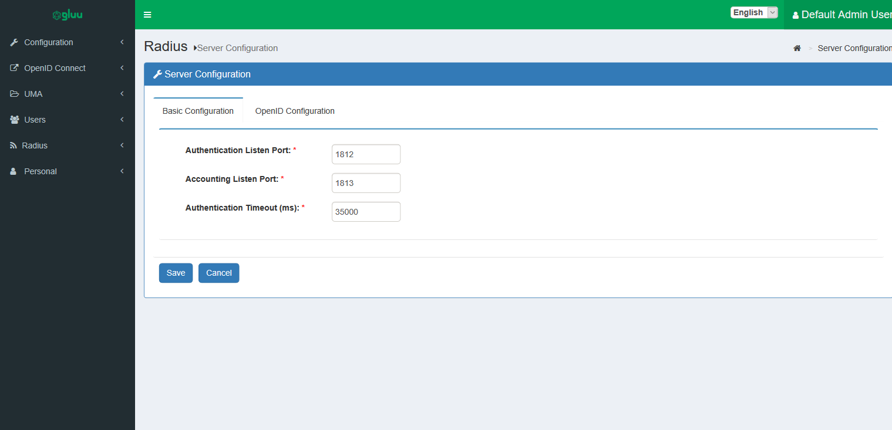
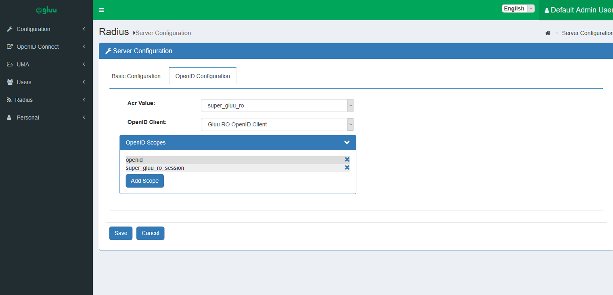
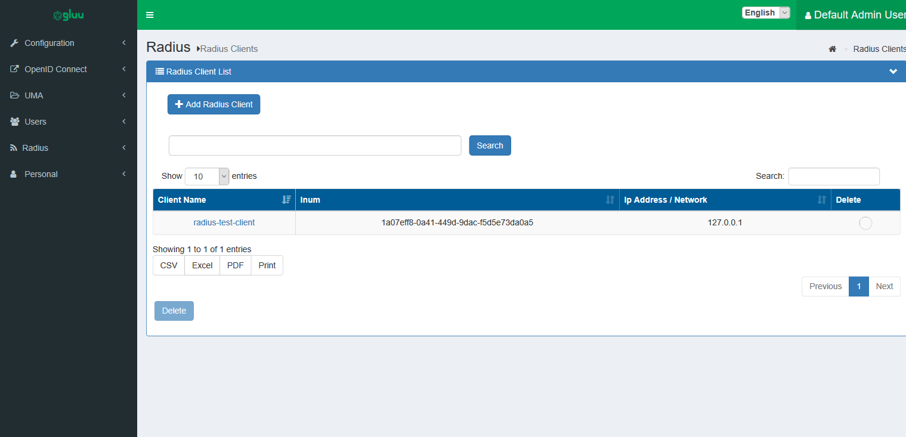
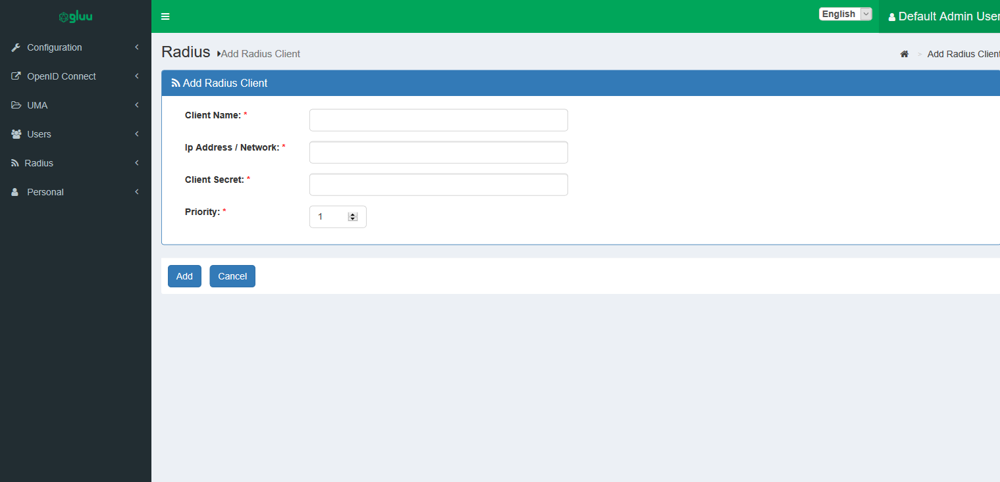

# Gluu Radius

## Overview
The Gluu Server now ships with a [radius](https://en.wikipedia.org/wiki/RADIUS) server called
Gluu Radius. It is based on the [tinyradius](http://tinyradius.sourceforge.net/) java library. 
It supports radius authentication, but does not provide radius accounting support. Radius accounting 
packets are simply ignored.

### Performance Considerations 
As mentioned above, Gluu Radius is based on the tinyradius java library. The library uses a single threaded, synchronous model to handle requests. This implies significant performance degradation when handling a large volume of requests, or 
long lived requests. To handle larger volumes, we recommend purchasing [Radiator](https://radiatorsoftware.com/products/radiator/) and using [our plugin](./gluu-radiator.md) for authentication.


## Installation  
Gluu Radius is an available component from version 4.0. During installation , while [running setup.py](../../installation-guide/install.md#run-setuppy), simply select `Y` when you are asked to install Gluu Radius.

## Service 
Gluu Radius runs as a service from within the Linux container. Certain configuration settings will require a service restart. View the [Services Commands](../../operation/services.md) doc for commands for the OS in use. 

## Configuration 
With Gluu Radius installed, a sidebar menu item called `Radius` will appear in the oxTrust UI which can be used to perform the following operations:

  - Configure the running instance of gluu-radius   
  - Add/Edit/Remove NAS/Radius clients    

### Basic Configuration 
 In oxTrust, navigate to `Radius` > `Server` Configuration and select the `Basic Configuration` tab.
 
 You can configure the following:
 
   - `Authentication Listen Port`: This is the port on which the server listens for authentication requests.
   
   - `Accounting Listen Port`: This is the port on which the server listens for accounting requests. Currently, the server simply ignores accounting packets.
   
   - `Authentication Timeout`: This is the maximum amount of time in milliseconds between when an authentication
     request is initiated and the user approving authentication. This applies only for long lived two-factor 
     authentication based requests (e.g. Super-Gluu).
  
!!! Note: 
    A change to any of these configuration parameters will require a restart of the `gluu-radius` service. Make sure the ports selected for authentication and accounting are open.

.

### OpenID Configuration 
In oxTrust, navigate to `Radius` > `Server Configuration` and select the `OpenID Configuration` tab. Configure the following:
 
   - `Acr Value`: Gluu Radius relies on a custom script of type `Resource Owner Password Credentials`. Select another script of the same type that can be used for authentication within certain constraints which will be given later.
 
   - `OpenID Client`: Gluu Radius relies on an OpenID client for authentication. You may specify another client here,  but this is also possible within certain constraints which will be given later.
   
   - `OpenID Scopes`: These are the scopes used during the password grant token request. For proper operation, the scope list *must* contain the `openid` scope.

!!! Note 
    A change to any of these configuration parameters will require a restart of the `gluu-radius` service.
    


### Radius Clients 
From the oxTrust UI , go to `Radius` > `Radius Clients`. A list of Radius / Nas Clients will appear which are authorized to authenticate via the radius server.

- To add a new Radius Client, click `Add Radius Client`. 

- To edit an existing client's details, click an existing client's name.

- To delete multiple clients at the same time, bulk select one or more radius clients and click `Delete`.



### Adding/Updating A Radius Client 
From the oxTrust UI, go to 'Radius > Radius Clients' , then click on `Add Radius Client` and specify the following:

  - `Client Name`: An easy mnemonic to recognize the client. 

  - `Ip Address/Network`: Specify either an IPv4 address here (xxx.xxx.xxx.xxx) or a CIDR subnet
    (xxx.xxx.xxx.xxx/xxx). The CIDR notation will match all Radius/NAS clients originating from that network. 
  
  - `Client Secret`: The Radius Client's secret.
  
  - `Priority`: Radius clients are matched by the gluu-radius not only by Ip Address/Network but also by priority. 
     So, if two entries _may_ match for one client (Ip Address/Network), the entry with the highest priority will be selected. 



## Advanced Topics 
This section covers advanced configuration topics. They are optional and can be skipped.

### Config file 
 The Gluu Radius configuration file can be found under `/etc/gluu/conf/radius/gluu-radius.properties` 
in the linux container. There are a couple things you can change from the configuration file.

#### JWT authentication algorithm
By default `RS512` (RSASSA-PKCS1-v1_5 using SHA-512) is the algorithm used by Gluu Radius for authentication.
First, from the oxTrust UI , go to the configuration settings for the OpenID client used by Gluu Radius
(see `OpenId Configuration` in this document) and go to the `Encryption/Signing` Tab.
Change the option `JWS alg Algorithm for Authentication Method to Token Endpoint` to the algorithm of your choice.
The algorithm *must* be a keypair algorithm.
In the JWKS section (or in your jwks if you provided a url), copy the `kid` corresponding to the algorithm you selected,
and change the following line in the gluu radius configuration file.

```
radius.jwt.auth.keyId = <kid>
```
Once you are done , restart `gluu-radius`.

#### External jwks 
Using an external jwks requires you pasting the contents of the jwks into the `JWKS` section in the `Encryption/Signing` tab
of the OpenID client used by `gluu-radius` for authentication.
You also need to provide a keystore , which contains all of the keys , with each entry name having the corresponding `kid`
for each JWKS entry. Generation of a keystore file and/or a `JWKS` is outside the scope of this document.
You will need to change the following in the configuration file.
```
radius.jwt.keyStoreFile = <location of keystore file>
radius.jwt.auth.keyId = <kid of public key used for authentication>
radius.jwt.auth.keyStorePin = <encrypted pin for the keystore>
```
You can use the utility `/opt/gluu/bin/encode.py` to encrypt the plaintext keyStore password.


### Customization Constraints 
There are a couple of constraints if you will like to use your own OpenID client or custom script to authenticate
using `gluu-radius`.

#### Custom OpenID client 
1. The client *must* support private key JWT authentication.
1. The client *must* have the `super_gluu_ro_session` scope or any scope which will add a `__session_id`
   claim containing an authenticated session id to the idtoken for `password` token grant requests.
1. The client *must* have the `password` grant type 
1. The client *must* be enabled to include claims in the Id Token.
1. The keys used in the jwks for the client need to be saved in a keystore and have `gluu-radius` point 
   to them as specified in the [section above](./gluu-radius.md#using-an-external-jwks).
You can take a look at the default OpenID client that ships with Gluu Radius to have an idea.

#### Custom authentication script
1. The script must be of type `Resource Owner Password Credentials` 
1. The script *must* accept and process a `__password` http post parameter containing the user's password and not the `password`
   http post parameter.
1. The script *must* accept and process a `__step` http post parameter.
   1. When `__step` is equal to `initiate_auth` , the custom script *must* authenticate the user using the provided credentials      and *must* create a session on the server (authenticated or not) and return the session id in the idtoken with a claim
      name of `__session_id`. If the user can't be authenticated, the script must return false. 
   1. When `__step` is equal to `verify_auth`, the custom script *must* get the http post parameter called `__session_id`
      and verify if the associated session is authenticated. If it's not authenticated , the script *must* return `false`.
You can take a look at the default Custom Script that ships with gluu radius to have an idea.


     

