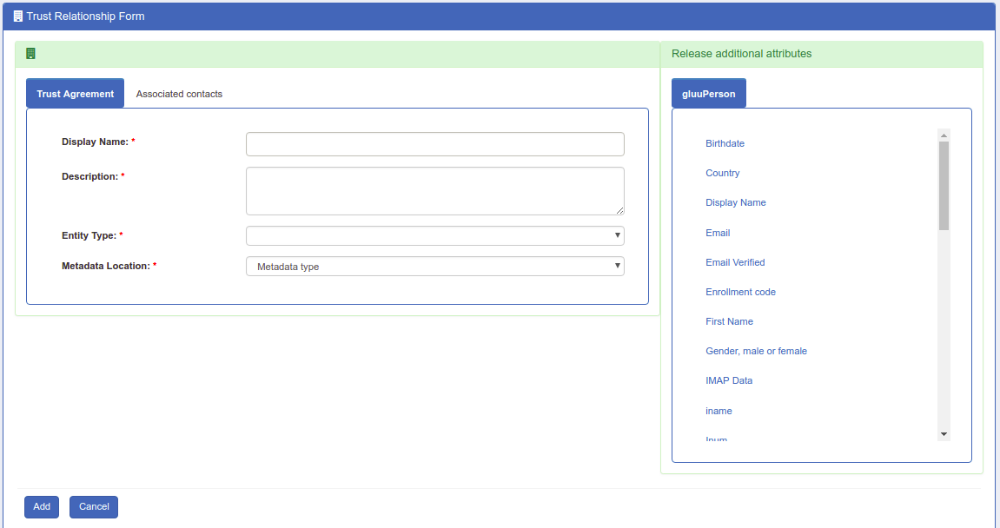
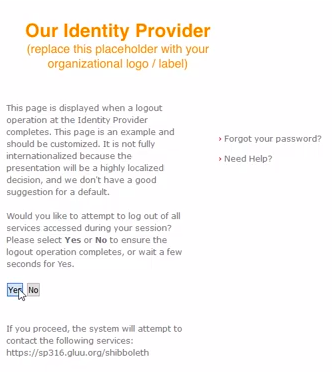
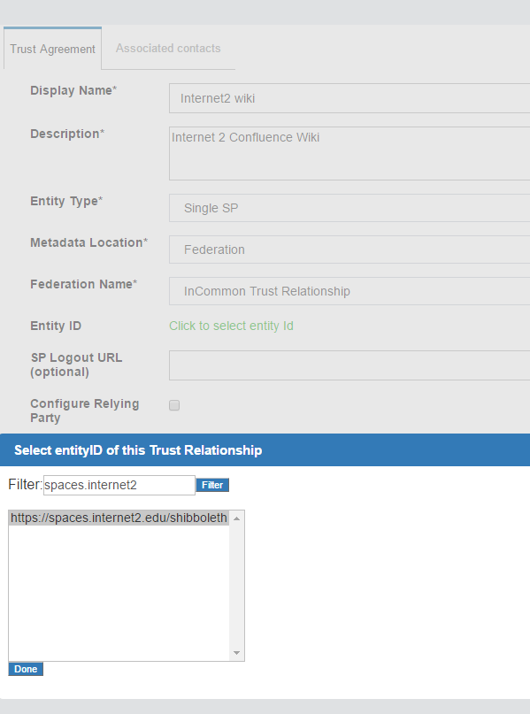

# SAML IDP 
## Overview
The Gluu Server acts as a SAML identity provider (IDP) to support outbound SAML single sign-on (SSO). 

In outbound SAML SSO transactions, external websites or applications (known as a Service Provider, or "SP") redirect users to the Gluu Server for authentication and authorization. Upon successful authentication, the user is redirected back to the SP with personal attributes and an active SSO session. 

The following section of the docs explains how to configure the Gluu SAML IDP for SSO. 

!!! Note 
    To support an inbound SAML workflow, where users are redirected to an external IDP for authentication (e.g. Social Login), review the [inbound SAML authentication guide](../authn-guide/inbound-saml-passport.md).

## Trust Relationship Requirements     
In the Gluu Server, the SAML IDPs SSO configuration is called a Trust Relationship (TR). Each TR requires the infomation listed below.

### Metadata of the SP             
Metadata is an XML file which has configuration data used to establish trust between the website (SP) and IDP (Gluu Server). Websites (SP) can provide metadata via a URL or as a separate file. Metadata can change, so a static URL typically requires the least amount of ongoing maintenance. 

### Metadata of the Gluu Server       
The Gluu Server's SAML metadata may be needed from time to time. It can be found at `https://hostname/idp/shibboleth`.
  
### Attribute Release      
Each SP may require one or more user attributes from the IDP in order to grant a person access to a protected resource. Required attributes vary depending on the application, and should be explicitly specified in the target application's documentation. The administrator can use the oxTrust interface to release the necessary attributes to the SP as described [below](#create-a-trust-relationship-in-the-gluu-server). 

## Configure NameID

A NameID or Name Identifier is used to identity the 'subject' of a SAML assertion. The format of nameID can be anything but is typically `emailAddress`.

### oxTrust GUI

Here is how to configure NameID in oxTrust: 

 - Create your custom attribute by following [this guide](./attribute.md#custom-attributes). 
 - Go to SAML -> 'Configure Custom NameID'

   - 'Enable' `Create NameID`
   - 'Attribute Base': Attribute value to calculate name Identifier. 
   - 'Attribute Name': Custom attribute name which we created [earlier here.](https://gluu.org/docs/ce/admin-guide/attribute/#custom-attributes)
   - 'Attribute Type': Type of name identifier: `emailAddress`, `unspecified`, or `persistent`

 - Restart `identity` and `idp` services by: 
   - `service identity stop/start`
   - `service idp stop/start`
 
### Manual Configuration
It's also possible to configure `NameID` through configuration file / velocity templates. The template file for `NameID` definitions are located in the `attribute-resolver.xml.vm` file under `/opt/gluu/jetty/identity/conf/shibboleth3/idp/`.

The example below adds `customTest`, which we [created earlier here](https://gluu.org/docs/ce/admin-guide/attribute/#custom-attributes), as `NameID` based on UID attribute. The following are put into the `attribute-resolver.xml.vm` file.

  * Add declaration for the new attribute
  ```
  #if( ! ($attribute.name.equals('transientId') or $attribute.name.equals('persistentId') or $attribute.name.equals('customTest') ) )
  ```
  * Add definition for the new attribute
```
 <resolver:AttributeDefinition id="customTest" xsi:type="Simple"
                              xmlns="urn:mace:shibboleth:2.0:resolver:ad"
                              sourceAttributeID="mail">

        <resolver:Dependency ref="siteLDAP"/>
        <resolver:AttributeEncoder xsi:type="SAML2StringNameID"
                                xmlns="urn:mace:shibboleth:2.0:attribute:encoder"
                                nameFormat="urn:oasis:names:tc:SAML:2.0:nameid-format:email" />
</resolver:AttributeDefinition> 
```
* Update /opt/shibboleth-idp/conf/saml-nameid.xml to generate SAML 2 NameID content

```
    <bean parent="shibboleth.SAML2AttributeSourcedGenerator" 
          p:format="urn:oasis:names:tc:SAML:2.0:nameid-format:email"
          p:attributeSourceIds="#{ {'customTest'} }"/>
```
* Restart identity and idp services using below command

`service identity/idp stop`

`service identity/idp start`

## Create a Trust Relationship

Follow these instructions to create a SAML TR in your Gluu Server: 

1. Go to `SAML` > `Trust Relationships`    
1. Click on `Add Trust Relationship`     
1. A new form will appear where you can provide all required information to create a Trust
  Relationship (TR).     
1. Click the `Add` button in the lower left corner to save the TR.     



A description of each TR creation field follows:

- **Display Name**: Name of the Trust Relationship (it should be unique for every TR)       
- **Description**: Purpose of the TR and an SSO link can be added here       
- **Entity Type**: You have two options to choose for entity type.
    - *Single SP*: A "Single SP" is one specific target SAML SP.  
    - *Federation/Aggregate*: A "Federation/Aggregate" is a trusted network of SP's, like [InCommon](https://www.incommon.org/federation/). Described in more detail [below](#federation-configuration).  
- **Metadata Location**: There are four available options to choose from. The correct Type depends on how the SP is delivering Metadata to your IDP      
    - *File*: Choose `File` if the SP has provided an uploadable metadata document in XML format.
    - *URI*: Chose `URI` if the SP metadata is hosted on a URI that is accessible from the Internet.
    - *Federation*: Choose this option if the target application (SP) is affiliated with a federation service (e.g. InCommon, NJEdge etc.). Fedeartion's TR must be created first for it to appear in this list. Learn more about working with a federation [below](#federation-configuration).
- **Released**: The SPs required attributes must be added to this panel. The required attributes can be selected from the menu on the left with the heading “Release Additional Attributes”.     

!!! Warning
    If the `Entity Type` is `Federation/Aggregate`, all selected attributes will be released to *every* SP that relies on the Federation. Therefore, attributes should only be released to Federations when absolutely required.  
        

## IDP-initiated outbound SAML flow

A regular outbound SAML flow starts at an SP. The user is redirected to an IDP with a SAML request, and is then sent by the IDP to the ACS endpoint of the SP with a SAML response. A shortened version of this flow is called "IDP-initiated" (or "unsolicited" in Shibboleth's documentation). It starts with the IDP sending a SAML response to the SP, when no prior SAML request was made.

The Gluu Server is configured to support this SAML flow out-of-the-box. To employ it, follow these steps:

1. Add a TR for the SP using the standard procedure described [above](#create-a-trust-relationship). Wait until the updated configuration is re-loaded by the IDP.   
1. Craft a URL like this: `https://idp.gluu.host.loc/idp/profile/SAML2/Unsolicited/SSO?providerId=https%3A%2F%2Fsphost-shib.site%3a8443%2Fshibboleth`, where: 
    1. `idp.gluu.host.loc` is the DNS name of the target Gluu Server   
    1. `providerId` URL query parameter contains `entityid` of the target SP   
1. Send the user to the composed URL (e.g. via redirection by on-page JS, an action triggered by a button, etc.)

## Relying Party Configuration     
Through the Relying Party configuration you can customize how different IDP profiles will respond to requests received from the SP, including encryption and digital signature options. The underlying IDPs functionality is described in [the Shibboleth wiki](https://wiki.shibboleth.net/confluence/display/IDP30/RelyingPartyConfiguration).  

The "Configure Relying Party" checkbox is accessible on the TR creation page and must be enabled with a specific profile(s) selected as active for this TR to generate a valid configuration. In most cases, just adding the SAML2SSO profile with default settings will suffice.

     

Setting the checkbox will result in a link which, if clicked, will summon a list of profiles currently available for customization. Each entry in the list has a brief description of its purpose and a selection of settings for which custom values may be chosen, as can be seen on image below.     

     

oxTrust allows you to tweak a limited subset of profiles mentioned in the Shibboleth wiki. The SAML2SSO profile is the most commonly used browser SSO profile.

| Profile  | Configuration Wiki Link |
| -------  | ----------------------- |
| SAML2SSO | [https://wiki.shibboleth.net/confluence/display/IDP30/SAML2SSOConfiguration](https://wiki.shibboleth.net/confluence/display/IDP30/SAML2SSOConfiguration) |
| SAML2Logout | [https://wiki.shibboleth.net/confluence/display/IDP30/SAML2LogoutConfiguration](https://wiki.shibboleth.net/confluence/display/IDP30/SAML2LogoutConfiguration) |
| SAML2AttributeQuery | [https://wiki.shibboleth.net/confluence/display/IDP30/SAML2AttributeQueryConfiguration](https://wiki.shibboleth.net/confluence/display/IDP30/SAML2AttributeQueryConfiguration) |
| SAML2ArtifactResolution | [https://wiki.shibboleth.net/confluence/display/IDP30/SAML2ArtifactResolutionConfiguration](https://wiki.shibboleth.net/confluence/display/IDP30/SAML2ArtifactResolutionConfiguration) |

### SAML Single Logout

Gluu Server supports SAML2 single logout if enabled by the administrator. To enable, create a SAML2Logout RP profile with the following configuration:


Once enabled, the user can be directed to `https://[hostname]/idp/Authn/oxAuth/logout` when they wish to log out. The user will be directed to a confirmation page.



If the user clicks `Yes` or just waits a few seconds, the session will be killed and the user will be logged out.

## Federation Configuration     
If your target SP is part of a federation like [InCommon](https://www.incommon.org/federation/), a TR can be created for the SP using the federation's metadata. To achieve this, add a TR for the federation in the Gluu Server first, then create TRs for each target SP in the federation. 

The example below shows how to add a TR for InCommon.


Once a TR has been established with the federation, TR's can be configured for any SP in the federation by selecting the federation from the `Federation Name`, then selecting the entity-id for the SP. 

In the example below, we are creating a TR for the 'Internet2 Wiki', which is an InCommon Federation affiliated SP (meaning, the SPs entityID is available in InCommon metadata). 



## Force Authentication

The Gluu Server supports force authentication out-of-the-box. Including `ForceAuthn=true` in the initial SAML request from the SP signals to the IDP that the user must reauthenticate, even if they already have a valid session at the server. This feature can be used to verify the user's identity prior to granting them access to highly protected resources.

Upon receiving the SAML request with this flag, the IDP will invalidate its session for the user, then will issue a new OpenID Connect (OIDC) authorization request to oxAuth, including the `prompt=login` parameter. This parameter forces oxAuth to invalidate its session as well. The user will then follow the full authentication procedure.

## SAML SP
If your target application (SP) does not already support SAML, we recommend using the [Shibboleth SP](../integration/sswebapps/saml-sp.md) web server filter to secure and integrate the application with your Gluu SAML IDP. 
