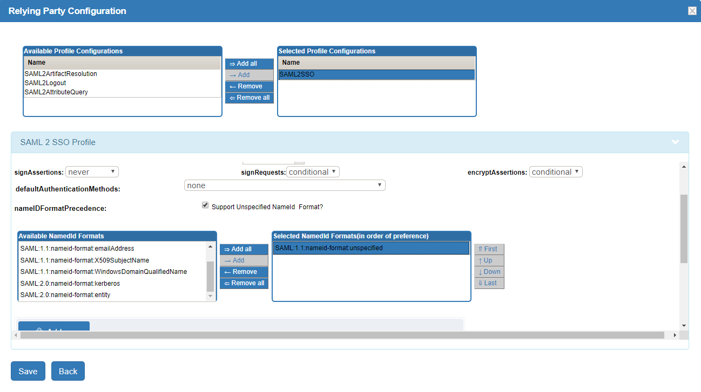
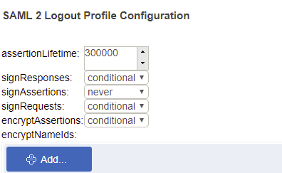
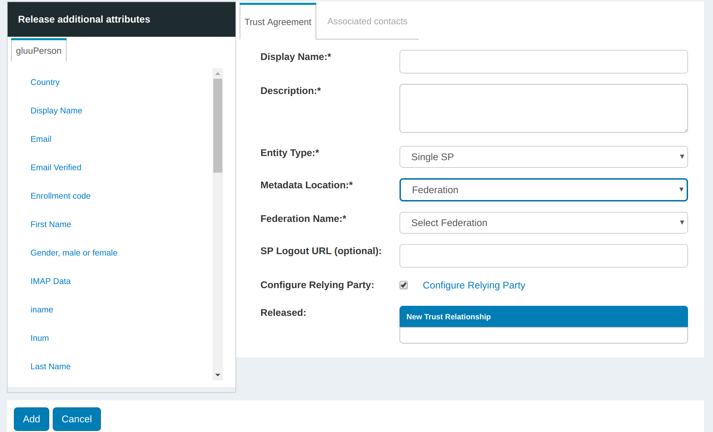

# SAML IDP 

## Overview
The Gluu Server acts as a SAML identity provider (IDP) to support outbound SAML single sign-on (SSO). 

In outbound SAML SSO transactions, external websites or applications (known as a Service Provider, or "SP") redirect users to the Gluu Server for authentication and authorization. Upon successful authentication, the user is redirected back to the SP with personal attributes and an active SSO session. 

The following section of the docs explains how to configure the Gluu SAML IDP for SSO. 

!!! Note 
    To support an inbound SAML workflow, where users are redirected to an external IDP for authentication (e.g. Social Login), review the [inbound SAML authentication guide](../authn-guide/inbound-saml-passport.md).

## Prerequisites 

In order to support SAML SSO, the Gluu Server must include the Shibboleth SAML IDP. 

- During a fresh Gluu Server installation, simply opt in when prompted for Shibboleth. 

- To add Shibboleth to an existing Gluu Server deployment, follow [these instructions](../operation/faq.md/#adding-passportjs-andor-shibboleth-idp-post-installation). 

In addition, the target application must also support SAML. If the app doesn't already support SAML, see the section below about [SAML SP software](#saml-sp). 

## Trust Relationship Requirements     
The Gluu Server SAML IDP configuration for SSO is called a Trust Relationship (TR). Each TR may require the following infomation: 

### SP Metadata             
Metadata is an XML file which has configuration data used to establish trust between the SP and IDP. The SP's metadata can be provided as a URL or a separate file. Metadata can change, so a static URL is typically preferred when available. 
  
### Attribute Release      
In order to grant access to a protected resource, each SP may require one or more user attributes from the IDP. Required attributes should be specified in the SP's documentation. Attributes can be chosen for release during the creation of each TR, as described [below](#create-a-trust-relationship). 

### IDP Metadata       
The SP may need Gluu's SAML IDP metadata, which can be found at: `https://hostname/idp/shibboleth`.

## Create a Trust Relationship
Follow these instructions to create a SAML TR in your Gluu Server: 

1. Go to `SAML` > `Trust Relationships`    
1. Click on `Add Trust Relationship`     
1. A new form will appear where you can provide all required information to create a Trust
  Relationship (TR).     
1. Click the `Add` button in the lower left corner to save the TR.    


A description of each TR creation field follows:

- **Display Name**: Name of the Trust Relationship (it should be unique for every TR)         
- **Description**: Purpose of the TR can be added here          
- **Entity Type**: There are two options for entity type:    
  - *Single SP*: A "Single SP" is one specific target SAML SP.  
  - *Federation/Aggregate*: A "Federation/Aggregate" is a trusted network of SP's, like [InCommon](https://www.incommon.org/federation/). Described in more detail [below](#federation-configuration).     
- **Metadata Type**: There are three available options. The correct option depends on how the SP is delivering Metadata to your IDP.       
    - *File*: Choose `File` if the SP has provided an uploadable metadata document in XML format.      
    - *URI*: Chose `URI` if the SP metadata is hosted on a URI that is accessible from the Internet.       
    - *Federation*: Choose `Federation` if the target application (SP) is affiliated with a federation service (e.g. InCommon, NJEdge etc.). A TR for the federation must be created first before it will appear in this list as an available option. Learn more about working with a federation [below](#federation-configuration).     
      
- **Released**: The SP's required user attributes must be added to this panel. Select attributes from the column on the left with the heading “Release Additional Attributes”.     

!!! Warning
    If the `Entity Type` is `Federation/Aggregate`, all selected attributes will be released to *every* SP that relies on the Federation. Therefore, attributes should only be released to Federations when absolutely required.  

## NameID

A NameID or Name Identifier is used to identity the "subject" of a SAML assertion. Some SAML SP's expect a specific SAML NameID Format. The format of NameID can be anything but is typically `emailAddress`. 

There are two ways to create the NameID in Gluu:

### Configure NameID in oxTrust

Follow these instructions to configure NameID in oxTrust: 

 - Navigate to `SAML` > `Configure Custom NameID`

   - Check the box for `Enabled`
   - Source Attribute: Choose the attribute value to calculate the Name Identifier. 
   - NameId Type: Choose the type of Name Identifier (Note: `urn:oasis:names:tc:SAML:1.1:nameid-format:unspecified` is deprecated) 
 - [Restart](../operation/services.md#restart) the `identity` and `idp` services    

    !!! Note 
        Restart not required if IDP and oxTrust are on the same host (i.e. non-cluster mode).
 
### Manual configuration

It's also possible to configure `NameID` through configuration file / velocity templates. 

- Update /opt/shibboleth-idp/conf/saml-nameid.xml to generate SAML 2 NameID content

    ```
    <bean parent="shibboleth.SAML2AttributeSourcedGenerator" 
          p:format="urn:oasis:names:tc:SAML:1.1:nameid-format:emailAddress"
          p:attributeSourceIds="#{ {'mail'} }"/>
    ```

- [Restart](../operation/services.md#restart) the `identity` and `idp` services.

###  Support unspecified nameID format

Though this feature is now deprecated, NameIDs with an unspecified format can still be accepted if required. Follow these steps:

1. Navigate to `Relying Party Configuration > SAML 2 SSO Profile`
1. Select/Check `Support Unspecified NameID Format`
1. Make sure `urn:oasis:names:tc:SAML:1.1:nameid-format:unspecified` is in the `Selected NameId Formats(in order of preference)` list

     

!!! Note
    You need to explicitly choose all supported formats.

## AuthnContextClassRef Support

Gluu offers out-of-the-box support for the SAML parameter `AuthnContextClassRef` (ACRS). Including the `<saml:AuthnContextClassRef>` tag in the initial SAML request from the SP signals to the IDP which authentication mechanism to present to the user.

    <samlp:AuthnRequest xmlns:samlp="urn:oasis:names:tc:SAML:2.0:protocol" xmlns:saml="urn:oasis:names:tc:SAML:2.0:assertion" ID="ONELOGIN_809707f0030a5d00620c9d9df97f627afe9dcc24" Version="2.0" ProviderName="SP test" IssueInstant="2014-07-16T23:52:45Z" Destination="http://idp.example.com/SSOService.php" ProtocolBinding="urn:oasis:names:tc:SAML:2.0:bindings:HTTP-POST" AssertionConsumerServiceURL="http://sp.example.com/demo1/index.php?acs">
      <saml:Issuer>http://sp.example.com/demo1/metadata.php</saml:Issuer>
      <samlp:NameIDPolicy Format="urn:oasis:names:tc:SAML:1.1:nameid-format:emailAddress" AllowCreate="true"/>
      <samlp:RequestedAuthnContext Comparison="exact">
        <saml:AuthnContextClassRef>urn:oasis:names:tc:SAML:2.0:ac:classes:PasswordProtectedTransport</saml:AuthnContextClassRef>
      </samlp:RequestedAuthnContext>
    </samlp:AuthnRequest>

### AuthnContextClassRef - Default Supported Values 

Gluu offers out-of-the-box support for following:

- `urn:oasis:names:tc:SAML:2.0:ac:classes:Password`
- `urn:oasis:names:tc:SAML:2.0:ac:classes:PasswordProtectedTransport`
- `urn:oasis:names:tc:SAML:2.0:ac:classes:InternetProtocol`

### AuthnContextClassRef Extension
Custom `AuthnContextClassRef` attribute values can be defined under `Configuration` > `Manage SAML ACRs` 

The recommended format is either `urn` or `uri`. For example: 

    urn:oasis:names:tc:SAML:2.0:ac:classes:X509
    urn:oasis:names:tc:SAML:2.0:ac:classes:TLSClient
    urn:oasis:names:tc:SAML:2.0:ac:classes:PasswordProtectedTransport
    urn:oasis:names:tc:SAML:2.0:ac:classes:Password
    urn:oasis:names:tc:SAML:2.0:ac:classes:Kerberos
    urn:oasis:names:tc:SAML:2.0:ac:classes:InternetProtocol
    https://refeds.org/profile/mfa
    https://refeds.org/profile/sfa

### Select AuthnContextClassRef in oxTrust

ACRS values require a one-to-one association with authentication scripts. In oxTrust, navigate to `Configuration` > `Manage Custom Scripts` > `Person Authentication` and, for each applicable script, select the desired SAML ACRS attribute fields, e.g. `urn:oasis:names:tc:SAML:2.0:ac:classes:PasswordProtectedTransport`.   


## IDP-initiated outbound SAML flow

A regular outbound SAML flow starts at an SP. The user is redirected to an IDP with a SAML request, and is then sent by the IDP to the SP's ACS endpoint with a SAML response. A shortened version of this flow is called "IDP-initiated" (or "unsolicited"). It starts with the IDP sending a SAML response to the SP when no prior SAML request was made.

To configure this SAML flow, follow these steps:

1. Add a TR for the SP using the standard procedure described [above](#create-a-trust-relationship). Wait until the updated configuration is re-loaded by the IDP.   
1. Craft a URL like this: `https://idp.gluu.host.loc/idp/profile/SAML2/Unsolicited/SSO?providerId=https%3A%2F%2Fsphost-shib.site%3a8443%2Fshibboleth`, where: 
    1. `idp.gluu.host.loc` is the DNS name of the target Gluu Server   
    1. `providerId` URL query parameter contains the `entityid` of the target SP   
1. Send the user to the composed URL (e.g. via redirection by on-page JS, an action triggered by a button, etc.)

The user should gain immediate access to the protected resource, with no further redirects or authentication. 


## Relying Party Configuration     
Through the Relying Party configuration you can customize how different IDP profiles will respond to requests received from the SP, including encryption and digital signature options. The underlying IDPs functionality is described in [the Shibboleth wiki](https://wiki.shibboleth.net/confluence/display/IDP30/RelyingPartyConfiguration). 

The "Configure Relying Party" checkbox is accessible on the TR creation page and must be enabled with a specific profile(s) selected as active for this TR to generate a valid configuration. In most cases, just adding the SAML2SSO profile with default settings will suffice.

     

Setting the checkbox will result in a link which, if clicked, will summon a list of profiles currently available for customization. Each entry in the list has a brief description of its purpose and a selection of settings for which custom values may be chosen, as can be seen on image below.     

     
     
oxTrust allows you to tweak a limited subset of profiles mentioned in the Shibboleth wiki. The SAML2SSO profile is the most commonly used browser SSO profile.

| Profile  | Configuration Wiki Link |
| -------  | ----------------------- |
| SAML2SSO | [https://wiki.shibboleth.net/confluence/display/IDP30/SAML2SSOConfiguration](https://wiki.shibboleth.net/confluence/display/IDP30/SAML2SSOConfiguration) |
| SAML2Logout | [https://wiki.shibboleth.net/confluence/display/IDP30/SAML2LogoutConfiguration](https://wiki.shibboleth.net/confluence/display/IDP30/SAML2LogoutConfiguration) |
| SAML2AttributeQuery | [https://wiki.shibboleth.net/confluence/display/IDP30/SAML2AttributeQueryConfiguration](https://wiki.shibboleth.net/confluence/display/IDP30/SAML2AttributeQueryConfiguration) |
| SAML2ArtifactResolution | [https://wiki.shibboleth.net/confluence/display/IDP30/SAML2ArtifactResolutionConfiguration](https://wiki.shibboleth.net/confluence/display/IDP30/SAML2ArtifactResolutionConfiguration) |

## SAML Single Logout

Gluu Server supports SAML2 single logout (SLO) if enabled by the administrator. To enable, create a SAML2Logout RP profile with the following configuration:



Once enabled, the user can be directed to `https://[hostname]/idp/Authn/oxAuth/logout` when they wish to log out. The user will be directed to a confirmation page.


If the user clicks `Yes` or just waits a few seconds, the session will be killed and the user will be logged out.

## IDP-initiated outbound SAML flow

A regular outbound SAML flow starts at an SP. The user is redirected to an IDP with a SAML request, and is then sent by the IDP to the ACS endpoint of the SP with a SAML response. A shortened version of this flow is called "IDP-initiated" (or "unsolicited" in Shibboleth's documentation). It starts with the IDP sending a SAML response to the SP, when no prior SAML request was made.

The Gluu Server is configured to support this SAML flow out-of-the-box. To employ it, follow these steps:

1. Add a TR for the SP using the standard procedure described [above](#create-a-trust-relationship). Wait until the updated configuration is re-loaded by the IDP.   
1. Craft a URL like this: `https://idp.gluu.host.loc/idp/profile/SAML2/Unsolicited/SSO?providerId=https%3A%2F%2Fsphost-shib.site%3a8443%2Fshibboleth`, where: 
    1. `idp.gluu.host.loc` is the DNS name of the target Gluu Server   
    1. `providerId` URL query parameter contains `entityid` of the target SP   
1. Send the user to the composed URL (e.g. via redirection by on-page JS, an action triggered by a button, etc.)

## Federation Configuration     
If your target SP is part of a federation like [InCommon](https://www.incommon.org/federation/), a TR can be created for the SP using the federation's metadata. To achieve this, add a TR for the federation in the Gluu Server first, then create TRs for each target SP in the federation. If working with large metadata files, make sure the backend has enough resources to handle such a large operation.

The example below shows how to add a TR for InCommon.



Once a TR has been established with the federation, TRs can be configured for any SP in the federation by selecting the federation from the `Federation Name`, then selecting the entity-id for the SP. 

In the example below, we are creating a TR for the 'Internet2 Wiki', which is an InCommon Federation affiliated SP (meaning, the SPs entityID is available in InCommon metadata). 


## IDP cache support

IDP requires `shibboleth.StorageService` to store user sessions. This is defined in `/opt/shibboleth-idp/conf/idp.properties` configuration file in property `idp.replayCache.StorageService`.
Default IDP installation uses `shibboleth.StorageService` service. This service stores data in server memory. As result it does not survive restarts and is not replicated across a cluster. In order to resolve these limitations starting from 4.1 IDP uses `shibboleth.GluuStorageService`. This implementation is based on Gluu [cache](https://github.com/GluuFederation/oxCore/tree/master/core-cache). This library provides Memory, Memcached, Redis, Redis + Sentinel, Native (LDAP or Cocuhbase) cache implementations. The active mode is defined globally for oxAuth/oxTrust/IDP in oxTrust GUI. After changing cache type it's mandatory to restart these services to apply new changes.

This new CE 4.1 implementation allows to use IDP in cluster without extrac configuration changes.

## Customizing IDP pages

See [this page](../operation/custom-design.md#customizing-saml-idp-pages) for instructions on customizing user-facing IDP pages.

## Force Authentication

The Gluu Server supports the SAML force authentication parameter out-of-the-box. Including `ForceAuthn=true` in the initial SAML request from the SP signals to the IDP that the user must be reauthenticated, even if they already have a valid session at the server. This feature can be used to verify the user's identity prior to granting them access to highly protected resources.

Upon receiving the SAML request with this flag, the IDP will invalidate its session for the user, then will issue a new OpenID Connect (OIDC) authorization request to oxAuth, including the `prompt=login` parameter. This parameter forces oxAuth to invalidate its session as well. The user will then follow the full authentication procedure.

## SAML SP
If the target application (SP) does not already support SAML, we recommend using the [Shibboleth SP](../integration/sswebapps/saml-sp.md) web server filter to secure and integrate the application with your Gluu SAML IDP. 

