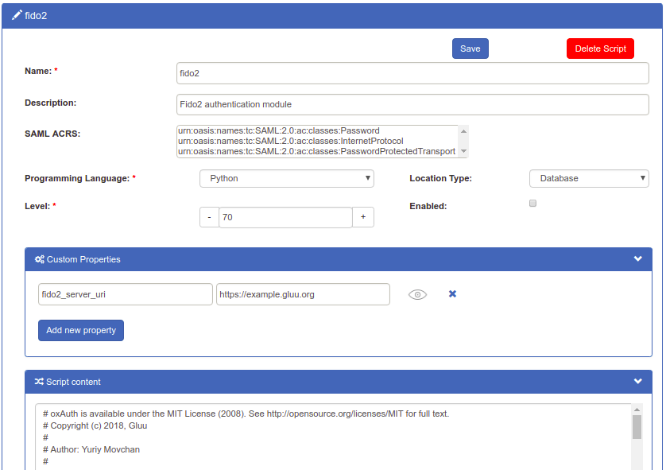
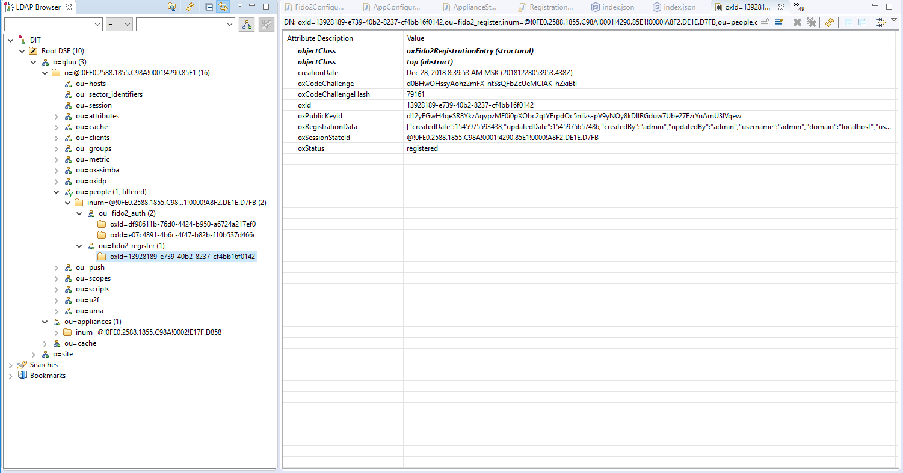

# FIDO2

## Overview
[FIDO 2.0 (FIDO2)](https://fidoalliance.org/fido2/) is an open authentication standard that enable users to leverage common devices to securely authenticate to online services in both mobile and desktop environments.

FIDO2 is comprised of the [W3C’s Web Authentication specification (WebAuthn)](https://www.w3.org/TR/webauthn/) and FIDO’s corresponding [Client-to-Authenticator Protocol (CTAP)](https://fidoalliance.org/specs/fido-v2.0-ps-20170927/fido-client-to-authenticator-protocol-v2.0-ps-20170927.html). WebAuthn defines a standard web API that can be built into browsers and related web platform infrastructure to enable online services to use FIDO Authentication. CTAP enables external devices such as mobile handsets or FIDO Security Keys to work with WebAuthn and serve as authenticators to desktop applications and web services.

This document explains how to use the Gluu Server's included 
[FIDO2 interception script](https://github.com/GluuFederation/oxAuth/blob/master/Server/integrations/fido2/Fido2ExternalAuthenticator.py) 
to implement a two-step, two-factor authentication (2FA) with username / password as the first step, and any FIDO2 device as the second step. 

## Prerequisites
- A Gluu Server ([installation instructions](../installation-guide/index.md));      
- [FIDO2 interception script](https://github.com/GluuFederation/oxAuth/blob/master/Server/integrations/fido2/Fido2ExternalAuthenticator.py) (included in the default Gluu Server distribution);     
- At least one FIDO2 device for testing, like one of the devices [listed below](#FIDO2-devices). 
- For Linux-based operating systems, a little modification required in udev rule, that is stated [below](#fido2-linux).

### FIDO2 Devices
Some well known FIDO2 devices and manufacturers include:           

- [Yubico](https://www.yubico.com/)      
- [Vasco DIGIPASS SecureClick](https://www.vasco.com/products/two-factor-authenticators/hardware/one-button/digipass-secureclick.html)   
- [HyperFIDO](http://hyperfido.com/)       
- [Feitian Technologies](http://www.ftsafe.com/)      

[Purchase FIDO2 devices on Amazon](https://www.amazon.com/s/ref=nb_sb_noss/146-0120855-4781335?url=search-alias%3Daps&field-keywords=fido2). Or, check [FIDO's certified products](https://fidoalliance.org/certification/fido-certified-products/) for a comprehensive list of FIDO2 devices (sort by `Specification` == `FIDO2`). 

## Properties
The script has the following properties

|	Property	|	Description		|	Example	|
|-----------------------|-------------------------------|---------------|
|fido2_server_uri		|URL of the oxAuth FIDO2 server|`https://idp.mycompany.com`|

## Enable FIDO2

Follow the steps below to enable FIDO2 authentication:

1. Navigate to `Configuration` > `Manage Custom Scripts`.    

1. Click on the `Person Authentication` tab       

1. Find the `fido2` script       

1. Enable the script by checking the box       

1. Scroll to the bottom of the page and click `Update`

Now FIDO2 is an available authentication mechanism for your Gluu Server. This means that, using OpenID Connect `acr_values`, applications can now request FIDO2 authentication for users. 

!!! Note 
    To make sure FIDO2 has been enabled successfully, you can check your Gluu Server's OpenID Connect 
    configuration by navigating to the following URL: `https://<hostname>/.well-known/openid-configuration`. 
    Find `"acr_values_supported":` and you should see `"fido2"`. 

## Enable FIDO2 U2F Endpoints

By default, the FIDO2 endpoints are disabled in the Gluu Server for compatibility with older versions. To activate the endpoints, follow these steps:

1. Navigate to `Configuration` > `JSON Configuration`

1. Click on the `oxAuth Configuration` tab

1. Scroll down to the Fido2 Specification

1. Set the `disable` field to `False`

1. Click the `Save Configuration` button at the bottom of the page.

## Make FIDO2 the Default

If FIDO2 should be the default authentication mechanism, follow these instructions: 

1. Navigate to `Configuration` > `Manage Authentication`. 

1. Select the `Default Authentication Method` tab. 

1. In the Default Authentication Method window you will see two options: `Default acr` and `oxTrust acr`. 

 - `oxTrust acr` sets the authentication mechanism for accessing the oxTrust dashboard GUI (only managers should have acccess to oxTrust).    

 - `Default acr` sets the default authentication mechanism for accessing all applications that leverage your Gluu Server for authentication (unless otherwise specified).    

If FIDO2 should be the default authentication mechanism for all access, change both fields to `fido2`.  

!!! Note
    If FIDO2 is set as a default authentication mechanism users will **not** be able to access the protected resource(s) while using a mobile device or a browser that does not support FIDO2 (e.g. Internet Explorer).  

## FIDO2 Login Page
Below is an illustration of the Gluu Server's default FIDO2 login page:

The design is being rendered from the [FIDO2 xhtml page](https://github.com/GluuFederation/oxAuth/blob/master/Server/src/main/webapp/auth/fido2/login.xhtml). To customize the look and feel of this page, follow the [customization guide](../operation/custom-design.md). 

## Using FIDO2 Tokens 

### Credential Enrollment
FIDO2 device enrollment happens during the first authentication attempt. 

### Subsequent Authentications
All subsequent FIDO2 authentications for that user account will require the enrolled FIDO2 key. 

### FIDO2 Credential Management
A user's FIDO2 devices can be removed by a Gluu administrator in LDAP under the user entry as shown in the below screenshot. 

## FIDO2 Discovery Endpoint
A discovery document for FIDO2 is published by the Gluu Server at: `https://<hostname>/.well-known/fido2-configuration` This document specifies the URL of the registration and authentication endpoints.

## FIDO2 in Linux 

From your terminal run the below commands and reboot your computer. 

  - `sudo curl https://hypersecu.com/downloads/files/configurations/70-u2f.rules > /etc/udev/rules.d/70-u2f.rules`
  - `chmod +x /etc/udev/rules.d/70-u2f.rules`
