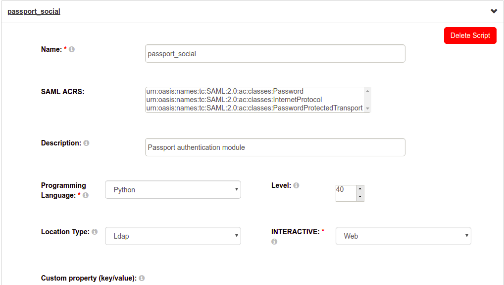
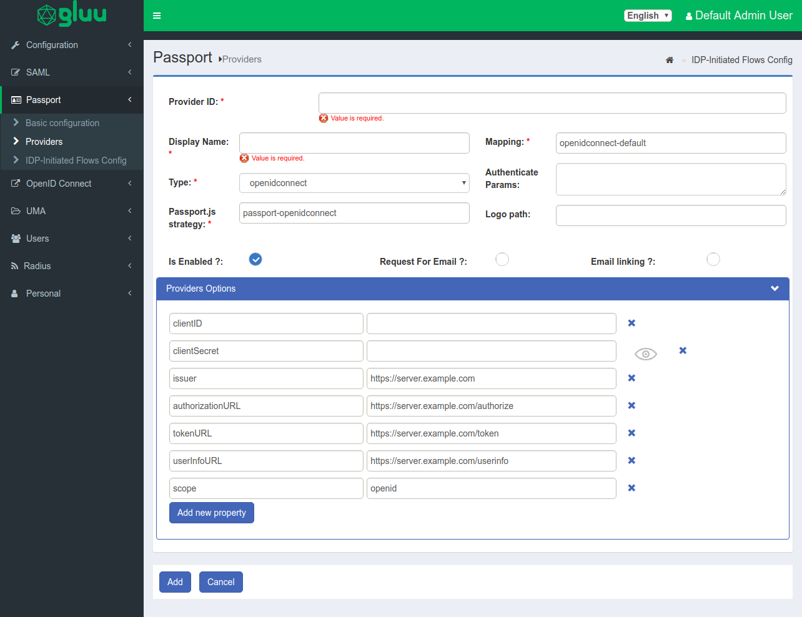
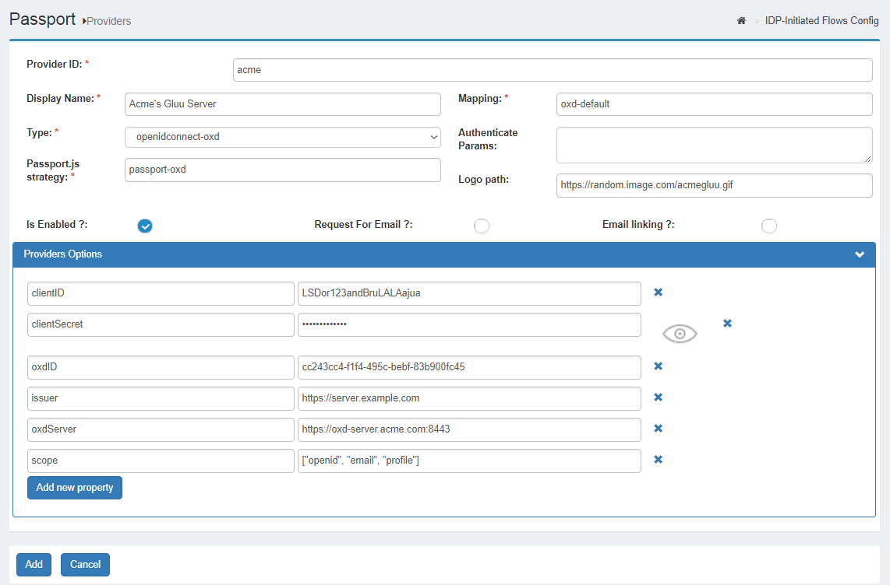
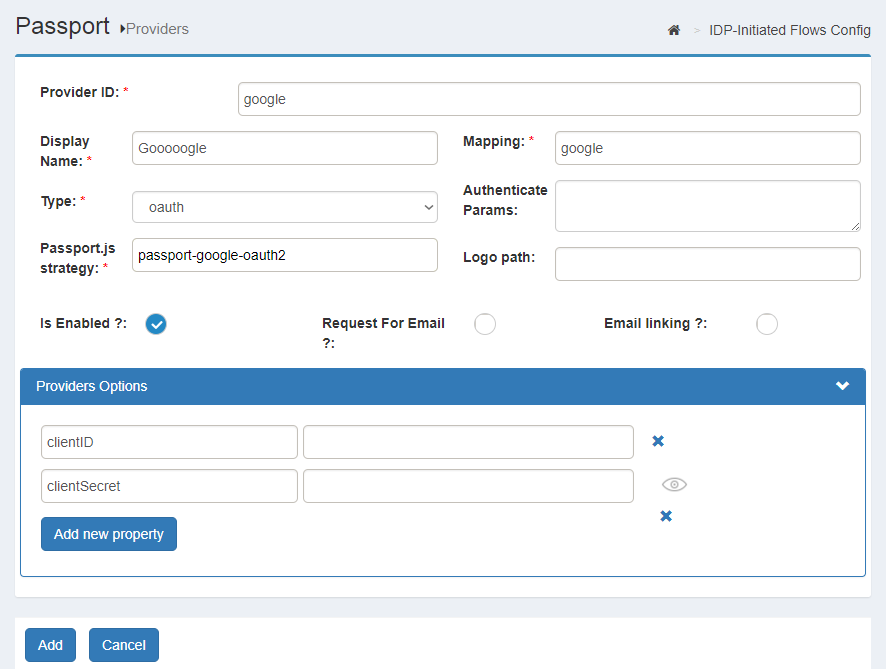
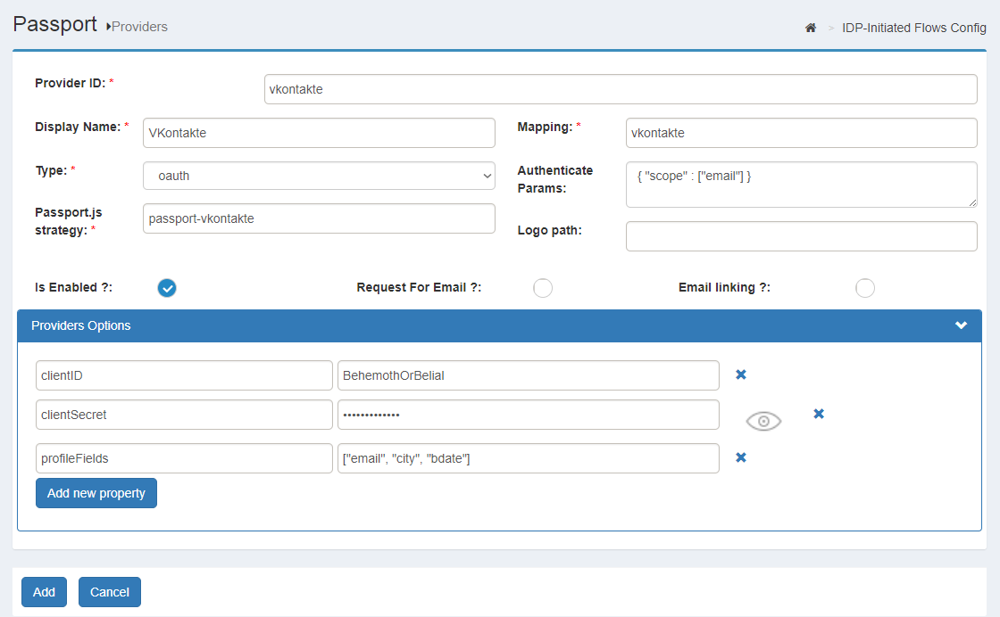

# Inbound OAuth & OpenID Connect

## Overview
This document provides instructions for configuring the Gluu Server to support user authentication at one or more external OAuth or OpenID Connect Providers (a.k.a. inbound OAuth / OpenID). For a quick overview of key concepts associated with "inbound identity", visit the [introductory page](./passport.md). 

## Enable Passport

Make sure the Gluu Server installation already has [Passport installed](./passport.md#passport-setup). Then perform the following:

1. Enable the custom script

    - In oxTrust, navigate to `Configuration` > `Custom scripts`          
    - Navigate to the `Person Authentication` tab, expand the script labelled `passport_social`, check `enabled`, and click `Update`    
         
    - Navigate to the `UMA RPT Policies` tab, expand the script labelled `scim_access_policy`, check `enabled`, and click `Update`       
      
1. Enable Passport support:    

    - In oxTrust, navigate to `Configuration` > `Organization configuration` > `System configuration`
    - In `Passport support` choose `Enabled`    
    - Click `Update`    

     

Once the steps above are performed, the TCP port 8090 appears ready to accept connections.

## Integrate OpenID Connect providers

Follow these steps to integrate an external OP for login to an OIDC application:

1. Add the OP in the admin UI
1. Register a client at the OP
1. Supply OIDC parameters
1. Protect the OIDC application with `passport_social` authentication

**Notes:**

- OP integration is achieved via the [`passport-openidconnect`](https://github.com/jaredhanson/passport-openidconnect) strategy, which **only** supports the OpenID Connect code flow (not hybrid or implicit). 
- Communication with the token endpoint is carried out via POST only.
- There is no support for secretless clients (just confidential OAuth clients). 
- Ensure the machine(s) running Passport have access to the OP you are trying to connect to.

### Add the OP in the admin UI

1. In oxTrust, navigate to `Configuration` > `Passport` > `Providers`

1. Click on `Add new provider`

1. Enter an identifier for this provider (letters, digits, and underscore characters allowed). Check [here](./passport.md#identifiers) to learn more about identifiers usage

1. Enter a display name for the provider  (e.g "Partner 1", "Customer 1", etc.)

1. In `type`, choose "openidconnect" (if you are using Gluu oxd as a mediator with an OP, check [this](#using-oxd-as-mediator) section)

1. Optionally, supply a `logo path` for this provider (eg. `img/openidconnect.png`). Check this [section](./passport.md#about-logo-images) of the introductory page to learn more

1. Check `Is enabled` (unless there is a reason to leave this provider integration temporarily disabled)

1. It's not required to check `Request For Email` or `Email linking` unless implementing a [custom flow](./passport.md#altering-flow-behaviour)

1. Click on `Add` (meanwhile, accept the default values for the remaining fields)

 

A simple standard [attribute mapping](./passport.md#attribute-mapping-and-transformation) is used for OpenID Connect providers by default. This will populate `uid`, `mail`, `cn`, `displayName`, `givenName`, and `sn` LDAP attributes if the relevant corresponding claims were gathered in the `userInfo` request.

To learn more about how mappings work, check the [tutorial](../tutorials/passport-attributes-mapping.md). Also review the `/opt/gluu/node/passport/server/mappings/openidconnect-default.js` file in the Gluu chroot. If you need to make adjustments, do not edit the default mapping file, create a new one based on its contents.

### Register a client at the OP

The procedure for registering a client at the external provider may vary. In some setups, the OP may support dynamic registration of clients. Check the product documentation or inquire the administrator of the provider to integrate.

When prompted for the redirect URI enter the URL shown in the field labeled "Callback URL" of provider's form. The URL looks like

```
https://your-gluu-host/passport/auth/<PROVIDER-ID>/callback
```

where `PROVIDER-ID` is the identifier assigned to the recently added provider.

After the process is finished, you should be given a client ID and a client Secret.

### Supply OIDC parameters

In the summary table, click on the name of the recently added provider and supply values for `clientID` and `clientSecret`. Fill the rest of the fields according to the endpoints exposed by the OP being configured. Depending on the OP capabilities, you can add more properties as supported, for instance `acr_values`.

### Protect the OIDC application with `passport_social` authentication

The same steps described for [Social Login](#protect-the-application-with-passport_social-authentication) can be followed in this case. If additional assistance is needed, open a ticket on [Gluu support](https://support.gluu.org).

### Using oxd as mediator

When using oxd, administrators can follow the steps similar as [above](#integrating-openid-connect-providers), taking into account the following considerations:

- For provider `type`, select "openidconnect-oxd"

- Instead of creating a client directly, a call to the oxd server [`register-site` API method](https://gluu.org/docs/oxd/4.0/api/#register-site) must be issued. [Here](https://github.com/GluuFederation/passport-oxd#create-a-client) is an example. From this action, the `oxdID` will be obtained. Ensure the client created actually has the scopes requested.

- Supply values for the properties required. These properties are explained [here](https://github.com/GluuFederation/passport-oxd#configure-strategy) (see the options parameter). 

- If you need to supply values for optional properties, their values must be provided as JSON content. The following are examples of valid JSON values: `true`, `0`, `"a string"`, `["item1", "item2"]`, `{ "key": { "some": "value" }}`.

- `/opt/gluu/node/passport/server/mappings/oxd-default.js` is the default mapping file. Create your own if it does not fit your needs.

 

### Using an external Gluu Server as OP

In this section, we provide specific steps on how to configure a Gluu Server instance as the external OP (here called "remote Gluu"). Note that this is **not** the same server in which Passport has been installed. 

1. To [register a client](#register-a-client-at-the-op) in your remote Gluu server, log in with admin credentials to `https://<remote-gluu-server>/identity` and navigate to `OpenID Connect` > `Clients` > `Add`. Provide the following settings:

    - client name: *any of your choosing*
    
    - client secret: *a password for this client*

    - application type: native

    - pre-authorization: false

    - persist client authorizations: true

    - subject type: pairwise

    - JWS algorithm ID token: rs256

    - authentication method for token endpoint: client_secret_post

    - require auth time: false

    - scopes: openid, profile, user_name, email

    - grant types: authorization_code

    - logout session required: false

    - response types: code

    - redirect login URI: `https://<host-name>/passport/auth/<PROVIDER-ID>/callback`. Where `<host-name>` is the host of the Passport-enabled Gluu Server 

1. Supply the [OIDC parameters](#supply-oidc-parameters) as follows:

   - `clientID` and `clientSecret`: Grab those from the recently created client. Go to `OpenID Connect` > `Clients` and use for "clientID" the one appearing in the "Inum" column of the table.

   - `issuer`: `https://<remote-gluu-server>`
   
   - `authorizationURL`: `https://<remote-gluu-server>/oxauth/restv1/authorize`
   
   - `tokenURL`: `https://<remote-gluu-server>/oxauth/restv1/token`
   
   - `userInfoURL`: `https://<remote-gluu-server>/oxauth/restv1/userinfo`

## Setting up Social Login

Follow these steps to configure your Gluu Server for Social Login:

1. Add the provider in the admin UI
1. Obtain client credentials
1. Supply strategy parameters
1. Protect the application with `passport_social` authentication

!!! Note
    Ensure the machine(s) running Passport have access to the OAuth provider you are trying to connect to.

### Add the provider in the admin UI

1. In oxTrust navigate to `Configuration` > `Passport` > `Providers`

1. Click on `Add new provider`

1. Enter an identifier for this provider (letters, digits, and underscore characters allowed). Check [here](./passport.md#identifiers) to learn more about identifiers usage

1. Enter a display name for the provider (e.g "Yahoo!", "Windows Live", "Foursquare", etc.)

1. In `type` choose "oauth"

1. For Passport.js strategy use the reference table below:
    
    |Provider|Strategy|
    |-|-|
    |Dropbox|passport-dropbox-oauth2|
    |Facebook|passport-facebook|
    |Github|passport-github|
    |Google|passport-google-oauth2|
    |LinkedIn|@sokratis/passport-linkedin-oauth2|
    |Tumblr|passport-tumblr|
    |Twitter|passport-twitter|
    |Windows Live|passport-windowslive|
    |Yahoo!|passport-yahoo-oauth2|

    If the provider of interest is not listed, find the proper [node package](https://www.npmjs.com/) for that provider and install it. The package **must be** a Passport.js strategy based on OAuth 1.0 or OAuth 2.0.

    Packages can be installed in the following way:

    - Log in to Gluu Server chroot.
    - Switch to `node` user: `su - node`.
    - Add the `node` executable to path: `export PATH=$PATH:/opt/node/bin`.
    - `cd` to the Passport application: `cd /opt/gluu/node/passport`. Recommended: back up this folder before proceeding
    - Ensure the VM has Internet access and install the strategy, eg. `npm install STRATEGY --save` where `STRATEGY` is the package to install, for instance, `passport-reddit`.
    - [Restart](../operation/services.md#restart) the `passport` service.

    Strategies do not follow any standardized naming convention, so it's not possible to autofill the "Passport.js strategy" field based on words previously entered in the provider's display name. Also, there are cases where several strategies are suitable for a given provider.

1. Fill the name of the applicable mapping. Use the following table as reference:

    |Provider|Mapping|
    |-|-|
    |Dropbox|dropbox|
    |Facebook|facebook|
    |Github|github|
    |Google|google|
    |LinkedIn|linkedin|
    |Tumblr|tumblr|
    |Twitter|twitter|
    |Windows Live|windowslive|
    |Yahoo!|yahoo|

    If the provider of interest is not listed, a mapping file must be created. A mapping is a mechanism that defines how the profile data released by the external provider will be saved locally by Gluu. 
    
    It is recommended to create mappings based on existing mapping files. Make a copy of any file listed in the table above (see directory `/opt/gluu/node/passport/server/mappings` in Gluu chroot) and name it appropriately. Enter the name (without file extension) in the form field. The [tutorial](../tutorials/passport-attributes-mapping.md) contains instructions on how to write attribute mappings. It is an easy task and generally does not require programming skills.
    
1. If the provider being added is present in the table above, enter `img/<mapping>.png` (we already bundle images for the social sites supported out-of-the-box). Otherwise, check this [section](./passport.md#about-logo-images) of the introductory page.
    
     
    
1. `Authenticate params` is a field that normally can be left empty. It is used to supply the value for the second parameter of Passport.js method `passport.authenticate`. It is recommended to supply data here only when the provider to be added is not listed in the table above.

    As an example, suppose [VKontakte](http://www.vk.com) is the external provider to integrate. To have access to user's email, a proper scope must be specified (check [here](https://github.com/stevebest/passport-vkontakte#extended-permissions) and [here](https://vk.com/dev/permissions)). In this case, the field `Authenticate params` can be filled with `{ "scope": ["email"] }`. Note the usage of `"` instead of `'` and that object keys have to be wrapped with `"`.
   
    **Only valid JSON content will work.** No Javascript dynamic expressions can be included. For instance, `{ "key": Math.random() }` won't produce the effect desired.
    
    In all Passport.js strategies, `passport.authenticate` is usually called at two different places in the code. The params configured here are those corresponding to the route `/auth/<PROVIDER-ID>` and not to the callback URL `/auth/<PROVIDER-ID>/callback`.
    
1. Check `Is enabled` (unless there is a reason to leave this provider integration temporarily disabled)

1. It's not required to check `Request For Email` or `Email linking` unless implementing a [custom flow](./passport.md#altering-flow-behaviour)

1. Leave the fields under the `Providers Options` empty and click `Add`.

### Obtain client credentials

Every provider has its own procedure for issuing client credentials (AKA client ID and client secret). Check the developer docs of the specific social site for more information. The aim is to get to a page that allows creation of applications. Here are links for a few popular providers: 

- [GitHub](https://github.com/settings/applications/new)   
- [Twitter](https://apps.twitter.com)   
- [Facebook](https://developers.facebook.com)       

To create an application, you will need to provide information like an application name or ID, domain name of your application, and authorization callback URLs. The callback URL is shown in the field labeled "Callback URL" of provider's form. The URL looks like

```
https://your-gluu-host/passport/auth/<PROVIDER-ID>/callback
```

where `PROVIDER-ID` is the identifier assigned to the recently added provider.

Once the application is created, you will be given two pieces of data: client ID and client secret. Terminology varies depending on provider; sometimes it is called consumer key and consumer secret, or app ID and app secret, etc. For instance, [this is how it looks on Facebook](../img/user-authn/passport/fb-addurl.png).    

### Supply strategy parameters

In the summary table, click on the name of the recently added provider and supply values for `clientID` and `clientSecret`. If the strategy for the provider in question was manually installed (ie. by `npm install ...`), check the documentation of the strategy and determine if extra `options` parameters have to be passed for the strategy instantiation.

As an example, the VKontakte [docs](https://github.com/stevebest/passport-vkontakte#profile-fields) state strategy instantiation can have the following form in order to request email, city, and birth date in addition to typical profile fields:

```
new VKontakteStrategy(
    {
        profileFields: ['email', 'city', 'bdate']
    },
...)
```

If this behavior is desired, click on `Add new property`, fill on the left with `profileFields` and on the right with the actual value for this property (eg. `["email", "city", "bdate"]`). Note again the use of `"` in preference of `'`



Any number of properties can be added. The following are examples of valid values for a property: `true`, `0`, `"a string"`, `["item1", "item2"]`.

**Notes:**
- There is no need to supply a property value for `callbackURL`. Gluu Passport internally sets its value. 
- Some strategies do not use `clientID` but `consumerKey`. In this case, `consumerKey` is automatically generated. The same applies for `clientSecret`/`consumerSecret`.
- If neither `clientID` nor `consumerKey` is used, supply the name as a separate property (click on the `Add new property` button). This is the case for example of [wechat](https://github.com/liangyali/passport-wechat#configure--strategy) where `appID` and `appSecret` are used.

Finally, press the `Update` button.

### Protect the application with `passport_social` authentication

From the application, send an OpenID connect authorization request to your Gluu Server, passing `acr_values=passport_social`. This will show a form with username+password fields, as well as links to every provider enabled to trigger the process of inbound authentication as shown below:


For more information on `acr_values` manipulation, check this [page](../admin-guide/openid-connect.md#authentication).

For a concrete example, and as a means to quickly test the work so far, oxTrust can be configured to be protected with `passport_social` this way:

- Navigate to `Configuration` > `Manage Authentication` > `Default Authentication`
- Set the `oxTrust acr` field to `passport_social` 
- Click `Update` and wait for 1 minute

Open a separate browsing session (e.g incognito) and try accessing oxTrust. If your setup is correct, you'll be prompted for authentication at the external provider and, after successfully authenticating, will be redirected back to oxTrust as an authenticated user.

!!! Note
    Once you have supplied login credentials at an external provider, you won't be prompted for authentication again until your session expires or you explicitly log out of the external provider.
    
If you get an error page like the one below, double check your configuration and Internet access from both your browser and VM. Also check the [logs](./passport.md#files-and-severity-level).


Once login is successful, you can check user profile data as explained [here](#checking-user-profile).

## Checking user profile

Once login is successful, check user data by navigating to `Personal` > `Profile` in oxTrust. Alternatively you can use the admin user and navigate to `Users` > `Manage people` to inspect the recently created user entry.

To check the actual profile data received during the authentication transaction, review the [logs](./passport.md#files-and-severity-level) and search for a message that looks like "Resulting profile data is". To be able to view this message, set logging level to `debug` and wait for the server to pick the changes.  

If you modify some aspect of your profile at the external provider and attempt to re-login, the user attributes will also be updated in your local Gluu LDAP.

## Making all applications use inbound identity flow

To force all applications that leverage Gluu Server as authentication server to use inbound identity authentication flow, proceed as follows: 

- In oxTrust navigate to `Configuration` > `Manage Authentication` >  `Default Authentication`
- Set the `default_acr` value to `passport_social`
