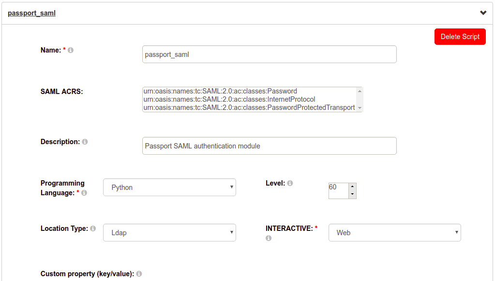
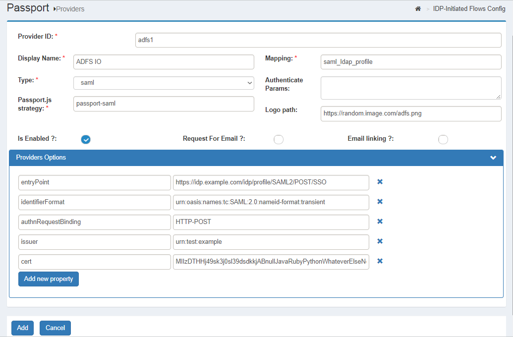
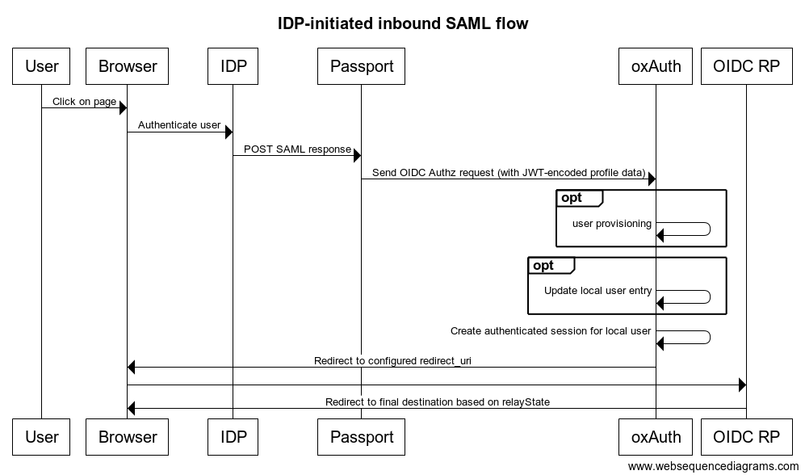

# Inbound SAML using Passport

## Enable Passport

The [introductory page](./passport.md) provides a quick overview of key concepts to get the most out of inbound identity with Gluu Passport. Ensure the Gluu Server installation already has [Passport component installed](./passport.md#passport-setup). Follow theses steps to enable it:

### Enable the custom script

- In oxTrust, navigate to `Configuration` > `Custom scripts`          
- Navigate to the `Person Authentication` tab, expand the script labelled `passport_saml`, check `enabled`, and click `Update`         
- Navigate to the `UMA RPT Policies` tab, expand the script labelled `scim_access_policy`, check `enabled`, and click `Update`       
      
### Enable Passport support 

- In oxTrust navigate to `Configuration` > `Organization configuration` > `System configuration`
- In `Passport support` choose `Enabled`    
- Click `Update`    

 

## Integrate IDPs for inbound SAML

Follow these steps to integrate an external IDP for inbound SAML:

!!! Note
    Ensure the machine(s) running Passport have access to the SAML provider you are trying to connect to.

### Add the IDP in the admin UI

1. In oxTrust, navigate to `Configuration` > `Passport` > `Providers`

1. Click on `Add new provider`

1. Enter a display name for the IDP

1. In `type`, choose "saml"

1. Optionally, supply a `logo path` for this provider. Check this [section](./passport.md#about-logo-images) of the introductory page to learn more

1. Check `Is enabled` (unless there is a reason to leave this provider integration temporarily disabled)

1. It's not required to check `Request For Email` or `Email linking` unless implementing [custom flow behavior](./passport.md#altering-flow-behaviour)

As mentioned earlier in the [introduction to inbound identity](./passport.md#supported-providers), Passport reuses [Passport.js](http://www.passportjs.org/) strategies to integrate a variety of identity provider "flavors". For IDPs, the [passport-saml](https://github.com/bergie/passport-saml/) strategy is used. This strategy is highly customizable via [configuration parameters](https://github.com/bergie/passport-saml/#config-parameter-details), which are specified in the "Provider options" panel.

By default, only a small set of parameters for a working setup are shown in the options panel:

- `entryPoint`: URL to which SAML requests can be sent to
- `identifierFormat`: Identifier format to request from IDP
- `authnRequestBinding`: SAML binding for requesting authentication, only `HTTP-POST` or `HTTP-Redirect` are supported. If not provided, the default is `HTTP-Redirect`
- `issuer`: `entityID` of Passport as SP (eg. `urn:test:example`). You can use different values or the same across different added IDPs
- `cert`: The IDP's public PEM-encoded X.509 certificate used to validate incoming SAML responses. Include only the body of the certificate: suppress the `BEGIN CERTIFICATE` and `END CERTIFICATE` lines, any whitespace, and all line breaking characters (new line/carriage return).

!!! Note 
    The certificate supplied for `cert` is the one intended for signing. For example, if you are using Shibboleth bundled in a Gluu Server instance, visit `https://<remote-gluu-host>/idp/shibboleth` and see the contents of XML tag `KeyDescriptor` where `use="signing"` inside `IDPSSODescriptor` tag.



#### Supply extra properties if needed

Add other properties you might consider relevant. For details on this topic you can check `passport-saml` repo [documentation](https://github.com/bergie/passport-saml/#config-parameter-details). If not specified, the following properties are added by default:

|Property|Value|
|-|-|
|validateInResponseTo|true|
|requestIdExpirationPeriodMs|3600000|
|decryptionPvk|/etc/certs/passport-sp.key|
|decryptionCert|/etc/certs/passport-sp.crt|

To be more precise, `decryptionPvk` and `decryptionCert` are filled with the `SP TLS cert` and `SP TLS key` values found in the basic configuration. In oxTrust visit `Passport` > `Basic Configuration` to see these values.

#### Cache Provider configuration

When `validateInResponseTo` is set to `true`, a simple in-memory cache is used to store the IDs of the SAML requests sent by Passport. Then the `InResponseTo` of SAML responses are validated against the cache. Check [here](https://github.com/bergie/passport-saml/#cache-provider) to learn more. 

This cache can lead to validation errors when the Gluu Passport environment consists of more than one server (such as a clustered setup). To account for this scenario, we provide a safe cache for validation based on Redis. In most cases, a clustered Gluu installation already leverages a Redis cache, so we can reuse it here. To use this cache, add a property named `redisCacheOptions`, with a dictionary with keys as explained [here](https://github.com/NodeRedis/node_redis#options-object-properties) as its value.

The following is an example for `redisCacheOptions` value. Note that keys are wrapped with `"` and string values use `"` instead of `'`:

```
{ "host": "server.co", "port": 6379, "password": "secret" }
```

!!! Note
    Navigate in oxTrust to `Configuration` > `JSON configuration` > `Cache provider configuration`. If `cacheProviderType` is set to REDIS, you are safe to go and can reuse some of the parameters found under the `redisConfiguration` section for `redisCacheOptions`. If the clustered setup is using a different cache provider, please check the corresponding Cluster Manager [docs](https://gluu.org/docs/cm/4.0/deploy/#cache) or open a support [ticket](https://support.gluu.org).


### Register Passport metadata with external IDP

Passport will automatically generate SP metadata for every enabled IDP added through the admin UI. The next step is to register this metadata at every external IDP.

Metadata can be accessed in a browser at `https://<your-gluu-host>/passport/auth/meta/idp/<PROVIDER-ID>.xml` where `PROVIDER-ID` is the identifier assigned to the IDP added. In oxTrust, navigate to `Passport` > `Providers` and see the ID column in the providers table. Metadata can also be found in the Gluu chroot under `/opt/gluu/node/passport/server/idp-metadata`. 

Registering metadata contents at remote IDPs is a process that may differ across IDP implementations. As an example, when the remote IDP is another Gluu Server, a [trust relationship](https://gluu.org/docs/ce/admin-guide/saml/#create-a-trust-relationship) should be created. Review the corresponding documentation for your IDPs. 

Apply the required configuration at the IDP so the appropriate attributes are released to the SP.

### Configure attribute mapping

A mapping is a mechanism that defines how the profile data released by the IDP is saved to local Gluu LDAP (see [attribute mapping](./passport.md#attribute-mapping-and-transformation). By default, IDPs use the `saml_ldap_profile` mapping, based on the [X.500/LDAP Attribute Profile](http://www.oasis-open.org/committees/download.php/28042/sstc-saml-attribute-x500-cs-01.pdf).

To learn more about how mappings work, check the [tutorial](../tutorials/passport-attributes-mapping.md). Also review the file `/opt/gluu/node/passport/server/mappings/saml_ldap_profile.js` in the Gluu chroot. If the mapping does not suit your needs or requires adjustment, create a new mapping file based on the default, rather than editing the default mapping file. You may also check the `saml_basic_profile`, which is based on the SAML Basic Attribute Profile.

Provide the name (excluding the extension) of the mapping file to use in the providers details form (in the `mapping` field).

### Make use of `passport_saml` authentication

To offer inbound SAML from an OpenID Connect application, use the same steps described for [Social Login](./passport.md#protect-the-application-with-passport_social-authentication), except the acr value has to be `passport_saml`.

<!--
If your application is a SP (SAML provider), ....
-->

### Checking user profile
To check the actual profile data received during the authentication transaction, review the logs and search for a message starting with "Resulting profile data is". To view this message, set the logging level to `debug` and wait for the server to pick up the change.

## IDP-initiated inbound flow

### Overview

The inbound SAML flow resembles the [generic flow](./passport.md#sample-authentication-flow) of inbound identity used in Gluu. However in certain circumstances, the IDP may attempt to initiate the flow by delivering a SAML response without any previously existing SAML request. This is called "IPD-initiated inbound" flow.

The approach in Gluu to handle this scenario consists of detecting if SAML responses are unsolicited (ie. not associated to preliminary SAML requests) by examining the SAML `inResponseTo` attribute. If `inResponseTo` is missing, it is considered an action initiated by the IDP.

When this kind of request is received by Passport SP, the usual profile mapping takes place, and then the profile data is sent (encoded) in the parameters of an OpenID Connect authorization request to Gluu Server. The request is processed by oxAuth and the user provisioning occurs locally, as it does with the standard flow.

Finally, this will generate a redirect to a URL whose handler logic should be able to take the user to its final destination. This logic can be deemed part of an OpenID Connect Requesting party (the analog of an SP in the SAML world).

The following diagram depicts the flow:

 

### About the Assertion Consumer Service (ACS) URL

Unsolicited SAML responses can be posted to:

```
https://<your-gluu-host>/passport/auth/saml/<PROVIDER-ID>/callback
```

where `PROVIDER-ID` is the identifier assigned to the given IDP. In oxTrust, just visit `Passport` > `Providers` and see the ID column in the providers table. 


This is the same endpoint used in the regular flow where SAML requests are previously sent to the IDP.

### Configuring the flow

To facilitate the process described above, Gluu includes the following to minimize the amount of configuration and coding required:

- A pre-existing OpenID client to be used to issue the authorization request
- UI forms in oxTrust to easily configure the parameters of the authorization to generate per registered IDP in Passport
- A sample redirection page that sends the user's browser to a URL (previously passed as `relayState` in the initial SAML response)

To enable IDP-initiated inbound capabilities for an existing IDP, follow these steps:

- Navigate to `Passport` > `IDP-initiated flows config`
- Click the `Add` button
- Choose the IDP you want to enable usage of IDP-initiated flow
- Accept the defaults and click on `Update`


From here on, if the IDP sends an unsolicited response to Passport ACS, an OIDC authorization request will be issued using the client that appears selected on the top of the form (by default the "Passport IDP-initiated flow Client"). After the user is authenticated in Gluu, a redirection will be made to `https://<your-gluu-host>/oxauth/auth/passport/sample-redirector.htm` that will simply redirect to the value of the `relayState` which is assummed to be a valid URL.

### Customization

The `IDP-initiated flows config` page in oxTrust provides default values for a working setup with minimal effort. To tweak the behavior, you have to build your own redirect page. There you can handle `relayState` as desired and potentially show options in the event `relayState` is absent. Learn how to retrieve this value checking the source code of the `sample-redirector.htm`:

- Login to chroot
- Run `jar -xf /opt/gluu/jetty/oxauth/webapps/oxauth.war auth/passport/sample-redirector.xhtml`

Remember to provide the new redirect URI in oxTrust (`Passport` > `IDP-initiated flows config`) for the IDP of interest. Changes may take up to 1 minute to take effect.

!!! Note
    The page will receive the typical parameters of an OIDC authentication response in the HTTP request. Do not transfer those parameters to other requests/redirects that the handler logic may perform.

## Using the demo app

!!! Warning 
    This is a minimalistic web application developed with the sole purpose of showcasing how inbound SAML can be achieved with Passport. It is strongly discouraged to leave it running indefinitely on a production server.
    
The ["Inbound SAML Demo"](https://github.com/GluuFederation/Inbound-SAML-Demo) application is a small Node.js app that provides an easy way to test the Inbound SAML scenario. The project requires `node` to be installed on the machine where the app will run. Optionally, and for the sake of simplicity, we recommend reusing the `Node.js` setup of your Gluu Server where Passport is running.

Follow the guidelines below to run the Demo app in your Gluu Server host:

### Web UI configuration steps

1. Log in to the oxTrust web UI as an administrator

1. Navigate to the `OpenID Connect` > `Clients` page, and register a new OIDC client to your Gluu Server with the following required properties:

    - *Redirect login URI*: `http://passport-saml-demo-app.example.com:3000/profile/`    
    - *Grant types*: `authorization_code`   
    - *Response types*: `code` and `id_token`    
    - *Scopes*: `openid`, `email`, `user_name` and `profile`   
    - *Client secret*: an non-empty value

1. Go to `Configuration` > `JSON configuration` > `oxAuth configuration`

    - Scroll down to `authorizationRequestCustomAllowedParameters` and click on the plus icon
    - Enter `preselectedExternalProvider`
    - Save the configuration

1. Update the Passport custom script to read the custom parameter

    - Navigate to `Configuration` > `Custom scripts`   
    - In `Person Authentication` tab, expand the script labelled `passport_saml`   
    - Click `Add new property` and enter `authz_req_param_provider` in the left field      
    - In the right field, enter the name of the custom parameter (e.g. `preselectedExternalProvider`)
    - Press `Update` at the bottom

### Console configuration steps

1. Log in to the Gluu chroot container.

1. Ensure the VM has internet access and that incoming connections to TCP port 3000 are allowed to reach applications running on this machine.

1. Switch to "node" user with `su - node`.

1. Download and extract the [project files](https://github.com/GluuFederation/Inbound-SAML-Demo/archive/master.zip).

1. Edit the file `server.js`. In the line that reads `let idps = ...`, supply the IDs of the SAML IDPs you have added so far, e.g `['Shib_123', 'OktaCore']`

1. Edit the file `client-config.json` file and provide proper values for `ClientID` (the `inum` of the client created in oxTrust), `clientSecret`, and `hostname` (the FQDN of this Gluu Server instance).

1. Initialize the Demo app:      

    - `$ cd ~/Inbound-SAML-Demo/`
    
    - `$ npm install`
    
1. Run the `$ node server.js` application. You can stop the app if needed by hitting `Ctrl + C` at any moment.

!!! Note 
    Starting the demo app as described above will render the SSH session unusable while allowing you to see useful debug output, redirected to stdout. If necessary, start another SSH session in a separate console window for other tasks.

### Test Passport

1. In the machine where you will run this test, add a host entry so that the name `passport-saml-demo-app.example.com` resolves to the IP address of the machine where the demo app was installed.

1. Open a web browser and navigate to `http://passport-saml-demo-app.example.com:3000`.

1. Select one of the displayed IDPs to initiate external authentication.

    

1. After logging in at the IDP, you will be redirected back to Gluu Server, where you might be prompted to authorize release of your personal data to the Demo app.

   
   
1. After consenting to release the requested claims, you'll be sent to the Demo app with an authorization code that is needed for retrieving your personal data.

1. The application will display retrieved claims on the "/profile" page   

      

See the Demo in action in this [video](https://www.youtube.com/watch?v=ubhDgGU8C8s&feature=youtu.be).

## Troubleshooting tips

If there are any issues during setup or testing, consider the following:

1. Make sure that the system clocks are synchronized between all the machines that participate in the flow (NTP is recommended.) When clocks are out of sync, it's known to cause a hard-to-troubleshoot "infinite loop" (a non-ending redirection across a given set of pages).

1. Some IDPs may choose to encrypt assertions in their SAML responses in a way that the Passport module is not able to understand. In case of any issues with the flow (especially after receiving the SAML response from remote IDP by the Passport module), try to disable assertions' encryption at involved IDP in order to verify whether this is the cause (the response will still be normally passed over the encrypted channel via the SSL/TLS providing enough strong security).

1. [Log files](./passport.md#files-and-severity-level) can be a useful source of clues about what is going on under the hood.

1. For debugging purposes, you can print the contents of profile data you are receiving from the external provider. Follow the guidelines given [here](./inbound-oauth-passport.md#checking-user-profile).

If you still have trouble, feel free to open a [support ticket](https://support.gluu.org) for further assistance. Please provide all related log entries to speed up the resolution process.
