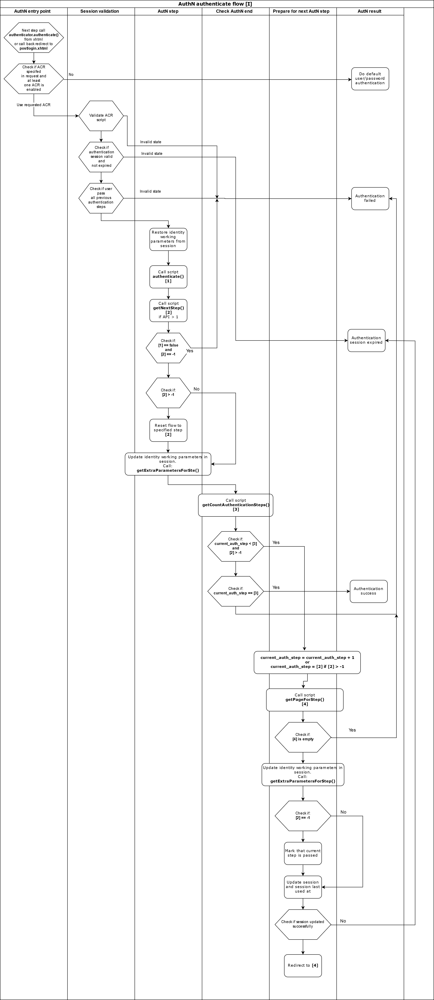
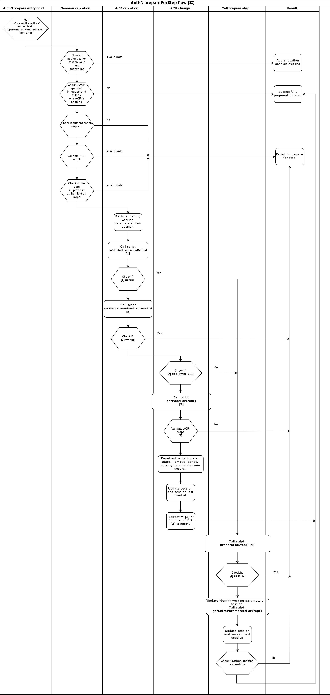

# User Authentication Introduction
The Gluu Server was designed to be very flexible in handling user authentication. Username and password is the default form of authentication ("basic"). Stronger forms of authentication, like One-Time Passcodes (OTP), FIDO Security Keys, and Gluu's U2F push-notification mobile app, Super Gluu, can be implemented to increase account security. 

All Gluu Server authentications are routed through the oxAuth OpenID Provider (OP) using the OpenID Connect `acr` paramter. Incoming SAML or CAS assertions can be taken from a 3rd party IDP, for example ADFS, and can be used as the basis for an OpenID Connect session in Gluu. This enables seamless SSO across a diverse environment of federated applications. 

## Authentication Interception Scripts
The Gluu Server leverages [interception scripts](../admin-guide/custom-script.md) to facilitate the user authentication process. Interception scripts specify authentication steps and which pages should be presented to the user. The name of each script corresponds with its acr value in the Gluu Server.  

Interception scripts are included for a number of authentication mechanisms, such as:

- [FIDO U2F](./U2F.md)
- [TOTP/HOTP](./otp.md)
- [Super Gluu](./supergluu.md)  (Gluu's free 2FA mobile push app)   
- [Duo Security](./duo.md)
- [Social Login](./passport.md) 

Interception scripts included in Gluu's default distribution can be customized and extended, or new scripts can be written to support unique business requirements for authentication. For example, a script could be extendeded to implement extra authentication steps based on contextual information such as fraud scores, location, or browser profiling. 

Follow the [custom authentication script tutorial](./customauthn.md) to better understand how interception scripts work. 

!!! Note
    All pre-written authentication scripts can be found in the [oxAuth integration folder on GitHub](https://github.com/GluuFederation/oxAuth/tree/master/Server/integrations). 
    

## Default Authentication Mechanism
In oxTrust, navigate to `Configuration` > `Manage Authentication` > `Default Authentication` to specify the default authentication mechanism for two use cases: 

1. `default_acr`: this is the default authentication mechanism exposed to *all* applications that send users to your Gluu Server for sign-in. Unless an app specifically requests a different form of authentication using the OpenID Connect `acr_values` parameter (as specified [below](#multiple-authentication-mechanisms)), users will receive the form of authentication specified in this field. 

2. `oxTrust_acr`: this form of authentication will be presented to anyone specifically trying to access the oxTrust admin GUI.

Depending on your requirements, you can set both fields to the same authentication mechanism, or choose a different mechanism for each use case. 

In addition, specific apps can request specific forms of authentication using the OpenID Connect `acr_value`. More on that topic [below](#multiple-authentication-mechanisms). 

If a default ACR is not specified, oxAuth will determine it based on enabled scripts and the internal user/password ACR. This internal ACR, `simple_password_auth`, is set to level -1. This means that it has lower priority than any scripts, so oxAuth will use it only if no other authentication method is set.

## Basic Authentication

Gluu will default to Basic Authentcation, which is username and password authentication against the local Gluu LDAP. If [LDAP synchronization](../user-management/ldap-sync.md) has been configured, an existing backend LDAP server can be used for authentication.

Learn how to [configure basic authentication](./basic.md).

## Two-Factor Authentication (2FA)

Gluu includes interception scripts for the following forms of 2FA:

- [FIDO 2.0](./fido2.md)
- [U2F](./U2F.md)
- [Super Gluu](./supergluu.md)  
- [OTP apps](./otp.md)
- [SMS OTP](./sms-otp.md)
- [Duo Security](./duo.md)
- [Certificate Authentication](./cert-auth.md)

To a support an authentication mechanism not listed above, review the [custom authentication script tutorial](./customauthn.md) to learn how to write your own authentication scripts. 

### 2FA enrollment

Once 2FA is enabled, the Gluu Server's default behavior is to prompt for enrollment the first time a user signs in. 

### 2FA Credential Management	
	
Once users enroll 2FA credentials for their account, the credentials can be viewed and removed by the Gluu Server administrator either directly in LDAP, or in the user record in oxTrust via the [Manage People interface](../user-management/local-user-management.md#managing-associated-2fa-devices). 

!!! Note
    To offer self-service credential management, where end-users can manage their own 2FA authentication credentials, check out our new app, [Gluu Casa](https://casa.gluu.org). 

## Social Login

If you want to support social login or inbound SAML, include Passport in your installation of Gluu Server.

Passport provides a crowd-sourced approach to supporting social login at many popular consumer IDPs, such as Facebook, LinkedIn, GitHub, etc. In addition to normalizing social login, it provides a standard mapping for user claims, allowing you to dynamically enroll new users into your Gluu Server that have authenticated elsewhere.

Learn how to [configure social login](./passport.md), [inbound SAML providers](./inbound-saml-passport.md) and [inbound OIDC providers](./inbound-oauth-passport.md). 

## Multiple Authentication Mechanisms
The Gluu Server can concurrently support multiple authentication mechanisms, enabling Web and mobile apps ("clients") to request a specific type of authentication using the standard OpenID Connect request parameter: `acr_value`. 

In oxTrust, navigate to `Configuration` > `Manage Custom Scripts` > `Person Authentication` and check the `Enabled` box for each applicable authentication interception script. Click the `Update` button at the bottom of the page to save the changes. 

By default, users will get the default authentication mechanism as specified [above](#default-authentication-mechanism). However, using the OpenID Connect `acr_values` parameter, web and mobile clients can request any *enabled* authentication mechanism. 

Each authentication mechanism has a "Level" rank assigned to it which describes how secure and strict it is. The higher the "Level", the more reliable mechanism represented by the script is. Though several mechanisms can be enabled at the same Gluu instance at the same time, for any specific user's session only one of them can be set as the current one (and will be returned as `acr` claim of `id_token` for them). If after initial session is created a new authorization request from a RP comes in specifying another authentication method, its "Level" will be compared to that of the method currently associated with this session. If requested method's "Level" is lower or equal to it, nothing is changed and the usual SSO behavior is observed. If it's higher (i.e. a more secure method is requested), it's not possible to serve such request using the existing session's context, and user must re-authenticate themselves to continue. If they succeed, a new session becomes associated with that requested mechanism instead.

Enabled scripts can be confirmed by checking oxTrust or the Gluu OP configuration URL, `https://<hostname>/.well-known/openid-configuration`, and finding the `"acr_values_supported"`. 

Learn more about `acr_values` in the [OpenID Connect core spec](http://openid.net/specs/openid-connect-core-1_0.html#acrSemantics) and in the Gluu Server [OpenID Connect docs](../admin-guide/openid-connect.md#authentication).

## Account Lockout Policy

The default Gluu Server distribution includes an interception script to implement a basic account lockout policy, which will deactivate a user's account after a set number of consecutive failed login attempts.

Learn how to [configure account lockout](./lockout.md). 

## Customizing the Login Page 

Learn how to customize the look and feel of Gluu Server login pages in the [Design Customizations](../operation/custom-design.md) section of the Operations Guide.

## Revert Authentication 

New authentication flows and methods should **always** be tested in a different browser to reduce the chance of lockout. However, in case you find yourself locked out of the GUI, refer to the [revert authentication mechanism docs](../operation/faq.md#revert-an-authentication-method). 

## Extending the Authentication Flow

The oxAuth Person Authenticator Script (ACR) interface includes methods extend the user authentication flow. There are two entry points of this flow, `prepareForStep` and `authenticate`.

oxAuth calls `prepareForStep` from XTHML, and its role is to prepare data to render the login page or redirect to a third party system for authentication. 

oxAuth expects `authenticate` to call from the login page or from `/oxauth/postlogin.htm` (the callback from a third party system). Its role is to verify user data that is submitted by the user.

The following diagram demonstrates the `authenticate` flow:

)

The following diagram demonstrates the `prepareForStep` flow:

