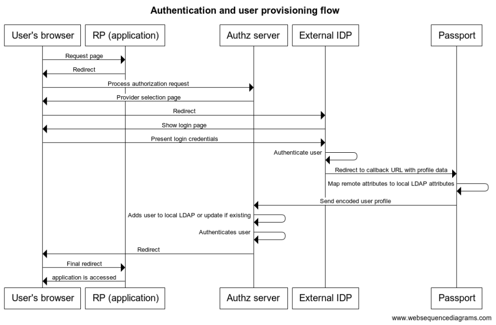
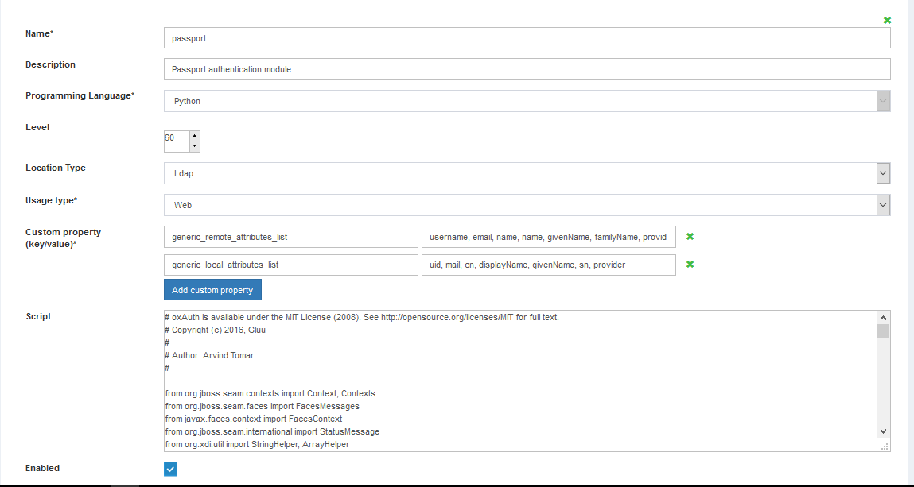
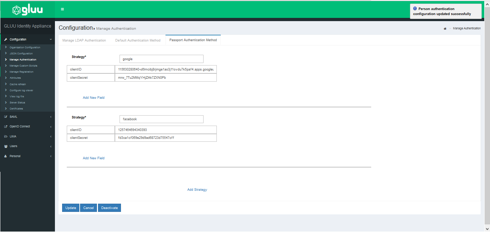
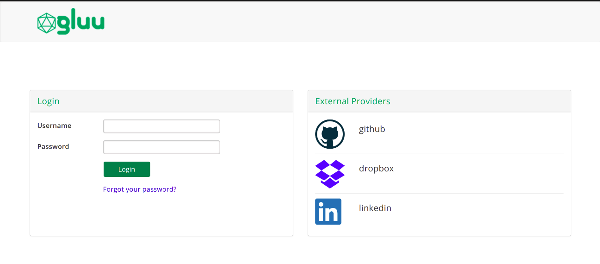
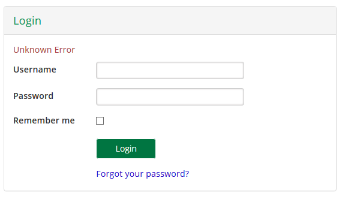

# Inbound OAuth & OpenID Connect

## Overview

The Gluu Server bundles the Passport.js authentication middleware to enable social login and inbound SAML and OpenID Connect (all of which can be referred to as "inbound identity"). Passport normalizes the process of supporting user authentication at external identity providers and offers a standard mapping for user claims and user registration in your Gluu Server. 

Passport is an MIT licensed, Node.js web app that supports hundreds of "authentication strategies" out-of-the-box, including strategies for popular consumer apps like Facebook, Twitter, Github, etc.    

## Passport setup 
Passport is available as an optional component in the Gluu Server that can included during initial installation or added post installation, as needed.  

### During Gluu installation
For new deployments, simply opt to include Passport during [Gluu Server installation](https://gluu.org/docs/ce/installation-guide/). 

### Post Gluu installation

To add Passport to an existing Gluu Server installation, perform the following actions (requires Internet access):

1. Login to Gluu Server chroot

1. cd to `/install/community-edition-setup`

1. wget `https://raw.githubusercontent.com/GluuFederation/community-edition-setup/master/post-setup-add-components.py`

1. `chmod +x post-setup-add-components.py` 

1. Run `./post-setup-add-components.py -addpassport`

## Sample authentication flow

The following is a high-level diagram depicting a simple inbound identity user authentication and provisioning workflow:

 

1. User attempts to access an application protected by Gluu 
1. Without a session, user's browser is redirected to a page showing a list where he can choose the social site he wants to use for login. 
1. User is taken to social site where he is asked for login credentials.
1. Upon successful authentication, a redirection is made to Passport with user's profile data.
1. Passport securely sends relevant profile data to Gluu authentication component
1. If the user does not exist already in local Gluu LDAP, it is created with the attributes found in profile (if already existing, the profile is updated)
1. A session is created for the user at the authorization server. The user access the application.

!!! Warning
    To deploy an authentication flow like the one above, some configuration steps are required. Important tasks include enabling passport endpoints, creating OAuth clients at social sites you want to support, and supply strategies parameters to determine behaviour.  

## Supported social login providers 

Gluu Server 3.1.7 ships with strategies to support social login at the following providers:

- Dropbox
- Facebook
- Github
- Google
- Linkedin
- Tumblr
- Twitter
- Windowslive
- Yahoo

To integrate a provider not mentioned above, follow the instructions [below](#supporting-a-new-strategy).

## Setting up social login

This section describes the steps required to implement the [sample workflow](#sample-authentication-flow) described above. In this example we will offer a couple of authentication choices. The protected application will be the Gluu Server admin GUI, oxTrust. 

The following summarizes the steps (and assumes Passport is already included in your Gluu Server, [see above](#passport-setup)):

1. Enable Passport
1. Register for a (developer) account at social sites
1. Create applications (clients) in social sites
1. Fill strategy details
1. Set oxTrust authentication to Passport
1. Test (in a different browser)

### Enable passport

1. Enable the required custom scripts:    

    - In oxTrust navigate to `Configuration` > `Custom scripts`          
    - Navigate to the `Person Authentication` tab, expand the script labelled `passport_social`, check `enabled`, and click `Update`         
    - Navigate to the `UMA RPT Policies` tab, expand the script labelled `scim_access_policy`, check `enabled`, and click `Update`       
      
1. Enable passport support:    

    - In oxTrust navigate to `Configuration` > `Organization configuration` > `System configuration`    
    - In `Passport support` choose `Enabled`    
    - Click `Update`    

     

### Obtain client credentials

Every provider has its own procedure for issuing client credentials (i.e. client ID and client secret). Check the docs of the specific app for more information. The aim is to get to a page that allows creation of applications. Here are links for a few popular providers: 

- [GitHub](https://github.com/settings/applications/new)   
- [Twitter](https://apps.twitter.com)   
- [Facebook](https://developers.facebook.com)       

To create an application you will need to provide information like an application name or ID, domain name of your application, and authorization callback URLs.

For our example, you can use the domain name of your Gluu Server (e.g. `https://myidp.domain.com`). For callback URL use the following the convention:

```
https://<idp-hostname>/passport/auth/<strategy>/callback
```

Where `<strategy>` is the name of the Passport.js strategy you are integrating, for example `../auth/facebook/callback`. 

The portion after the domain name must match that found in the corresponding `js` file in the chroot folder `/opt/gluu/node/passport/server/auth` (search for `callbackURL`). This directory contains all providers supported out-of-the-box.

Once the application is created you will be given two pieces of data: client ID and client secret. 

!!! Note
    Terminology varies depending on provider; sometimes it is called consumer key and consumer secret, or app ID and app secret, etc. For instance, [this is how it looks on Facebook](../img/user-authn/passport/fb-addurl.png).    

### Add strategy details

In oxTrust navigate to `Configuration` > `Manage Authentication` > `Passport Authentication Method`. 

Do the following for each provider you wish to support:

- Click `Add Strategy`             
- Add the name of the provider in the `strategy` field (e.g. `github`) **Note: this field is case sensitive**  
- Paste the client ID and client secret details obtained in the previous step in the appropriate fields     



Additional parameters can be supplied in the form. We will cover this [later](#altering-flow-behaviour).

### Protect oxTrust with Passport

Navigate to `Configuration` > `Manage Authentication` > `Default Authentication` and set the `oxTrust acr` field to `passport_social` and click `Update`. This will force oxTrust to use the Passport authentication flow. 

### Testing

#### Passport logs

Passport logs can be found in `/opt/gluu/node/passport/logs`. By default, severity of messages logged is `INFO`. You can tweak this by altering Passport's configuration file. For more information see [Log level](#log-level).

In addition to Passport logs, the log statements of the custom script are key. You can find those in `/opt/gluu/jetty/oxauth/logs/oxauth_script.log`.

#### Login flows

Wait for 1 minute for passport to pickup configuration changes. Open a separate browsing session (e.g incognito) and try accessing oxTrust: `https://<idp-hostname>/identity`. You should be presented with a form like the one shown below with your external identity providers populated:



To start testing, simply confirm the username + password authentication flow is working as expected. Sign in and out to confirm.

Next, attempt to use one of the social login options you've configured. If your setup is correct, you'll be prompted for authentication at the external provider and, after successfully authenticating, will be redirected back to oxTrust as an authenticated user.

!!! Note
    Once you have supplied login credentials at an external provider, you won't be prompted for authentication again until your session expires or you explicitly log out of the external provider.  
    
If you get an error page like the one below, for example, double check your configuration and Internet access.



If you are stuck and need additional assistance, open a ticket on [Gluu support](https://support.gluu.org).  

#### User data

Once oxTrust login is successful, check user data by navigating in oxTrust to `Personal` > `Profile`. Alternatively you can use the admin user and navigate to `Users` > `Manage people` to inspect the recently created user entry.

To check the actual profile data received during the authentication transaction, review this [section](#inspecting-profile-data).

If you modify some aspect of your profile at the external provider and attempt to re-login, the user attributes will also be updated in your local Gluu LDAP.

## Making other applications use inbound identity

In the previous section we experimented with an authentication flow to access oxTrust. There are two ways to force other applications to leverage the inbound identity authentication flow: 

1. Make this the default authentication workflow for *all* apps: in oxTrust navigate to `Configuration` > `Manage Authentication` >  `Default Authentication` and set the `default_acr` value to `passport_social`.  

1. Make specific apps leverage this flow: adjust the code in your app so the authorization request sends as `acr_value` the string `passport_social` (the name of the custom interception script you enabled in Gluu to support this workflow).

For more information on `acr_value` manipulation, check this [page](../admin-guide/openid-connect/index.md#authentication).

Additionally, you can bypass the provider selection page and force usage of a specific provider by supplying a [custom authorization parameter](#preselecting-an-external-provider) with your authorization request.

## Inspecting profile data

For debugging purposes, you can print the contents of profile data received from the external provider by following these steps:

1. Locate the `js` file of the target identity provider. Inside the Gluu chroot, check `/opt/gluu/node/passport/server/auth`     

1. If missing, at the very top of the file add a line of code like this `var logger = require('../utils/logger')`     

1. Find the line of code starting with `var userProfile...` and just **before** it, add this: `logger.log2('info', 'Profile data received was %s:', JSON.stringify(profile))`     

1. Find the line of code starting with `return done...` and just **before** it, add: `logger.log2('info', 'Profile data sent is: %s', JSON.stringify(userProfile))`      

1. Save the file     

1. Restart passport by running the following command within the chroot: `service passport restart`

The two log statements added will print all profile data received from the external provider in JSON format, and the portion of that profile actually processed by Gluu, respectively.

Perform a login attempt by choosing an external provider, then check the contents of the [passport node logs](#passport-logs).

## How user onboarding works

As stated in the [sample flow](#sample-authentication-flow), after a user has logged in at an external provider a new record is added in local LDAP - or updated in case the user is known. 

To determine if a user was already added, a string is composed with the provider name and the user ID. For example, if user "MrBrown" has logged in at Twitter, the string would look like `passport-twitter:mrbrown`. An LDAP search is performed for a match in the people branch for an entry where attribute `oxExternalUid` equals `passport-twitter:mrbrown`.

If there are no matches, a new user entry is added with the values [received](#inspecting-profile-data) from the external provider, as well as the computed value for `oxExternalUid`. The user profile can contain single or multivalued attributes, however `id` and `provider` **must** be single-valued.

You may have noticed there is no `id` LDAP attribute. There is an intermediate step which does mapping of attributes from the remote source (external provider) to the local destination (Gluu LDAP). This is controlled by the [configuration properties](#custom-script-parameters) found in Passport's interception script.

Also note that you can apply some transformation of incoming attribute values before they are sent to the custom script by tweaking the correponding `js` file of the strategy of your interest.

## Altering flow behaviour

There are a couple of ways to modify the behavior of the authentication flow. These are slight flow changes though. To achieve needs not covered in this section, you may want to open a [support ticket](https://support.gluu.org) for further assistance. Customization may require programming skills in languages such as Python, Java, and Node.js.

Wait at least 1 minute before testing all modications to give the server time to pick up configuration changes.

### Requiring email in profile

Default implementation does not impose constraints around attributes requiredness with exception of `username`. If you want to flag `email` as required, you can add the following property to the strategy:

- In oxTrust, navigate to `Configuration` > `Manage Authentication` > `Passport Authentication Method`
- Click `Add new property` for the appropriate strategy    
- Enter `requestForEmail` in the left field and `true` in the right field
- Save your settings   

With this configuration added, to complete the login flow, a newcomer will be shown a page to enter their email after authentication at the external provider (this won't be needed for subsequent logins). The value entered is stored in LDAP `mail` attribute. However, if an existing user has such email assigned already authentication will fail.  

Most social providers prompt users to authorize the release of personal attributes to external providers, so depending on user settings the value may be present or not. This means that even if `requestForEmail` is set to `true`, there may be cases where users are not prompted.

### Email account linking

There are cases in which an external provider is trusted so you can change the default behavior of adding a new user entry locally, but binding an existing user to the one that is logging in. This linking can be done via email attribute.

For example, suppose you have 3 users in your Gluu local LDAP: Larry (`larry@acme.com`), Moe (`moe@acme.com`), and Curly (`curly@acme.com`). When you enable email account linking for provider "XYZ" and certain user logs in through XYZ to access your application, he will be logged as Moe as long as his email is "moe@acme.com" at XYZ.

To enable account linking, follow these steps:

- In oxTrust, navigate to `Configuration` > `Manage Authentication` > `Passport Authentication Method`    
- Click `Add new property` for the appropriate strategy    
- Enter `emailLinkingSafe` in the left field and `true` in the right field   
- Save your settings     

!!! Note
    Only enable this feature for trusted providers and do not set `requestForEmail` to `true` in this case, since this opens a big security hole.  

### Preselecting an external provider

In some cases you might not want to show external identity providers, instead simply directing a user to a specific external provider. In this case, you need to customize the authorization request being sent to Gluu in order to pass the desired provider. For this purpose you need to create a custom parameter for authorization requests and parameterize the passport script accordingly.

Please follow these steps:

1. Create a custom parameter for authorization request     
    
    - Log into oxTrust and navigate to `Configuration` > `JSON configuration` > `oxAuth configuration`
    - Scroll down to `authorizationRequestCustomAllowedParameters` and click the plus icon
    - Enter a name for the custom parameter you are adding, e.g. `preselectedExternalProvider`
    - Save the configuration     
    
1. Parameterize the Passport custom script to read the custom parameter

    - Navigate to `Configuration` > `Custom scripts`   
    - In `Person Authentication` tab, expand the script labelled `passport_social` (or `passport_saml` if you are using inbound SAML)   
    - Click `Add new property` and enter `authz_req_param_provider` in the left field      
    - In the right field, enter the name of the custom parameter (e.g. `preselectedExternalProvider`)

Now you can append a new query parameter to the request you issue to start the authorization process in your application, for example:

```
https://<domain-name>/oxauth/authorize.htm?response_type=code+...&client_id=...
   &scope=openid+...&redirect_uri=...&state=...
   &acr_values=passport_social
   &preselectedExternalProvider=<base64-url-encoded-provider-object>
```

Where `<base64-url-encoded-provider-object>` is the Base64-encoded representation of a small JSON content that must look like this:

```
{
   "provider" : "<strategy-name>"
}
```

In this case `<strategy-name>` is the name of an already configured strategy. Note this piece of data is case sensitive. 

The names of valid strategies are those defined in oxTrust in `Configuration` > `Manage Authentication` > `Passport authentication method`. If using SAML, valid providers are those defined in `/etc/gluu/conf/passport-saml-config.json`.

## Additional configuration details

### Log level

As mentioned [earlier](#passport-logs), there are two relevant logs: `oxauth_script.log` (where you will see statements about every step of the flow itself), and `passport-YYYYmmdd.log` which allows debugging certain aspects in the communication with external providers.

`oxauth_script.log` does not handle levels per se (all `print` statements of the custom script are sent to log) but passport logging level can be configured this way:

1. Login to Gluu chroot

1. `cd` to `/etc/gluu/conf`

1. Edit file `passport-config.json` so that property *logLevel* value is any of *error*, *warn*, *info*, *verbose*, *debug*. Some notes:
    - If your file does not contain *logLevel*, add a line like this `"logLevel": "info",` after the line starting with `"applicationEndpoint"...`
    - Ensure the file produced has valid JSON syntax
    
1. Save the file and preferably flush the contents of `/opt/gluu/node/passport/logs`

1. Restart passport: `service passport restart`.

### Custom script parameters

The interception script is the core code that implements the authentication flow. In general, it implements a provider agnostic inbound identity authentication flow. Actually, the script used for social login and inbound SAML are very similar.

The following describes the configuration properties of the passport script. We advise to login to oxTrust and navigate to `Configuration` > `Custom scripts` > `Person Authentication` tab, and expand the script (whether social or saml version).

- *generic_remote_attributes_list*: a comma-separated list of values in a one-to-one correlation with the values of the list *generic_local_attributes_list*. It contains the names of the attributes (of the remote profile) that will be mapped into local (Gluu) attributes when a user provisioned.

- *generic_local_attributes_list*: a comma-separated list of values in a one-to-one correlation with the values of the list *generic_remote_attributes_list*. They are the actual attributes that can be set (filled/updated) by the custom script when an user provisioned.

- *authz_req_param_provider*. This is used to programmatically pass an [external provider](#preselecting-an-external-provider).

### Provider's logo image

Strategies supported out-of-the-box are already bundled with corresponding logo images. To change the image shown for an existing strategy follow the below instructions:

1. Create images directory under `/opt/gluu/jetty/oxauth/custom/static`:`mkdir /opt/gluu/jetty/oxauth/custom/static/img`.

1. Create Passport directory under `/opt/gluu/jetty/oxauth/custom/static/img`:`mkdir /opt/gluu/jetty/oxauth/custom/static/img/passport`.

1. Copy the image to Passport directory (`/opt/gluu/jetty/oxauth/custom/static/img/passport`).

1. In oxTrust navigate to `Configuration` > `Manage Authentication` > `Passport Authentication Method`.

1. Click `Add new property` for the appropriate strategy.

1. Add `logo_img` in the left field, and in the right field add `../../ext/resources/img/passport/<image-name>` where `<image-name>` is the name of the file you copied during the first step. 

1. Wait 1 minute, then verify the image appears correctly by acessing your application in a browser.

Alternatively you can use an absolute URL for `logo_img` if the image is hosted elsewhere (e.g. `https://another.site.co/path/to/image`).

### External OpenID Connect Providers

Besides common social providers, external OpenID Connect Providers can also be supported. More specifically, you can enable one OpenID Provider and be up and running in a matter of minutes. 

1. In oxTrust navigate to `Configuration` > `Manage Authentication` > `Passport Authentication Method`. 

1. Click `Add Strategy` and fill the `strategy` field with the value `openidconnect`.

1. Fill the following fields according to the configuration of the external OP:
   
   - `clientID` and `clientSecret`: The details of an OIDC client previously registered at the OP

   - `issuer`: Location of the OP (e.g. `https://server.example.com`)
   
   - `authorizationURL`: The Authorization Endpoint (e.g `https://server.example.com/authorize`)
   
   - `tokenURL`: The endpoint used to obtain an access token, ID token, etc. (e.g. `https://server.example.com/token`)
   
   - `userInfoURL`: The endpoint that returns Claims about the authenticated end-user (e.g. `https://server.example.com/userinfo`)

   - `acr_values` (optional): Space-separated string that specifies the `acr` values the OP will be requested to use for processing authentication requests.

1. Save the configuration and wait for about 1 minute

Integration of OIDC providers is achieved via `passport-openidconnect` Passport.js strategy which **only** supports the OpenID Connect code flow (not hybrid or implicit). Additionally, comunication with the token endpoint is carried out via POST only. No support for secretless clients (just confidential oauth clients).

If you need to support a second OIDC provider, you have to duplicate the `openidconnect` strategy and proceed similarly as when [adding a new provider](#supporting-a-new-strategy).

#### Using an external Gluu Server as OP

Here we provide specific steps on how to configure your OpenID Connect strategy when using a Gluu Server instance as the external provider (here called "remote Gluu". Note this is **not** the same server in which Passport has been installed). 

1. Create a client in your remote Gluu server. Login with admin credentials to `https://<remote-gluu-server>/identity` and navigate to `OpenID` > `Clients` > `Add`. Provide the following settings:

    - client name: *any of your choosing*
    
    - client secret: *a password for this client*

    - application type: native

    - pre-authorization: false

    - persist client authorizations: true

    - subject type: pairwise

    - jws algorithm ID token: rs256

    - authentication method for token endpoint: client_secret_post

    - require auth time: false

    - scopes: openid, profile, user_name, email

    - grant types: authorization_code

    - logout session required: false

    - response types: code

    - redirect login uri: `https://<host-name>/passport/auth/openidconnect/callback`. Where `<host-name>` is the host of the Passport-enabled Gluu Server 

1. Follow the steps at the [beginning of this section](#openid-connect-providers). Particularly for step 3 provide:

   - `clientID` and `clientSecret`: The details of client just created. Go to "OpenID Connect" > "Clients" and use for "clientID" the one appearing in the column "Inum" of the table.

   - `issuer`: `https://<remote-gluu-server>`
   
   - `authorizationURL`: `https://<remote-gluu-server>/oxauth/restv1/authorize`
   
   - `tokenURL`: `https://<remote-gluu-server>/oxauth/restv1/token`
   
   - `userInfoURL`: `https://<remote-gluu-server>/oxauth/restv1/userinfo`

<!--
## Customizing UI pages
-->

## Supporting a new strategy

This section describes the steps needed to add a new authentication provider to your Gluu Passport installation. 

!!! Note
    Here we will use *reddit* integration as example, apply your changes according to the strategy you have choosen.  

Passport.js - the authentication middleware Gluu leverages - supports hundreds of strategies. Onboarding a new one requires finding a proper `npm` package, creating a file, and editing some already existing.

### Install the strategy module

You can use Passport.js [search feature](http://www.passportjs.org/packages/) to locate the proper node package. In most cases you will get redirected to the github page of the project where you'll find installation instructions for the strategy. Normally a command like `npm install <strategy-id>`. Do not execute this command directly, but in the following manner:

1. Login to Gluu Server chroot.

1. Switch to `node` user: `su - node`.

1. Add `node` executable to path: `export PATH=$PATH:/opt/node/bin`.

1. `cd` to passport application: `cd /opt/gluu/node/passport`. Recommended: backup this folder before proceeding

1. Ensure your vm has Internet access and install the strategy: `npm install passport-reddit --save`

### Add strategy setup code

Now that you added `passport-reddit` strategy, next step is creating a file named `reddit.js` in `/opt/gluu/node/passport/server/auth` with contents like:

```
var passport = require('passport')
var RedditStrategy = require('passport-reddit').Strategy

var setCredentials = function(credentials) {
    var callbackURL = global.applicationHost.concat("/passport/auth/reddit/callback")
    passport.use(new RedditStrategy({
            clientID: credentials.clientID,
            clientSecret: credentials.clientSecret,
            callbackURL: callbackURL
        },
        function(accessToken, refreshToken, profile, done) {
            var userProfile = {
                id: profile._json.id || '',
                name: profile.displayName || '',
                username: profile.username || profile._json.id || '',
                email: profile._json.email || '',
                givenName: profile._json.first_name || '',
                familyName: profile._json.last_name || '',
                provider: 'reddit'
            }
            return done(null, userProfile)
        }
    ))
}

module.exports = {
    passport: passport,
    setCredentials: setCredentials
}
```

This resembles what most already existing `js` files in `/opt/gluu/node/passport/server/auth` have. Documentation for the particular strategy will let you know if additional parameters can be supplied in the constructor call (`new RedditStrategy(...` in this case). For instance, certain strategies allow you to explicitly request the attributes needed from user profile. As an example:

```
   profileFields: ['id', 'name', 'displayName', 'email']
```

this is something that you would add after `callbackURL`. You can use more configuration options depending on your requirements.

Notice the function passed as second argument for `passport.use`: it fills variable `userProfile` with the actual data to be used by the custom script implementing the authentication flow. Parameter `profile` contains the representation of profile received directly from the external provider. Note that structure (properties) of `userProfile` is referenced in the attribute mapping established by *[generic_remote_attributes_list](#custom-script-parameters)* config property of custom script. This means all strategies must use the same names when building `userProfile`.

It is recommended to add ` || ''` for every field because data may be missing in the profile received. This ensures an empty string is parsed by the custom script instead of a string with the well-known javascript `undefined`.

Finally, note in variable function `setCredentials` the presence of parameter `credentials`. This holds the values filled in oxTrust for this particular strategy.

### Configure strategy routes

Edit `/opt/gluu/node/passport/server/routes/index.js` using the following instructions: 

1. Add this variable declaration `var passportReddit = require('../auth/reddit').passport` to require the file added in previous step. You will find a section at the top of the file where analog variables are defined for all supported strategies.

1. Add this couple of handlers at around line 250:

```
//=================== Reddit ===================
router.get('/auth/reddit/callback',
        passportReddit.authenticate('reddit', {
            failureRedirect: '/passport/login'
        }),
        callbackResponse)

router.get('/auth/reddit/:token',
	validateToken,
	passportReddit.authenticate('reddit'))
```

Second section of code triggers authentication against the external provider while the first one processes the redirection the provider does once authentication process is complete at their site. Here, `/auth/reddit/callback` is the redirect URL relative to `https://host/passport` that you will supply when [creating the application](???) with the external provider.

For more information about how routes work in Passport.js, check the docs of your strategy and Passport.js [docs](http://www.passportjs.org/docs/authenticate/).

### Call strategy's setCredentials

Edit file `/opt/gluu/node/passport/server/auth/configureStrategies.js` using these instructions:

1. Add this line of code `var RedditStrategy = require('./reddit')` to require the file we added previously. Place this variable declaration at the top of the file.

1. In the `setConfigurations` function, call the `setCredentials` of your strategy in the following manner:

```
//RedditStrategy
if (data.passportStrategies.reddit) {
	logger.log2('info', 'reddit details received')
	RedditStrategy.setCredentials(data.passportStrategies.reddit)
}
```

### Review your configuration

To finish, make sure you have:

- [Enabled passport](#enable-passport)
- [Ontained client credentials and created an application](#obtain-client-credentials)
- [Added configurations in oxTrust](#add-strategy-details), including a logo image as described [here](#providers-logo-image)

### Test the new strategy

You can follow the same instructions given in section ["Setting up social login for an app with Passport"](#testing).
