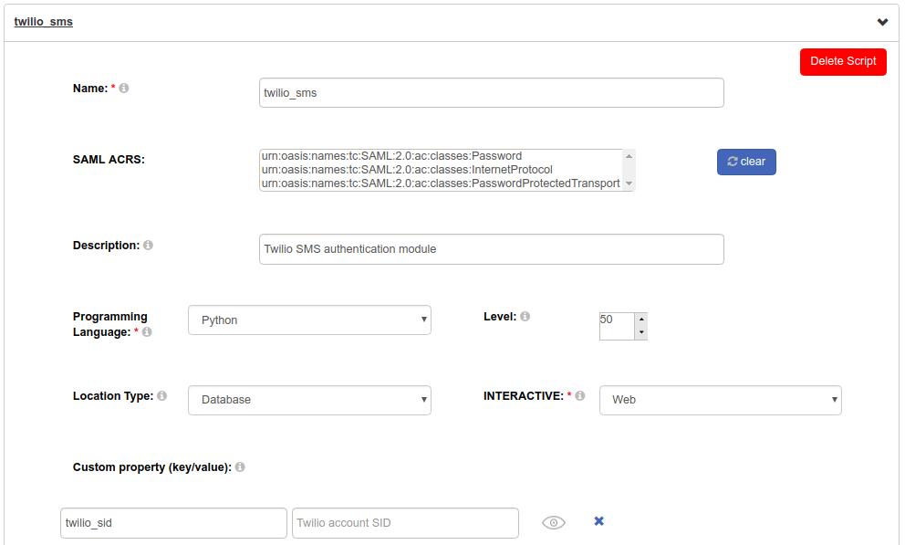

# SMS One-Time Password (OTP) Authentication

## Overview 
SMS is a common technology used for the delivery of OTPs. Text messages provide a ubiquitous communication channel, and are directly available in nearly all mobile handsets and, through text-to-speech conversion, any mobile or landline telephone. 

This document explains how to configure the Gluu Server for two-step, two-factor authentication (2FA) with username / password as the first step, and an OTP sent via text message as the second step. 

!!! Note
    As indicated, this script uses the [Twilio cloud communications platform](https://www.twilio.com) to deliver SMS messages.     
    
## Prerequisites 

- A Gluu Server (installation instructions [here](../installation-guide/index.md));    
- The [Twilio SMS OTP script](https://github.com/GluuFederation/oxAuth/blob/master/Server/integrations/twilio_sms/twilio2FA.py) (included in the default Gluu Server distribution);   
- A [Twilio account](https://www.twilio.com/).     
- The twilio [jar library](http://search.maven.org/remotecontent?filepath=com/twilio/sdk/twilio/7.17.6/twilio-7.17.6.jar) added to oxAuth
- A mobile device and phone number that can receive SMS text messages
    

## Twilio Configuration

Twilio offers Voice, SMS, and MMS capabilities, but we will only need SMS for the purpose of this document. 

When registering for a Twilio account, you will be asked to verify your personal phone number, and then will be given a Twilio phone number. 

Ensure the number given is [SMS enabled](https://support.twilio.com/hc/en-us/articles/223183068-Twilio-international-phone-number-availability-and-their-capabilities) and supports sending messages to the countries you are targeting. You may need to enable countries manually (see the [Geo permissions page](https://www.twilio.com/console/sms/settings/geo-permissions)).

Twilio trial accounts only allow sending messages to mobile numbers already linked to the account, so for testing you will want to add (and verify) some additional numbers besides your personal one to make sure the integration is working as expected. When you are ready to move to production, you will want to purchase a Twilio plan.

## Add Twilio library to oxAuth

- Copy the Twilio jar file to the following oxAuth folder inside the Gluu Server chroot: `/opt/gluu/jetty/oxauth/custom/libs` 

- Edit `/opt/gluu/jetty/oxauth/webapps/oxauth.xml` and add the following line:

    ```
    <Set name="extraClasspath">/opt/gluu/jetty/oxauth/custom/libs/twilio.jar</Set>
    ```
    
- [Restart](../operation/services.md#restart) the `oxauth` service     
    
## Properties

The custom script has the following properties:    

|	Property	|	Description		| Input value     |
|-----------------------|-------------------------------|---------------|
|twilio_sid		|Twilio account SID		| Obtain from your Twilio account|
|twilio_token		|Access token associated to Twilio account| Obtain from your Twilio account|
|from_number            |Twilio phone number assigned to the account| Obtain from your Twilio account|

## Enable SMS OTP

Follow the steps below to enable SMS OTP authentication:

1. Navigate to `Configuration` > `Manage Custom Scripts`.    

1. Click on the `Person Authentication` tab       

1. Find the `twilio_sms` script.

    

1. Populate the properties table with the details from your Twilio account:    

   - `twilio_sid`: Paste the *"Account SID"* of your recently created Twilio account. You can find this value in your account dashboard.   
   - `twilio_token`: Similar to your SID, you were also given a token upon registration.     
   - `from_number`: Use the Twilio number that was provided when you created your account (not your personal number).      

1. Enable the script by checking the box 

1. Scroll to the bottom of the page and click `Update`

Now SMS OTP is an available authentication mechanism for your Gluu Server. This means that, using OpenID Connect `acr_values`, applications can now request OTP SMS authentication for users. 

!!! Note 
    To make sure OTP SMS has been enabled successfully, you can check your Gluu Server's OpenID Connect configuration by navigating to the following URL: `https://<hostname>/.well-known/openid-configuration`. Find `"acr_values_supported":` and you should see `"twilio_sms"`. 

## Make SMS OTP the Default
If SMS OTP should be the default authentication mechanism, follow these instructions: 

1. Navigate to `Configuration` > `Manage Authentication`. 

1. Select the `Default Authentication Method` tab. 

1. In the Default Authentication Method window you will see two options: `Default acr` and `oxTrust acr`. 


 - `oxTrust acr` sets the authentication mechanism for accessing the oxTrust dashboard GUI (only managers should have acccess to oxTrust).    

 - `Default acr` sets the default authentication mechanism for accessing all applications that leverage your Gluu Server for authentication (unless otherwise specified).    

If SMS OTP should be the default authentication mechanism for all access, change both fields to twilio_sms.  
    
## SMS OTP Login Pages

The Gluu Server includes one page for SMS OTP:

1. A **login** page that is displayed for all SMS OTP authentications. 


The designs are being rendered from the [SMS xhtml page](https://github.com/GluuFederation/oxAuth/blob/master/Server/src/main/webapp/auth/otp_sms/otp_sms.xhtml). To customize the look and feel of the pages, follow the [customization guide](../operation/custom-design.md).


## Using SMS OTP

### Phone Number Enrollment

The script assumes the user phone number is already stored in his corresponding LDAP entry (attribute `phoneNumberVerified`). You can change the attribute by altering the script directly (see authenticate routine).

### Subsequent Logins
All <!--subsequent--> authentications will trigger an SMS with an OTP to the registered phone number. Enter the OTP to pass authentication. 

### Credential Management
    
A user's registered phone number can be removed by a Gluu administrator either via the oxTrust UI in `Users` > `Manage People`, or in LDAP under the user entry. Once the phone number has been removed from the user's account, the user can re-enroll a new phone number following the [phone number enrollment](#phone-number-enrollment) instructions above. 

## Troubleshooting    
If problems are encountered, take a look at the logs, specifically `/opt/gluu/jetty/oxauth/logs/oxauth_script.log`. Inspect all messages related to Twilio. For instance, the following messages show an example of correct script initialization:

```
Twilio SMS. Initialization
Twilio SMS. Initialized successfully
```

Also make sure you are using the latest version of the script that can be found [here](https://github.com/GluuFederation/oxAuth/blob/master/Server/integrations/twilio_sms/twilio2FA.py).

## Self-service account security

To offer end-users a portal where they can manage their own account security preferences, including two-factor authentication credentials like phone numbers for SMS OTP, check out our new app, [Gluu Casa](https://casa.gluu.org). 
