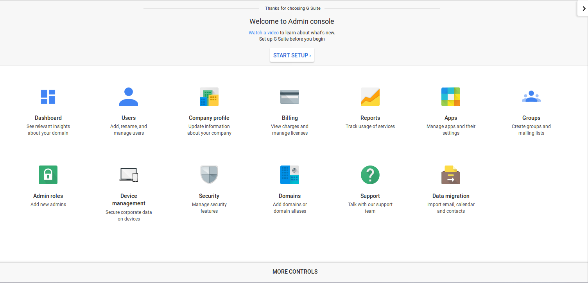
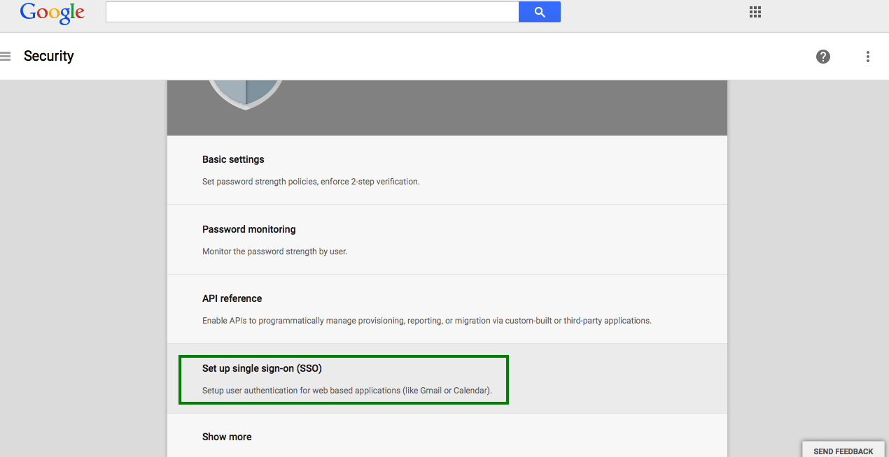

# Single Sign-On (SSO) to G Suite 

This document will explain how to configure G Suite and the Gluu Server for single sign-on (SSO).

!!! Note
    It is highly recommended to use Google's staging apps environment before migrating to production.
    
## Create a G Suite account

You can do that [here](https://gsuite.google.com/signup/basic/welcome). Don't forget to add at least one more user account(we are going to use that user to test SSO) other than default 'admin' account you are using in Google Admin panel.

If you already have an account skip to the next section.
   
!!! Note
    You need a valid and unused domain name
   
## Configuring G Suite


- Log in to your G Suite admin dashboard [here](https://admin.google.com).



- From the list of options choose the `Security` tab.

- A new page will open. Select `Set up single sign-on(SSO)` from the options.



- Single Sign-On setting page will appear. 


  This page contains a number of selection, and entry fields.

   * __Set up SSO with third party Identity Provider__: This refers to your Gluu Server instance. Enable this box.

   * __Sign-in Page URL__: Enter the uri of the sign-in page, for example `https://idp_hostname/idp/profile/SAML2/Redirect/SSO`.

   * __Sign-out Page URL__: Enter the uri of the logout page, for example `https://idp_hostname/idp/Authn/oxAuth/logout`.

   * __Change Password URL__: The uri an user is redirected if he wants to change his password. It is recommended that an organization provides such a link for its end users.

   * __Verification certificate__: Upload the SAML certificate of your Gluu Server. The SAML certificates are available in the `/etc/certs` folder inside the Gluu Server `chroot` environment. At the time of writting, the cert file is `/etc/certs/idp-signing.crt`

   * __Use a domain specific issuer__: Enable this box to use a domain-specific issuer.

   * Save your data using the `Save changes` button on the lower right of the page.

Refer to [Google SSO](https://support.google.com/a/answer/60224?hl=en) to know more.

## Configuring the Gluu Server

Now we need to get the Google Metadata and create a SAML Trust Relationship in the Gluu Server. Trust Relationships are created so that the IDP (your Gluu Server) can authorize/authenticate the user to the service provider (SP)--in this case, G Suite. 

### Google Metadata
In order to create a Trust Relationship, we need to grab the metadata of G Suite. This metadata can be collected from Google. It's generally specific to an organization account. The following is a template of the Google metadata. Replace `domain.com` with your own domain name (the one used when creating G Suite account).

```
<EntityDescriptor entityID="google.com/a/domain.com" xmlns="urn:oasis:names:tc:SAML:2.0:metadata">
    <SPSSODescriptor protocolSupportEnumeration="urn:oasis:names:tc:SAML:2.0:protocol">
       <NameIDFormat>urn:oasis:names:tc:SAML:1.1:nameid-format:emailAddress</NameIDFormat>
            <AssertionConsumerService index="1" Binding="urn:oasis:names:tc:SAML:2.0:bindings:HTTP-POST"
            Location="https://www.google.com/a/domain.com/acs" >
            </AssertionConsumerService>
    </SPSSODescriptor>
</EntityDescriptor>
```

Got the metadata? Great, we are ready to move forward. 


### Configure Shibboleth to support G Suite's custom nameId format

G Suite requires an email (`user@domain.com`) address as NameID. This requires configuring Shibboleth to support `emailAddress`.

Edit the `/opt/gluu/jetty/identity/conf/shibboleth3/idp/saml-nameid.xml.vm` file and uncomment the following sections, which are commented out by default:

```
        <bean parent="shibboleth.SAML2AttributeSourcedGenerator"
            p:format="urn:oasis:names:tc:SAML:1.1:nameid-format:emailAddress"
            p:attributeSourceIds="#{ {'mail'} }" />
```               

```
        <bean parent="shibboleth.SAML1AttributeSourcedGenerator"
            p:format="urn:oasis:names:tc:SAML:1.1:nameid-format:emailAddress"
            p:attributeSourceIds="#{ {'mail'} }" />
```

Restart the `identity` and `idp` services.
 
### Create a SAML Trust Relationship for Google Apps: 

- How to create a trust relationship can be found [here](../../admin-guide/saml.md#trust-relationship-requirements). We need to follow the "File" method for Google Apps trust relationship. Upload the metadata which we created couple of steps back. 
- Required attributes: 
     - You need to release the following attribute: Email.
 
## Test 
  
 - Create an user in Gluu Server representing the G Suite account you want to log into ( 2nd user other than G Suite admin account ).       
 - Make sure the user created in step one has mail attribute available whose value is equals to what is given there in G Suite account (example `user@domain.com`). 
 - Initiate SSO with `https://mail.google.com/a/domain.com` (Replace `domain.com` with your own domain name)
 - Enjoy!   
