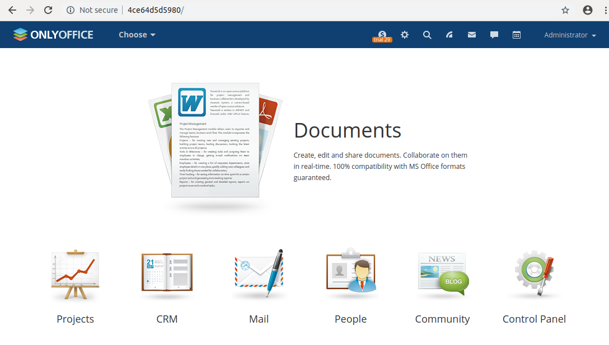

# Single Sign-On (SSO) to OnlyOffice

Follow these instructions to configure the Gluu Server and OnlyOffice for SSO. 

## Configure OnlyOffice
Follow the instructions below to configure OnlyOffice for SSO.

!!! Note
    Review the docs for [configuring OnlyOffice SSO](https://helpcenter.onlyoffice.com/server/controlpanel/enterprise/sso-description.aspx). 

- Sign in to OnlyOffice Portal with your administrative account

- Navigate to the Control Panel 
 

- Click on SSO (on the left), and select `Enable Single Sign-on Authentication`
  

- Add the information of your Gluu Server here, and click Save
     

- Click DOWNLOAD SP METADATA XML 

## Configure Gluu Server

Now, follow the instructions below to create a SAML Trust Relationship (TR) for OnlyOffice in the Gluu Server.

!!! Note
    Review the docs for [creating SAML TR's](../../admin-guide/saml.md). 

* Download the OnlyOffice metadata from the OnlyOffice website. 
* Create Trust Relationship:
  * _Display Name_: Name the TR (e.g. OnlyOffice SSO)
  * _Description_: Provide a description for the TR
  * _Metadata Type_: 'File'
  * Upload OnlyOffice metadata (obtained during OnlyOffice configuration)
  * Releases attributes: TransientID and Email
  * 'Add' the TR
  * Configure Relying Party: From the GUI, add the following configurations: 
    * Select `SAML2SSO`
        * includeAttributeStatement: Enabled
        * assertionLifetime: keep the default one
        * assertionProxyCount: keep the default one
        * signResponses: conditional
        * signAssertions: never
        * signRequests: conditional
        * encryptAssertions: never
        * encryptNameIds: never
        * Save
  * `Update` the trust relationship
  

