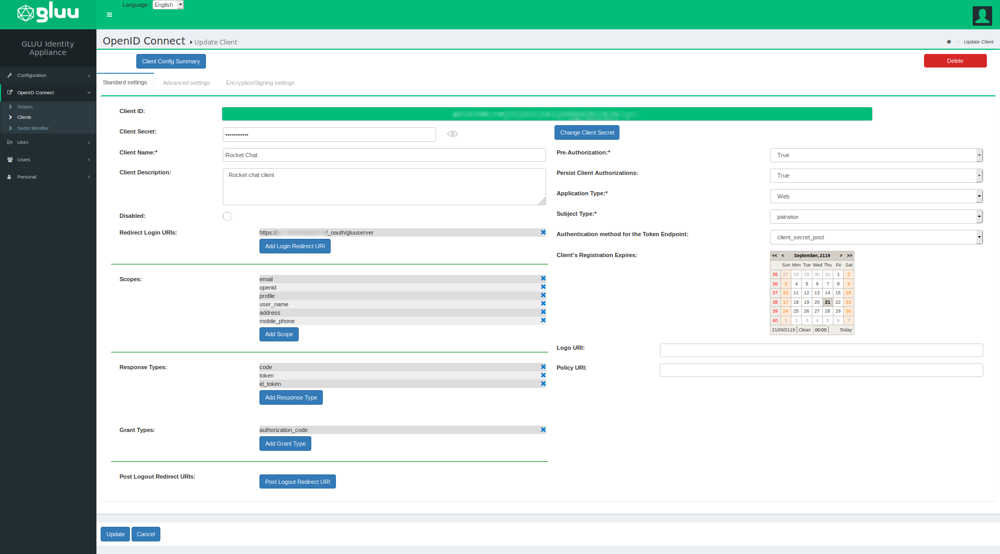
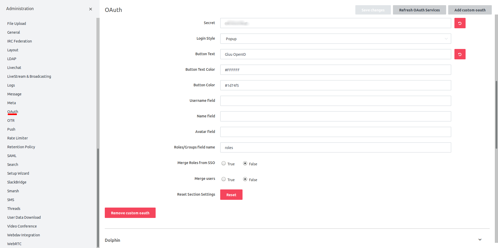
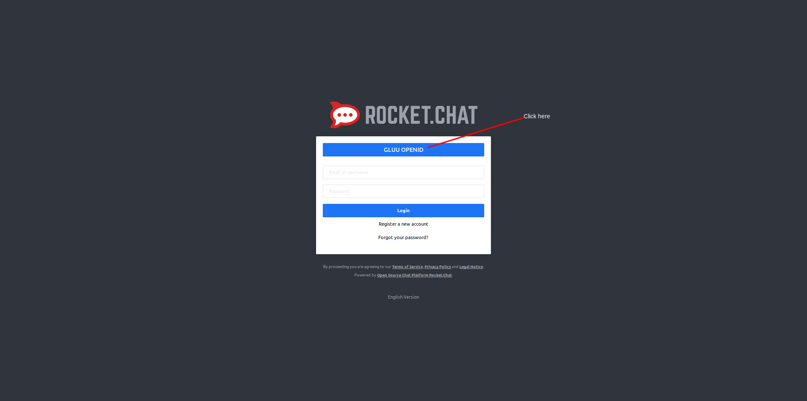
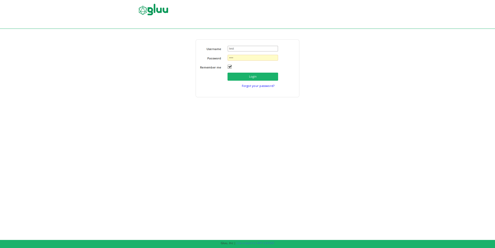

# Single Sign-On (SSO) to Rocket Chat

Before we start, an important point to note is that, RocketChat converts the name the custom oauth to small alphabets removing the hyphens, spaces etc. So, "Gluu Server" or "Gluu-Server" will be converted to "gluuserver". And then at the top of the custom oauth, **an important message** is generated as below:

`` When setting up your OAuth Provider, you'll have to inform a Callback URL. Use https://{your_rocketchat_url_accessible_from_gluu_server}/_oauth/gluuserver
``

This is important as it's used as `Redirect Login URI` during creation of client in Gluu Server.

## Adding Client in Gluu Server

In the left pane, click on `OpenID Connect` ---> `Client`. Then click on `Add Client` button in the main page area. 
The blank form for client creation looks like below screenshot.

- The `Client ID` is generated automatically.
- Keep sufficiently strong `Client Secret`.
- Add optional `Client Description`.
- Add `Redirect Login URIs` as **Callback URL** noted from from Rocket Chat custom oauth.
- Add `Scopes` **email**, **openid**, **profile** and **user_name**.
- Add `Response Types` **code**, **token**, **id_token**.
- Add `Grant Types` **authorization_code**.
- Set `Pre-Authorization` to **Yes**
- Set `Application Type` to **Web**.
- Set ` Authentication method for the Token Endpoint` to **client_secret_post**.

After all these settings, click on `Add` button. The configured client should look as per below screen.

## Configuring Rocket Chat For Integration With Gluu Server
 
In rocketchat Administration area, in left pane click on `OAuth`. Then click on `Add custom oauth`. Add some name, we named it as: `Gluu Server`. 
- Set `Enable` to **True**.
- Add `URL` of Gluu Server which is accessible from your Rocket Chat server.
- Add `Token Path` as **/oxauth/restv1/token**.
- Add `Identity Path` as **/oxauth/restv1/userinfo**.
- Add `Authorize Path` as **/oxauth/restv1/authorize**.
- Add `Scope` as **openid email profile user_name**
- Add `Id` noted from the client created in your Gluu Server.
- Add `Secret` noted from the client created in your Gluu Server.
- We chose `Button Text` as **Gluu OpenID**.
- `Login Styles` is a matter of choice.

Once you set all the parameters and save the changes, the screenshots look like below two screenshots.

Access your Rocket Chat server and you should see two options to login. The other one is at the top like ours added just now e.g **Gluu OpenID**. This is shown as below:

After we click, we're redirected to our Gluu Server which we mentioned during creation of the custom oauth. We had created a test user, so we added the username and password as shown below:

Once authentication is complete, the flow gets back to the Rocket Chat screen and asks us to creat a new username. That purely a matter of personal choice. We chose to keep it same i.e **test**. See the screen below asking us for username:

Once done, we're granted login to Rocket Chat.

