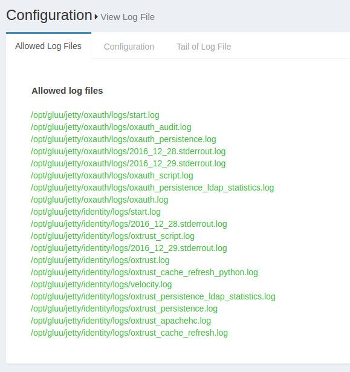
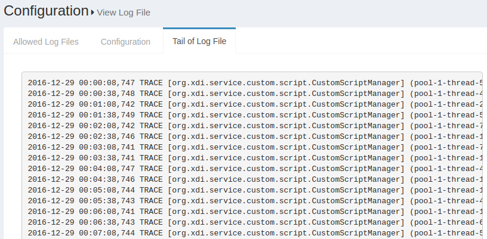
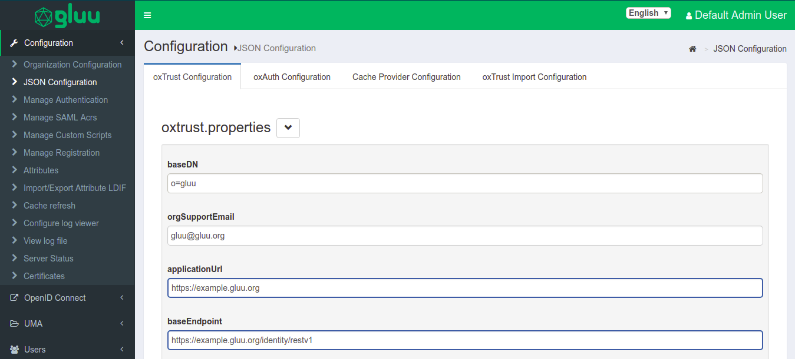

# Gluu Server Logs

When it comes to troubleshooting issues in the Gluu Server-from service 
hiccups to outages-logs are the best place to start. 

The Gluu Server administrator can investigate logs from the oxTrust 
[View Logs](../admin-guide/oxtrust-ui.md#view-log-file) feature or directly 
with SSH access to the Gluu-Server container. 

## View Log File

The log files configured in the earlier section can be viewed using the
**View log file** feature. This feature can be accessed through the
configuration menu using **Configuration --> View Log File**.



The **Display last lines count** field contains the lines that will be
displayed in the Web GUI. If the field contains the value **400**, then
the Gluu Server will show the last 400 lines of the log in the GUI. The
screenshot below shows an according example.



## Log Levels

**Logging Levels configuration through OxTrust UI**

The following log levels are available in oxTrust:

| Log Level | Messages Logged |  
|---------- |------------                  |  
|Trace      | All messages                 |  
|Debug      | Debug level and above        |  
|Info       | Informational level and above|  
|Warn       | Warning level and above      |  
|Error      | Error level and above        |  
|Fatal      | Only fatal errors            |  
|off        | Logging is disabled          |  

These logging levels can also be set in oxTrust UI.

1. Login to oxTrust UI as `admin` or with an administrator account.
1. Navigate to Configuration > JSON Configuration > OxTrust Configuration Tab.
    
1. Scroll to the very bottom of the page.
1. Click on the `logging level` and select the levels from the drop down.
1. Default value will be set to `Default`, you can change the level as per your requirement for extensive
troubleshooting.
1. Click on `Save Configuration` to save the configuration.

**Changing Log Levels using log4j2.xml**

Gluu Server logs use the log4j2 logging levels which can be changed in the `log4j2.xml` file.
`log4j2.xml` can be found in below path

`/opt/jetty-9.3/temp/jetty-localhost-8082-identity.war-_identity-any-8516765662711672787.dir`

And also the same file can be found in all incorporated Gluu apps, 
i.e oxauth, asimba, idp, oxauth-rp and identity

The available logging levels are :

| Log Level | Messages Logged |  
|---------- |------------                  |  
|Trace      | All messages                 |  
|Debug      | Debug level and above        |  
|Info       | Informational level and above|  
|Warn       | Warning level and above      |  
|Error      | Error level and above        |  
|Fatal      | Only fatal errors            |  
|off        | Logging is disabled          |  


The following files define the log levels in Gluu Server. Please edit the 
file with the levels given above and restart the `jetty` server. 
The following section is taken from a live Gluu Server `log4j.xml` file 
showing different log levels for different logs. The changes made this section will reflect in the logs.
```
<category name="org.xdi.oxauth">
        <priority value="TRACE" />
    </category>

    <!- ############### Gluu ################# ->
    <category name="org.gluu">
        <priority value="TRACE" />
    </category>

    <!- ############### opnexdi ################# ->
    <category name="org.openxdi">
        <priority value="TRACE" />
    </category>

    <!- ############### oxTrust ################# ->
    <category name="org.gluu.oxtrust">
        <priority value="TRACE" />
    </category>

    <!- ############### Embedded JBoss AS ################# ->
    <category name="org.jboss">
        <priority value="ERROR" />
    </category>
    <category name="com.arjuna">
        <priority value="ERROR" />
    </category>

```

Please restart the specific service after any change in log levels to 
allow the changes to take effect. Use the following command to restart tomcat:

!!! Note
    It is recommended to use OxTrust UI to change the logging levels.
    
## Setup Logs
The setup logs are stored inside the `/install/community-edition-setup/` folder. There are two logs available, one detailing the setup process and the other documenting the errors:

1. setup.log
2. setup_error.log

## Core logs
The available log files for Gluu Server Community Edition inside the `chroot` 
environment are listed below.

|Log File| Component|
|-|-|
|_/install/community-edition-setup_/**setup.log**|Setup detail log|
|/install/community-edition-setup_/**setup_error.log**|Setup error log|
|_/opt/gluu/jetty/idp/logs_/**start.log**|Logs time-stamp when IDP starts|
|_/opt/shibboleth-idp/logs_/**idp-warn.log**<br/>_/opt/shibboleth-idp/logs_/**idp-process.log**|IDP diagonostic log [Read more..](https://wiki.shibboleth.net/confluence/display/IDP30/LoggingConfiguration)|
|_/opt/shibboleth-idp/logs_/**idp-audit.log**|General audit log [Read more..](https://wiki.shibboleth.net/confluence/display/IDP30/LoggingConfiguration)|
|_/opt/shibboleth-idp/logs_/**idp-consent-audit.log**|Consent audit log [Read more..](https://wiki.shibboleth.net/confluence/display/IDP30/LoggingConfiguration)|
|_/opt/gluu/node/passport/node_modules/redis-parser_/**isolate-0x3615b50-v8.log**<br/>_/opt/gluu/node/passport/node_modules/redis-parser_/**isolate-0x28e7b50-v8.log**|Passport log|
|_/opt/gluu/jetty/asimba/logs_/**start.log**|Logs time-stamp when ASIMBA starts|
|_/opt/gluu/jetty/oxauth/logs_/**start.log**|Logs time-stamp when oxAuth starts|
|_/opt/gluu/jetty/oxauth/logs_/**oxauth_audit.log**|General audit log|
|_/opt/gluu/jetty/oxauth/logs_/**oxauth_persistence.log**|Logs connection with LDAP|
|_/opt/gluu/jetty/oxauth/logs_/**oxauth_script.log**|Logs for oxAuth custom script execution|
|_/opt/gluu/jetty/oxauth/logs_/**oxauth.log**|General log for oxAuth service|
|_/opt/gluu/jetty/oxauth-rp/logs_/**start.log**|Logs time-stamp when oxAuthRP starts|
|_/opt/gluu/jetty/oxauth-rp/logs_/**oxauth-rp.log**|General oxAuthRP log|
|_/opt/gluu/jetty/identity/logs_/**start.log**|Logs time-stamp when oxTrust starts|
|_/opt/gluu/jetty/identity/logs_/**oxtrust_script.log**|
|_/opt/gluu/jetty/identity/logs_/**oxtrust.log**|Logs for oxTrust custom script execution|
|_/opt/gluu/jetty/identity/logs_/**oxtrust_persistence.log**|Logs connection with LDAP|
|_/opt/gluu/jetty/identity/logs_/**oxtrust_cache_refresh.log**| Logs events relating to cache refresh|
|_/opt/gluu/jetty/identity/logs_/**oxtrust_velocity.log** | Log events related to the Apache Velocity template engine |
| _/opt/gluu/jetty/identity/logs_/**oxtrust_cleaner.log** | Logs information about the oxTrust clean-up services |
|_/var/log/openldap_/**ldap.log**|OpenLDAP Log, contains everything related to OpenLDAP|

### oxAuth logs
The oxauth logs contain the information about oxAuth authentication process and errors. 
The key oxauth logs are

1. `oxauth.log` under `/opt/gluu/jetty/oxauth/logs/`
This log is gathering most of the authentication related information. Generally this is the first log to review for any authentication-related troubleshooting, like authentication failure or missing clients etc. Here's an example showing a successful user authentication:

        2016-07-16 15:43:28,232 INFO  [org.xdi.oxauth.auth.Authenticator] Authentication success for Client: '@!EFCB.890F.FB6C.2603!0001!0A49.F454!0008!F047.7275'
        2016-07-16 15:43:28,232 TRACE [org.xdi.oxauth.auth.Authenticator] Authentication successfully for '@!EFCB.890F.FB6C.2603!0001!0A49.F454!0008!F047.7275'
        2016-07-16 15:43:28,238 DEBUG [xdi.oxauth.token.ws.rs.TokenRestWebServiceImpl] Attempting to request access token: grantType = authorization_code, code = 61ba3c0d-42c4-4f1f-8420-fd5f6707f1b1, redirectUri = https://test.gluu.org/identity/authentication/authcode, username = null, refreshToken = null, clientId = null, ExtraParams = {grant_type=[Ljava.lang.String;@1add2a62, redirect_uri=[Ljava.lang.String;@2e0995b5, code=[Ljava.lang.String;@7743b5af}, isSecure = true, codeVerifier = null
        2016-07-16 15:43:28,249 DEBUG [org.xdi.oxauth.service.UserService] Getting user information from LDAP: userId = zico 

1. `oxauth_script.log` under `/opt/gluu/jetty/oxauth/logs/`
  Most of the custom script's initialization and few more information are loaded here in this script. In the sample log below we can see 'Super Gluu' 2FA has been loaded in the Gluu Server:

        2016-07-16 19:06:32,705 INFO  [org.xdi.service.PythonService] (pool-2-thread-2) oxPush2. Initialization
        2016-07-16 19:06:32,713 INFO  [org.xdi.service.PythonService] (pool-2-thread-2) oxPush2. Initialize notification services
        2016-07-16 19:06:32,750 INFO  [org.xdi.service.PythonService] (pool-2-thread-2) oxPush2. Initialized successfully. oneStep: 'False', twoStep: 'True', pushNotifications: 'False'

1. `oxauth_persistence_duration.log` under `/opt/gluu/jetty/oxauth/logs/`
  This log contains information on the total execution times for LDAP operations such as `add` and `search`. It records at the `DEBUG` level, so it does not affect production environment performance.

### oxTrust logs
1. `oxtrust.log` under `/opt/gluu/jetty/identity/logs`
  This log gather logs related to Gluu Server Admin panel (called oxTrust). For example, what is the clientID of an oxTrust session? Or, what scopes are being used, etc. In the example below, you can see an admin user has successfully logged into the `test.gluu.org` Gluu Server admin panel, has the proper authorizationCode, a redirectURI, and the user's role:

        2016-07-16 16:41:55,690 INFO  [org.gluu.oxtrust.action.Authenticator] authorizationCode : 555a7586-6ca2-4b39-ab39-2ac78ec81524
        2016-07-16 16:41:55,690 INFO  [org.gluu.oxtrust.action.Authenticator]  scopes : user_name email openid profile
        2016-07-16 16:41:55,691 INFO  [org.gluu.oxtrust.action.Authenticator] clientID : @!EFCB.890F.FB6C.2603!0001!0A49.F454!0008!F047.7275
        2016-07-16 16:41:55,691 INFO  [org.gluu.oxtrust.action.Authenticator] getting accessToken
        2016-07-16 16:41:55,691 INFO  [org.gluu.oxtrust.action.Authenticator] tokenURL : https://test.gluu.org/oxauth/seam/resource/restv1/oxauth/token
        2016-07-16 16:41:55,691 INFO  [org.gluu.oxtrust.action.Authenticator] Sending request to token endpoint
        2016-07-16 16:41:55,692 INFO  [org.gluu.oxtrust.action.Authenticator] redirectURI : https://test.gluu.org/identity/authentication/authcode
        2016-07-16 16:41:55,919 DEBUG [org.gluu.oxtrust.action.Authenticator]  tokenResponse : org.xdi.oxauth.client.TokenResponse@1914b8d

1. `oxtrust_script.log` under `/opt/gluu/jetty/identity/logs`   
  This log collects information on oxTrust related scripts and their operations. For example, if an organization uses a custom attribute which populates values for every user, then the Gluu Server Administrator needs to use a custom script for their 'Cache Refresh' process. This log will receive information when the custom script runs.

1. `oxtrust_cache_refresh.log` under `/opt/gluu/jetty/identity/logs`    
  Cache Refresh related information such as status, primary failure, etc., is available in this log. In the sample snippet below we see the total number of users that have been synced into the Gluu Server, number of failures, and total number of updated users. 

        2016-07-16 17:18:17,691 DEBUG [gluu.oxtrust.ldap.cache.service.CacheRefreshTimer] (pool-1-thread-9) Updated person '@!EFCB.890F.FB6C.2603!0001!0A49.F454!0000!40EB.AB8E'
        2016-07-16 17:18:17,691 INFO  [gluu.oxtrust.ldap.cache.service.CacheRefreshTimer] (pool-1-thread-9) Updated '2,002' entries
        2016-07-16 17:18:17,722 INFO  [gluu.oxtrust.ldap.cache.service.CacheRefreshTimer] (pool-1-thread-9) Failed to update '0' entries
        2016-07-16 17:18:17,738 DEBUG [gluu.oxtrust.ldap.cache.service.CacheRefreshTimer] (pool-1-thread-9) Keep external persons: 'true'
        2016-07-16 17:18:17,739 DEBUG [gluu.oxtrust.ldap.cache.service.CacheRefreshTimer] (pool-1-thread-9) Count entries '0' for removal from target server
        2016-07-16 17:18:17,739 INFO  [gluu.oxtrust.ldap.cache.service.CacheRefreshTimer] (pool-1-thread-9) Removed '0' persons from target server
        2016-07-16 17:18:17,739 INFO  [gluu.oxtrust.ldap.cache.service.CacheRefreshTimer] (pool-1-thread-9) There are '2,002' entries before updating inum list
        2016-07-16 17:18:17,740 INFO  [gluu.oxtrust.ldap.cache.service.CacheRefreshTimer] (pool-1-thread-9) There are '2,002' entries after removal '0' entries 
        
1. `oxtrust_audit.log` under `/opt/gluu/jetty/identity/logs`
  This log provides basic auditing for oxTrust identity. It gathers information about who did what, when, and from where in the following format:

  Date - Object changed - Who applied the change - from which IP

  For example:

    2018-09-26 09:07:55,938 INFO  [qtp804611486-16]- OPENID CLIENT @!2D59.8992.A7F7.CD81!0001!6290.A960!0008!ACA6.3181.A647.456C **MyOwnClient** ADDED  BY USER Default Admin User FROM IP ADDRESS 192.168.1.6
    
1. `oxtrust_persistence_duration.log` under `/opt/gluu/jetty/oxauth/logs/`
  This log contains information on the total execution times for LDAP operations such as `add` and `search`. It records at the `DEBUG` level, so it does not affect production environment performance.

#### client_id and/or client_name logging
oxTrust configured to generate and view client_id and/or client_name logs. 
To configure client_id and/or client_name

- Login to oxTrust UI

- Navigate to `oxTrust` > `Configuration` > `oxAuth`

- For client_id to be populated and viewed in the logs set `logClientIdOnClientAuthentication` to `true`

- For client_name to be populated and viewed in the logs set `logClientNameOnClientAuthentication` to `true`

#### System logs 
- For Ubuntu: `/var/log/syslog`
- For RPM based systems: `/var/log/messages`

#### Web Server logs
- For Debian: `/var/log/apache2/`
- For RPM based systems: `/var/log/httpd/`

## System Logs

Sometimes it worthy to check system logs like `/var/log/messages`. These logs contain global system messages.

## Web Server logs

Apache httpd / apache2 logs are available in `/var/log/httpd` or `/var/log/apache2` for Ubuntu.

1. `access_log`: This log contains information about requests coming into the Gluu Server, 
success status or requests, execution time for any request etc.     

2. `error_log`: This log shows error messages if the web server encounter any issue while 
processing incoming requests.    

3. `other_vhosts_access.log`: This log is specific to the Gluu Server setup and those links 
which are being requested by a user from a web browser. An example below:     

        test.gluu.org:443 192.168.201.184 - - [17/Jul/2016:18:25:21 +0000] "GET /index.html HTTP/1.1" 200 13239 "-" "Java/1.7.0_95"
        test.gluu.org:443 192.168.201.1 - - [17/Jul/2016:18:25:56 +0000] "GET / HTTP/1.1" 302 2185 "-" "Mozilla/5.0 (Windows NT 10.0; WOW64) AppleWebKit/537.36 (KHTML, like Gecko) Chrome/51.0.2704.106 Safari/537.36"
        test.gluu.org:443 192.168.201.1 - - [17/Jul/2016:18:25:56 +0000] "GET /identity/ HTTP/1.1" 200 583 "-" "Mozilla/5.0 (Windows NT 10.0; WOW64) AppleWebKit/537.36 (KHTML, like Gecko) Chrome/51.0.2704.106 Safari/537.36"
        test.gluu.org:443 192.168.201.1 - - [17/Jul/2016:18:25:56 +0000] "GET /identity/home.htm HTTP/1.1" 302 272 "https://test.gluu.org/identity/" "Mozilla/5.0 (Windows NT 10.0; WOW64) AppleWebKit/537.36 (KHTML, like Gecko) Chrome/51.0.2704.106 Safari/537.36"
        test.gluu.org:443 192.168.201.1 - - [17/Jul/2016:18:25:56 +0000] "GET /identity/login?cid=4 HTTP/1.1" 302 474 "https://test.gluu.org/identity/" "Mozilla/5.0 (Windows NT 10.0; WOW64) AppleWebKit/537.36 (KHTML, like Gecko) Chrome/51.0.2704.106 Safari/537.36"
        test.gluu.org:443 192.168.201.1 - - [17/Jul/2016:18:25:56 +0000] "GET /oxauth/authorize?scope=openid+profile+email+user_name&response_type=code+id_token&nonce=nonce&redirect_uri=https%3A%2F%2Ftest.gluu.org%2Fidentity%2Fauthentication%2Fauthcode&client_id=%40%21EFCB.890F.FB6C.2603%210001%210A49.F454%210008%21F047.7275 HTTP/1.1" 302 450 "https://test.gluu.org/identity/" "Mozilla/5.0 (Windows NT 10.0; WOW64) AppleWebKit/537.36 (KHTML, like Gecko) Chrome/51.0.2704.106 Safari/537.36" 

4. There are few other logs like `ssl_access_log` , `ssl_error_log` , and `ssl_request_log` 
which are collecting information on port 443 specifically.      

Remember the initial `GET` request will hit the Apache server first, and 
then be proxied via the AJP port 8082 to . If you see traffic on the web server, 
but not on Jetty, this is a good place to check to see if something is wrong. 
For example, you might want to check if the firewall is blocking port 8082 
if you see somthing like this:

        [Thu Jul 14 23:49:19 2016] [error] ajp_read_header: ajp_ilink_receive failed
        [Thu Jul 14 23:49:19 2016] [error] (70007)The timeout specified has expired: proxy: read response failed from (null) (localhost)
        [Thu Jul 14 23:49:20 2016] [error] (70007)The timeout specified has expired: ajp_ilink_receive() can't receive header
        [Thu Jul 14 23:49:20 2016] [error] ajp_read_header: ajp_ilink_receive failed
        [Thu Jul 14 23:49:20 2016] [error] (70007)The timeout specified has expired: proxy: read response failed from (null) (localhost)
        [Thu Jul 14 23:49:20 2016] [error] (70007)The timeout specified has expired: ajp_ilink_receive() can't receive header
        [Thu Jul 14 23:49:20 2016] [error] ajp_read_header: ajp_ilink_receive failed
        [Thu Jul 14 23:49:20 2016] [error] (70007)The timeout specified has expired: proxy: read response failed from (null) (localhost)

## OpenLDAP Logs

OpenLDAP logs are enabled by default. And OpenLDAP by is configured to capture logs by syslog
from the operating system. However, if one has to disable logging (which we dont recommend), are done in sladp.conf
stored under following directory. For more details on OpenLDAP 
slapd configuration view [here](http://www.openldap.org/doc/admin24/slapdconfig.html)

`/opt/symas/etc/openldap/slapd.conf file`

The logs for OpenLDAP are stored under the below directory.

`/var/log/openldap/ldap.log`

>Note: OpenLDAP logs are not populated within Gluu container, its stored and generated under the host system

### OpenLDAP Log Level

By default Log Level of OpenLDAP is set to `stats sync`. If one has to change the log level, 
it could be performed by modifying the slapd.conf file under the above mentioned directory. 

`loglevel stats sync`

|Level|Keyword|Description|
|-----|-------|-----------|
|-1 | any | enable all debugging  |
|0 | *blank* |no debugging  |
|1 |trace|  trace function calls  |
|2  |packets | debug packet handling  |
|4  | args| heavy trace debugging  |
|8  | conns| connection management  |
|16 |  BER | print out packets sent and received  |
|32 |  filter|  search filter processing  |
|64 |  config|  configuration processing  |
|128 | ACL | access control list processing  |
|256 | stats|  stats log connections/operations/results  |
|512 |  stats2 | stats log entries sent  |
|1024|   shell | print communication with shell backends  |
|2048|  parse | print entry parsing debugging  |
|16384|  sync|  syncrepl consumer processing  |
|32768 |  none|  only messages that get logged whatever log level is set  |


## Clearing Logs

The "clear-logs" feature can be used to clear all log files with the extension `.log`, including system logs. Clear-logs can be helpful during troubleshooting, as well as research and development. We discourage its use in production systems if the logs are not backed-up. More features are planned. Please consider this as work in progress.

`# service gluu-server-3.1.6 clear-logs`
